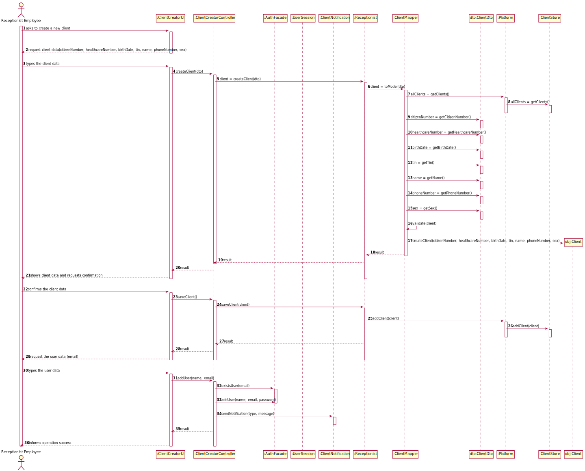

# US 003 - Register a Client.

## 1. Requirements Engineering

### 1.1. User Story Description

As a receptionist of the laboratory, I want to register a client.

### 1.2. Customer Specifications and Clarifications

**From the specifications document:**

> To register a client, the receptionist needs the client’s citizen card number, National Healthcare Service (NHS) number, birth date, sex, Tax Identification number (TIF), phone number, e-mail and name.

**From the client clarifications:**

> **Question:** Does the receptionist need to be logged in the app to preform the regist?
>
> **Answer:** Yes.
-
> **Question:** What parameter (asked by the receptionist) should the system use to create the password of the new client?
>
> **Answer:** The password should be randomly generated. It should have ten alphanumeric characters.
-
> **Question:** Considering the creation of new clients, we have this information ... Which type/format they should have?
>
> **Answer:** Citizen Card - 16 digit number ; NHS - 10 digit number ; TIN - 10 digit number ; Birth day - DD-MM-YY ; Name - max 35 characters ; Phone number - 11 digit number; Sex - Male/Female ;
-
> **Question:** Are all the fields required/mandatory?
>
> **Answer:** The sex is opcional. All other fields are required.
-
> **Question:** Should each client have an unique ID, generated during their creation?
> 
> **Answer:** No.
-
> **Question:** Is there any restrictions to the client age?
> 
> **Answer:** A client should not have more than 150 years of age. Although there are important developments in the pursuit of eternal youth, for now this value is ok.
-
> **Question:** Relative to registering a new user, how should the system respond in the event of creating a new user with the same attributes of an already existing user?
> 
> **Answer:** This should be treated as an error. A subset of the attributes of any client are unique.
-
> **Question:** How should the system send a email to the client with the password
> 
> **Answer:** Considering a set of technical restrictions, during the development of the Integrative Project we will not use any e-mail or SMS API services to send messages. All the e-mail and SMS messages should be written to a file with the name emailAndSMSMessages.txt. This file simulates the use of e-mail and SMS API services.

### 1.3. Acceptance Criteria

* **AC1:** The password should be randomly generated with 10 alphanumeric characters.
* **AC2:** All data required to register a client are mandatory, except for the phone number that is optional.
* **AC3:** Citizen Card needs 16 numbers
* **AC4:** NHS needs 10 numbers 
* **AC5:** TIN needs 10 numbers
* **AC6:** Birth day respect the format DD-MM-YY
* **AC7:** Age cannot be superior of 150 years and inferior of 0 years
* **AC8:** Name needs 35 characters
* **AC9:** Sex two options: Male/Female
* **AC10:** Phone number needs 11 numbers

### 1.4. Found out Dependencies

* Has a dependency on US7, as the administrator needs to create a receptionist first.

### 1.5 Input and Output Data

**Input Data:**

For client creation
* Citizen Card Number
* National Healthcare Number (NHS)
* Birth Date
* Tax Identification Number (TIN)
* Name
* Phone Number
* Sex

For client user creation
* Email

**Output Data:**

* Creation of a new client
* Creation of a new user
* (In)Success of the operation

### 1.6. System Sequence Diagram (SSD)

## 2. OO Analysis

### 2.1. Relevant Domain Model Excerpt

### 2.2. Other Remarks

* The customer only has access to the user after being registered by the receptionist

## 3. Design - User Story Realization

### 3.1. Rationale

**SSD - Alternative 1 is adopted.**

| Interaction ID | Question: Which class is responsible for... | Answer  | Justification (with patterns)  |
|:-------------  |:--------------------- |:------------|:---------------------------- |
| **Step 1** - *receptionist* asks to create a new clinical analysis laboratory |... interacting with the receptionist? | ClientCreatorUI | Pure Fabrication: There is no reason to assign this responsibility to any existing class in the Domain Model.           |
| | ... coordinating the US? | ClientCreatorController  | Controller  |
| **Step 4** - *system* requests the client data | | | |
| **Step 5** - *receptionist* types the client data | ... knowing all clients | ClientsStore | HC + LC, to reduce the number of classes of the platform, we create a clinicalStore class |
| | ... validating all data (global validation)? | Receptionist | IE: Checks that there are no repeat clients |
| |... instantiating a new client? | Receptionist | HC + LC + Creator (Rule 1)
| | ... saving the inputted data? | Client | IE: Instance created in step 1 |
| **Step 6** - *system* shows all the client data and requests confirmation | | | |
| **Step 7** - *receptionist* confirms the client data | ... validating all data (local validation)? | Client Person | IE: The Client knows the data |
| | ... save the new client instance? | ClientsStore | IE: Knows all the clients |
| **Step 8** - *system* requests the user data | | | | |
| **Step 9** - *receptionist* types the user data | ... verified if the user already exist? | AuthFacade | IE: Checks that there are no repeat users |
| | ... create a new user? | AuthFacade | IE: Creates a new user in the system |
| | ... notifies the client? | ClientNotification | IE: Sends a notification to a client via email or sms |
| **Step 10** - *system* informs operation success | ... informing operation success? | ClientCreatorUI | IE: is responsible for user interactions |

### Systematization ##

According to the taken rationale, the conceptual classes promoted to software classes are:

* Receptionist
* Client
* Platform

Other software classes identified:

* ClientCreatorUI
* ClientCreatorController
* ClientsStore
* AuthFacade
* ClientNotification

## 3.2. Sequence Diagram (SD)
**We choose the alternative 1**   
**Alternative 1**

**Alternative 2**

## 3.3. Class Diagram (CD)

**We choose the alternative 1**   
**Alternative 1**

**Alternative 2**

# 4. Tests

**Acceptance Criteria 3**
    
    @Test(expected = IllegalArgumentException.class)
    public void CreateCitizenNumberWithMoreThan16Carac() throws ParseException {
        Date date = dateFormat.parse(dateStr);
        client = new Client("10101010101010101010","1010101010", date, "1010101010", "client", "10101010101", "male");
    }

    @Test(expected = IllegalArgumentException.class)
    public void CreateCitizenNumberWithLessThan16Carac() throws ParseException {
        Date date = dateFormat.parse(dateStr);
        client = new Client("101010","1010101010", date, "1010101010", "client", "10101010101", "male");
    }

**Acceptance Criteria 4**

    @Test(expected = IllegalArgumentException.class)
    public void CreateNHSWithMoreThan10Carac() throws ParseException {
        Date date = dateFormat.parse(dateStr);
        client = new Client("1010101010101010","10101010101010", date, "1010101010", "client", "10101010101", "male");
    }

    @Test(expected = IllegalArgumentException.class)
    public void CreateNHSWithLessThan10Carac() throws ParseException {
        Date date = dateFormat.parse(dateStr);
        client = new Client("1010101010101010","101010", date, "1010101010", "client", "10101010101", "male");
    }

**Acceptance Criteria 5**

    @Test(expected = IllegalArgumentException.class)
    public void CreateTinWithMoreThan10Carac() throws ParseException {
        Date date = dateFormat.parse(dateStr);
        client = new Client("1010101010101010","1010101010", date, "10101010101010", "client", "10101010101", "male");
    }

    @Test(expected = IllegalArgumentException.class)
    public void CreateTinWithLessThan10Carac() throws ParseException {
        Date date = dateFormat.parse(dateStr);
        client = new Client("1010101010101010","1010101010", date, "101010", "client", "10101010101", "male");
    }

**Acceptance Criteria 6**

    @Test(expected = ParseException.class)
    public void CreateBirthDateBlank() throws ParseException {
        dateStr = "";
        Date date = dateFormat.parse(dateStr);
        client = new Client("1010101010101010","1010101010", date, "1010101010", "client", "10101010101", "male");
    }

**Acceptance Criteria 7**

    @Test(expected = ParseException.class)
    public void CreateBirthDateBlank() throws ParseException {
        //Arrange + Act
        dateStr = "";
        Date date = dateFormat.parse(dateStr);
        client = new Client("1010101010101010","1010101010", date, "1010101010", "client", "10101010101", "male");
    }

    @Test(expected = IllegalArgumentException.class)
    public void CreateNegativeAge() throws ParseException {
        //Arrange + Act
        dateStr = "11-11-2050";
        Date date = dateFormat.parse(dateStr);
        client = new Client("1010101010101010","1010101010", date, "1010101010", "client", "10101010101", "male");
    }

**Acceptance Criteria 8**

    @Test(expected = IllegalArgumentException.class)
    public void CreateNameWithNumbers() throws ParseException {
        Date date = dateFormat.parse(dateStr);
        client = new Client("1010101010101010","1010101010", date, "1010101010", "client11", "10101010101", "male");
    }

    @Test(expected = IllegalArgumentException.class)
    public void CreateNameWithMoreThan35Digits() throws ParseException {
        Date date = dateFormat.parse(dateStr);
        client = new Client("1010101010101010","1010101010", date, "1010101010", "clientclientclientclientclientclientclientclientclientclientclientclient", "10101010101", "male");
    }

**Acceptance Criteria 9**

    @Test(expected = IllegalArgumentException.class)
    public void CreateSexOther() throws ParseException {
        Date date = dateFormat.parse(dateStr);
        client = new Client("1010101010101010","1010101010", date, "1010101010", "client", "10101010101", "aaaaaaa");
    }

**Acceptance Criteria 10**

    @Test(expected = IllegalArgumentException.class)
    public void CreatePhoneNumberWithMoreThan11Carac() throws ParseException {
        Date date = dateFormat.parse(dateStr);
        client = new Client("1010101010101010","1010101010", date, "1010101010", "client", "1010101010101010", "male");
    }

    @Test(expected = IllegalArgumentException.class)
    public void CreatePhoneNumberWithLessThan11Carac() throws ParseException {
        Date date = dateFormat.parse(dateStr);
        client = new Client("1010101010101010","1010101010", date, "1010101010", "client", "101010", "male");
    }

# 5. Construction (Implementation)

## Class ClientCreateController

    public class ClientCreateController {

        public ClientCreateController() {

        }

        public boolean CreateClient(String citizenNumber, String healthcareNumber, Date birthDate, String tin, String name, String phoneNumber, String sex) {

            client = recep.CreateClient(citizenNumber, healthcareNumber, birthDate, tin, name, phoneNumber, sex);
    
            return client != null;
        }

        public boolean SaveClient() {
            return recep.SaveClient(client);
        }

        public boolean AddUser(String email, String name) {
            String password = //omitted
    
            AuthFacade loginCC = new AuthFacade();
            if (!loginCC.existsUser(email)) {
                return loginCC.addUser(name, email, password);
            }
    
            return false;
        }

        public boolean clientNotification(String type, String message){
            ClientNotification noti = new ClientNotification();

            return noti.sendNotification(type, message)
        }
    }

## Class Receptionist

    public class Receptionist extends Employee {

        public Receptionist(String id, String name, String phoneNumber, String email, String address, String soc) {
            super(id, name, phoneNumber, email, address, soc)
        }

        public Client CreateClient(String citizenNumber, String healthcareNumber, Date birthDate, String tin, String name, String phoneNumber, String sex) {
            Client client = new Client(citizenNumber, healthcareNumber, birthDate, tin, name, phoneNumber, sex);
            if (this.Validate(client)) {
                return client;
            }
            return null;
        }

        public boolean Validate(Client client) {
            result = //omitted
            if(result){
                return true;
            }else{
                return false;
            }
        }

        public boolean SaveClient(Client client) {
            result = //omitted
            if(result){
                return true;
            }else{
                return false;
            }
        }
    }   

## Class Platform

    class Platform
    {
        public Platform()
        {

        }

        public Clients[] getClients(){
            ClientsStore clients = new ClientsStore();
            
            return ClientsStore.getClients();
        }

        public boolean AddClient(Client client)
        {
            ClientsStore clients = new ClientsStore();

            return clients.AddClient(client)
        }
    }

## Class Client

    private String citizenNumber, healthcareNumber, birthDate, tin, name, phoneNumber, sex;
    
    class Client
    {
        public Client(String citizenNumber, String healthcareNumber, String birthDate, String tin, String name, String phoneNumber, String sex)
        this.citizenNumber = citizenNumber;
        this.healthcareNumber = healthcareNumber;
        this.tin = tin;
        this.birthDate = birthDate;
        this.name = name;
        this.phoneNumber = phoneNumber;
        this.sex = sex;
    }

## Class ClientNotification

    class ClientNotification
    {
        public ClientNotification()
        {

        }

        public boolean sendNotification(String type, String message)
        {
            try{
                // ... (omitted)
                return true
            }
            catch{
                // ... (omitted)
                return false
            }
        }
    }

## Class ClientsStore

    class ClientsStore
    {
        public Client[] getClients()
        {
            return // ... (omitted)
        }

        public AddClient(Client client)
        {
            try
            {
                // ... (omitted)
                return true;
            }
            catch
            {   
                // ... (omitted)
                return false;
            }
        }
    }

# 6. Integration and Demo

* Some demo purposes some tasks are bootstrapped while system starts.
* The Controller needs the CurrentUserSession to find out which specific instance of the Receptionist has to invoke, because it was the only way we found out which employee is performing that operation.
* The client notification is implemented via file .txt

# 7. Observations
* Some prefabricated authentication classes have been modified to allow Controllers to gain access to Current User Session. 

