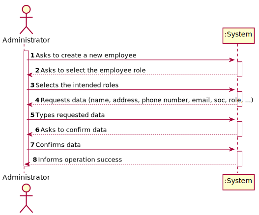
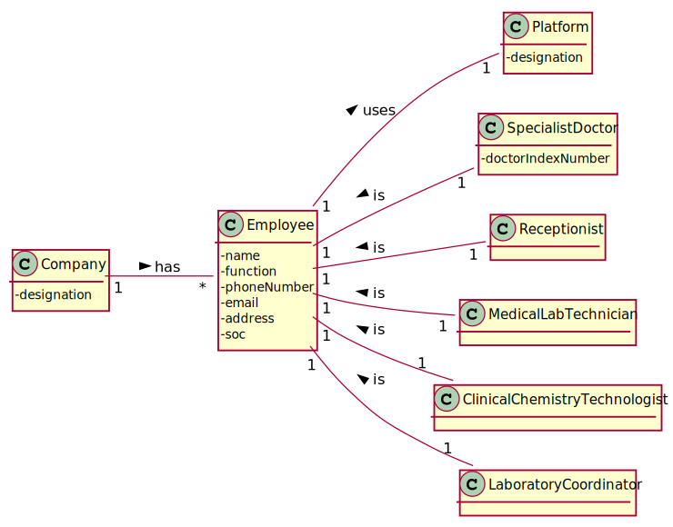
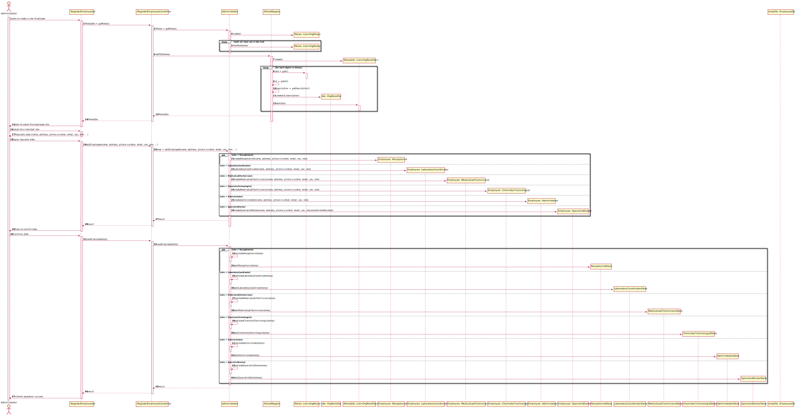
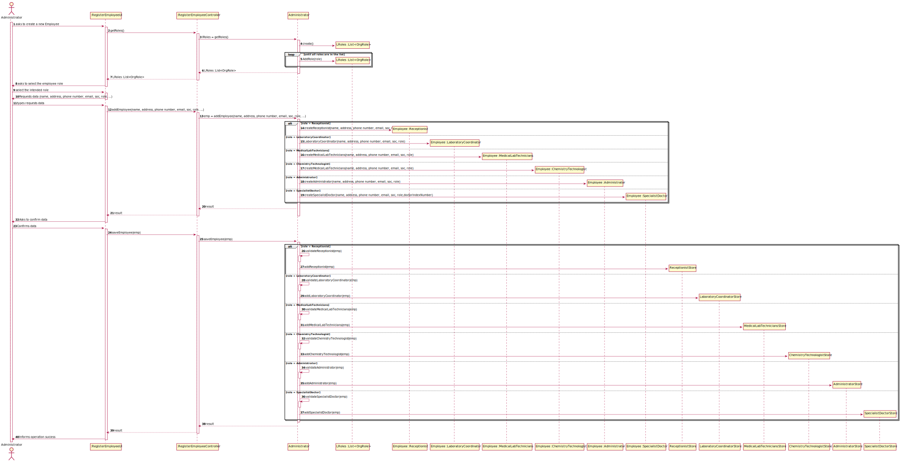
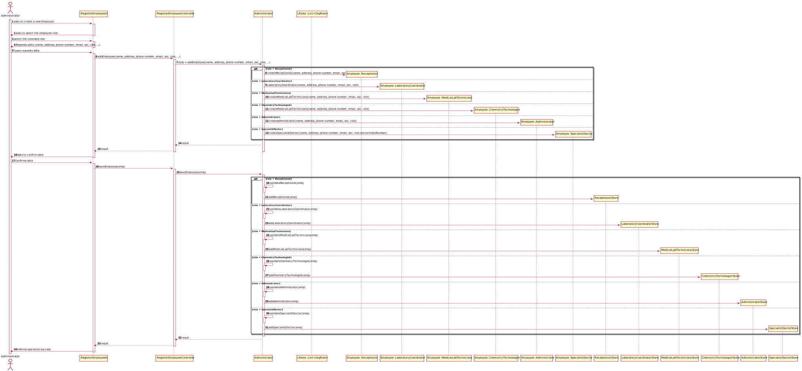
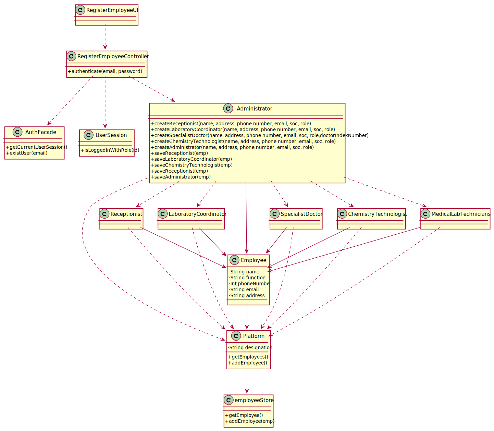

US7: Register a new employee

## 1. Requirements Engineering

### 1.1. User Story Description

*As an administrator, I wat to register a new employee*

### 1.2. Customer Specifications and Clarifications

**From the client clarifications:**

> **Question:** When creating a new employee, the attributes "Employee ID" and "Doctor Index Number", are implemented by the administrator or incremented by the system?
>
> **Answer:** Only the employee ID should be generated from the initials of the employee name and should include a number. The number has 5 digits and is increases automatically when a new employee is registered in the system. For instance, if the company has 20 employees and wants to register a specialist doctor having the name Ana Maria Santos Moura, then the employee ID for this specialist doctor should be AMSM00021.

> **Question:** Besides the Acceptance Criteria ("each user must have a single role defined in the system"), are there other criteria we need to take into consideration ?
>
> **Answer:** Please read the Project Requirements for Sprint B: "Each user must have a single role defined in the system. The "auth" component available on the repository must be reused (without modifications).". In my previous posts you can find other requirements that must be met in order to mark US7 as complete.

> **Question:** Are there any other employee roles than the ones specified in the documents?
>
> **Answer:** No.

> **Question:** Do these roles have different contracts with ManyLabs (i.e. temporary contract, permanent contract, freelance, etc...)? If so, should this be registered in the system together with the employee role information?
>
> **Answer:** Many Labs is known for making only permanent full-time contracts.Therefore, there is no need to register this type of information.

> **Question:** Should an employee be registered in the system with a name, TIF, email, date of birth, phone/mobile number and email? Which type, format should be used?
>
> **Answer:** I already answered this question.

> **Question:** For the role id and respective description should we use any specific format or type?
>
> **Answer:** From a previous answer: All the roles that exist in the Many Labs company are characterized by the following attributes: Employee ID; Organization Role; Name; Address; Phone Number; E-Mail; Standard Occupational Classification (SOC) code. Please make your question more clear.

### 1.3. Acceptance Criteria

* **AC1:** Each user must have a single role defined in the system*
* **AC2:** Name is a string with no more than 30 characters*
* **AC3:** Address is a string with no more than 30 characters*
* **AC4:** Phone number has 11-digit numbers*

### 1.4. Found out Dependencies

* There are no dependencies.

### 1.5 Input and Output Data

**Input Data:**

* Typed data:
    * Employee name,
    * Employee address,
    * Employee phone number,
    * Employee email,
    * Employee soc

  **Output Data:**

    * Creation of a new employee
    * Confirm employee creation

### 1.6. System Sequence Diagram (SSD)

### 1.7 Other Relevant Remarks

* There is no other relevant remarks.

## 2. OO Analysis

### 2.1. Relevant Domain Model Excerpt

*In this section, it is suggested to present an excerpt of the domain model that is seen as relevant to fulfill this
requirement.*

### 2.2. Other Remarks

* There is no other remarks.

## 3. Design - User Story Realization

### 3.1. Rationale

**The rationale grounds on the SSD interactions, and the identified input/output data.**

| Interaction ID | Question: Which class is responsible for... | Answer  | Justification (with patterns)  |
|:-------------  |:--------------------- |:------------|:---------------------------- |
| Step 1: Asks to create a new employee|...coordinate the US? |RegisterEmployeeController|Controller|
| |... interacting with the administrator?|RegisterEmployeeUI|Pure Fabrication: There is no reason to assign this responsibility to any existing class in the Domain Model.|
| Step 2: Asks to select the employee role||             |                              |
| Step 3: Selects the intended roles||             |                              |
| Step 4: Requests data (name, address, phone number, email, soc, role, ...)|...requesting employee data?|RegisterEmployeeUI|is responsible for user interactions|
| Step 5: Types requested data|...saving the inputted data?|Administrator|Create employee instance|
| |...local validation?|Administrator|knows its data|
| Step 6: Asks to confirm data|...asking for confirmation and showing the data inserted by the administrator??|RegisterEmployeeUI|is responsible for user interactions|
| Step 7: Confirms data|...saving the created employee?|Administrator|asks the role store to create the saved employee|
| |...validation?|Administrator|asks the role store with the employee just created if the creation was successful |  
| Step 8: Informs operation success|...informing operation success?|RegisterEmployeeUI|is responsible for user interactions|  

### Systematization ##

According to the taken rationale, the conceptual classes promoted to software classes are:

* Employee
* Administrator
* Receptionist
* MedicalLabTechnicians
* LaboratoryCoordinator
* SpecialistDoctor
* ChemistryTechnologist

Other software classes (i.e. Pure Fabrication) identified:

* RegisterEmployeeUI
* RegisterEmployeeController
* ReceptionistStore
* AdministratorStore
* MedicalLabTechniciansStore
* LaboratoryCoordinatorStore
* SpecialistDoctorStore
* ChemistryTechnologistStore
* AuthFacade
* UserSession

## 3.2. Sequence Diagram (SD)

**Alternative 1**

**Alternative 2**

**Alternative 3**

## 3.3. Class Diagram (CD)

# 4. Tests

**Test 1:** Check Save Receptionist Class

	@Test
    public void CheckSaveReceptionist() {
        //Arrange + Act
        Receptionist recep;
        Administrator admin = new Administrator("id", "name", "10101010101", "administrator@gmail.com", "address", "1010");
        recep = admin.CreateReceptionist("name", "address", "10101010101", "Receptionist@gmail.com", "1010");

        Platform plat = new Platform();

        Assert.assertTrue(admin.SaveReceptionist(recep));
    }

**Test 2:** Create instance of Administrator

    @Test
    public void CreateAdministrator() {
    //Arrange + Act
    Administrator aux;
    Administrator admin = new Administrator("id", "name", "10101010101", "administrator@gmail.com", "address", "1010");
    aux = admin.CreateAdministrator("name", "address", "10101010101", "administrator@gmail.com", "1010");
    
            Assert.assertTrue(admin.ValidateAdministrator(aux));
        }
    *It is also recommended organizing this content by subsections.*

**Test 2:** Try to create invalid instance of Administrator

    @Test(expected = IllegalArgumentException.class)
    public void CreateWrongAdministrator() {
    //Arrange + Act
    Administrator aux;
    Administrator admin = new Administrator("id", "name", "10101010101", "administrator@gmail.com", "address", "1010");
    aux = admin.CreateAdministrator("name", "address", "101010101012", "administrator@gmail.com", "1010");

        Platform plat = new Platform();
        plat.AddAdministrator(aux);

        Assert.assertFalse(admin.ValidateAdministrator(aux));
    }

# 5. Construction (Implementation)

## Class Administrator

        class Administrator extends Employee {
            public Administrator(String id, String name, String phoneNumber, String email, String address, String soc) {
            super(id, name, "Administrator", phoneNumber, email, address, soc);
        }

        public String CreateId(String name){
          String id = "", inicials = "";
  
          //ommitted 
  
          return id;
        }

        public Receptionist CreateReceptionist(String name, String address, String phoneNumber, String email,  String soc) {

        Receptionist receptionist = new Receptionist(CreateId(name), name, phoneNumber, email, address, soc);
        if (this.ValidateReceptionist(receptionist)) {
            return receptionist;
        }
        return null;
        }

        public boolean ValidateReceptionist(Receptionist receptionist) {
            Platform plat = new Platform();
            List<Receptionist> receptionistList = plat.getReceptionist();
    
            for (Receptionist value : receptionistList) {
                if (value.equals(receptionist)) {
                    return false;
                }
            }
    
            return true;
        }

        public boolean SaveReceptionist(Receptionist receptionist) {
            Platform receptionists = new Platform();
    
            return receptionists.AddReceptionist(receptionist);
        }
    

        public Administrator CreateAdministrator(String name,String address, String phoneNumber, String email,  String soc) {
    
            Administrator administrator = new Administrator(CreateId(name),  name,  phoneNumber,  email,  address,  soc);
            if (this.ValidateAdministrator(administrator)) {
                return administrator;
            }
            return null;
        }

        public boolean ValidateAdministrator(Administrator administrator) {
            Platform plat = new Platform();
            List<Administrator> administratorList = plat.getAdministrator();
    
            for (Administrator value : administratorList) {
                if (value.equals(administrator)) {
                    return false;
                }
            }
    
            return true;
        }

        public boolean SaveAdministrator(Administrator administrator) {
            Platform administrators = new Platform();
    
            return administrators.AddAdministrator(administrator);
        }
		
	}

##Class RegisterEmployeeController

    public class RegisterEmployeeController {

    UserSession session;
    Receptionist recep = null;
    Administrator admin = null;

    public RegisterEmployeeController(UserSession session) {

    }

    public boolean AddUser(String email, String name, String role) {
        byte[] array = new byte[10];
        new Random().nextBytes(array);
        String password = new String(array, StandardCharsets.UTF_8);

        AuthFacade loginCC = new AuthFacade();
        if (!loginCC.existsUser(email)) {
            return loginCC.addUserWithRole(name, email, password, role);
        }

        return false;
    }

    public boolean createReceptionist(UserSession session, String name, String address, String phoneNumber, String emailEmployee, String soc) {
        Email emailUser = session.getUserId();
        String email = emailUser.getEmail();

        Platform plat = new Platform();
        List<Administrator> recepList = plat.getAdministrator();

        for (Administrator administrator : recepList) {
            if (administrator.getEmail().equalsIgnoreCase(email)) {
                admin = administrator;
            }
        }

        recep = admin.CreateReceptionist(name, address, phoneNumber, emailEmployee, soc);

        return recep != null;
    }

    public boolean SaveReceptionist() {

        boolean verification;
        verification = admin.SaveReceptionist(recep);

        if (verification) {
            AddUser(recep.getEmail(),recep.getName(),recep.getFunction());

            return true;
        }

        return false;
    }

    public boolean createAdministrator(UserSession session, String name, String address, String phoneNumber, String emailEmployee, String soc) {
        Email emailUser = session.getUserId();
        String email = emailUser.getEmail();

        Platform plat = new Platform();
        List<Administrator> recepList = plat.getAdministrator();

        for (Administrator administrator : recepList) {
            if (administrator.getEmail().equalsIgnoreCase(email)) {
                admin = administrator;
            }
        }

        admin = admin.CreateAdministrator(name, address, phoneNumber, emailEmployee, soc);

        return recep != null;
    }

    public boolean SaveAdministrator() {

        boolean verification;
        verification = admin.SaveAdministrator(admin);

        if (verification) {
            AddUser(admin.getEmail(),admin.getName(),admin.getFunction());

            return true;
        }

        return false;
    }

}

##AdministratorStore

    public class AdministratorStore {
    
      static List<Administrator> administratorList = new ArrayList<>();

      public AdministratorStore(){}
  
      public static void AddAdministrator(Administrator administrator){
        administratorList.add(administrator);
      }
  
      public static List<Administrator> getAdministrator(){
        return administratorList;
      }

    }

# 6. Integration and Demo

Some prefabricated authentication classes have been modified to allow Controllers to gain access to it.

The Controller needs the CurrentUserSession to find out which specific instance of the Receptionist has to invoke, because it was the only way we found out which employee is performing that operation.

# 7. Observations

Administrator class is getting too many responsibilities due to IE pattern and, therefore, it is harder to maintain.

