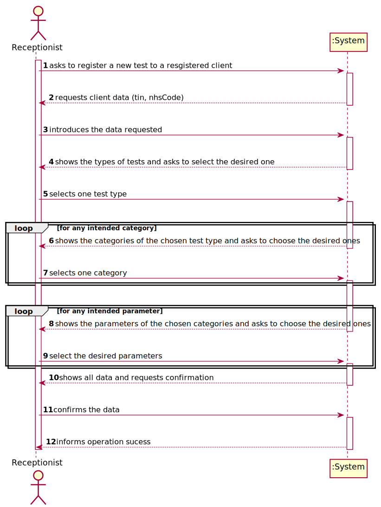
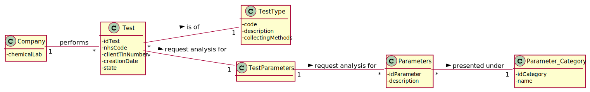
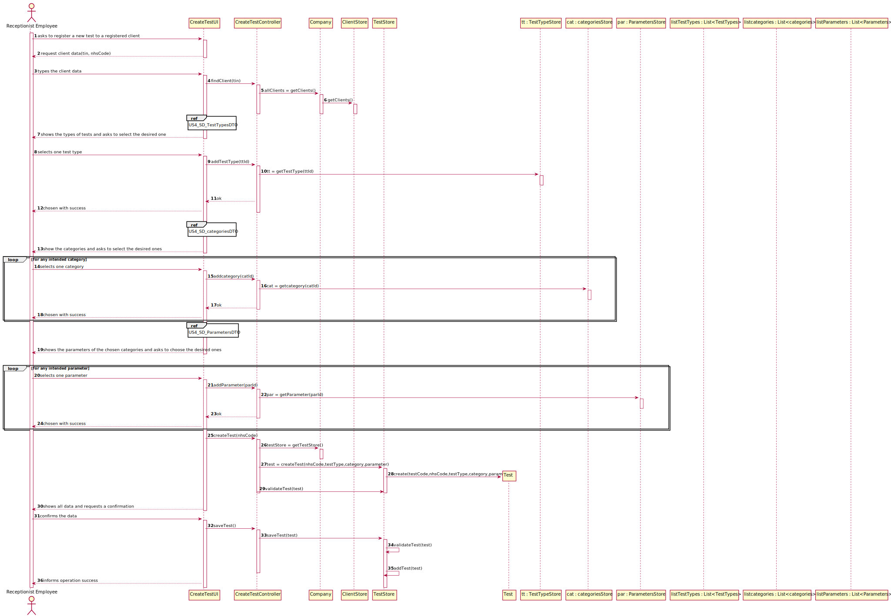
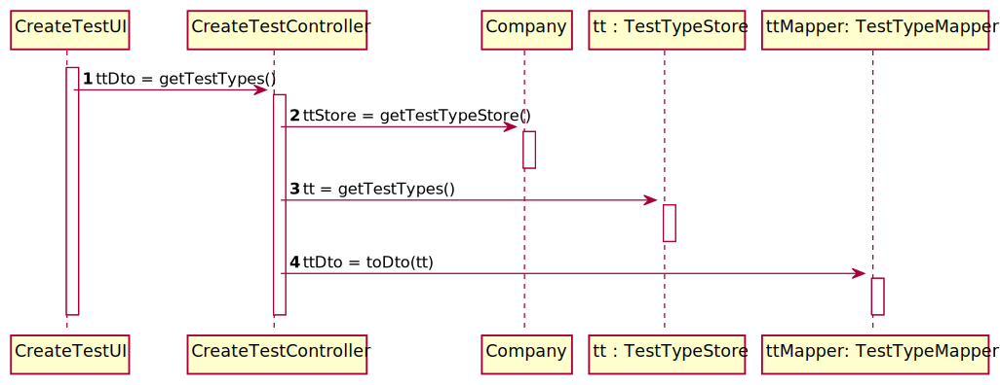
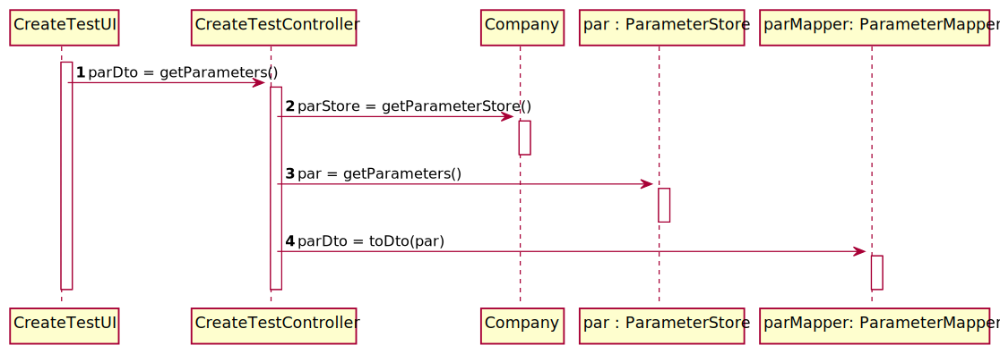
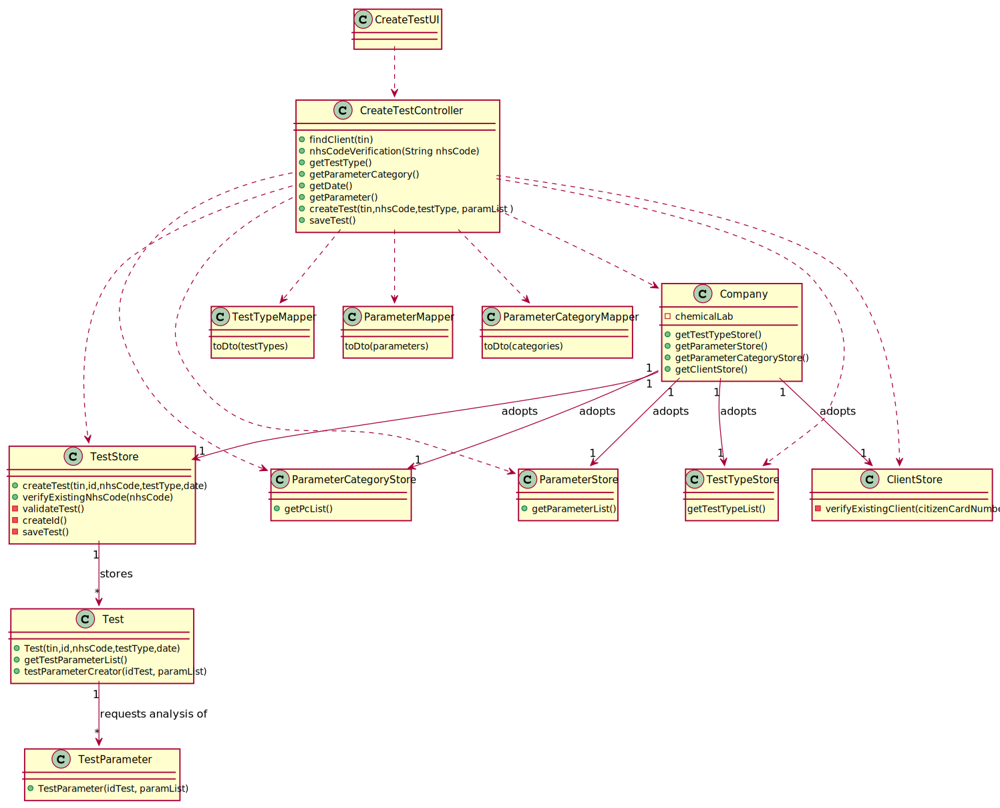

# US 004 - To register a test to be performed to a client

## 1. Requirements Engineering

### 1.1. User Story Description

As a receptionist of the laboratory, I intend to register a test to be performed to a
registered client.

### 1.2. Customer Specifications and Clarifications 

**From the specifications document:**

>	"a receptionist asks the client’s citizen card number, the lab order which contains the type of test and parameters to be measured and registers in the application the test to be performed to that client." 

**From the client clarifications:**

> **Question:** When the receptionist chooses the test type, should the categories appear, and then when selecting the category, the receptionist can choose the parameters for the test? Or when the Receptionist chooses the test type, should appear all the parameters that it includes immediately?
>
> **Answer:** Firstly, the receptionist should choose a test type. Then choose a category from a set of categories. Last, the receptionist should choose a parameter.

-

> **Question:**  On the project description it says "Each test is characterized by an internal code, an NHS code, a description that identifies the sample collection method...". You said that the code is a 12 digit sequential number. Does this mean that, for example, the first test will have the code "000000000001" and so on?
>  
> **Answer:** Yes.
 
-

> **Question:** I wanted to ask if the NHS code of which test is unique or not?
> 
> **Answer:** Yes.
 
-

> **Question:** About the other Test attributes, do we need to have in consideration any other criteria? Is the code generated or NHS code ooptional ?
> 
> **Answer:** All test attributes are mandatory. The test attributes are the following:Test code : sequential number with 12 digits. The code is automatically generated. NHS code: 12 alphanumeric characters.

-

> **Question:** Shouldn't the receptionist locate the Client by the Citizen Card Number instead of TIN Number?
> 
> **Answer:** The receptionist should use the TIN number to find the client.

-

> **Question:** Should we show the list of all clients available or just introduce the client's CCN ?
> 
> **Answer:** The TIN number should be used to find a client and associate the client with the test.
 
-

> **Question:** You've said on previous questions that the NHS code contains 12 characters and is alphanumeric, so this will be different from the NHS number from the client, am I right? If so, how do we know a certain test is associated to a client?
> 
> **Answer:** A test has a NHS code and a client has a NHS number. In US4 the receptionist of the laboratory should ask the client to get his TIN number. Using the TIN number the receptionist of the laboratory can find all information about the client. Do not forget that a client should be registered in the system to make a test.

### 1.3. Acceptance Criteria

* **AC1:** The receptionist must select the parameters to be analysed from all possible parameters in accordance with the test type.
* **AC2:** The test code must be a sequential number with 12 digits and must be automatically generated.
* **AC3:** NHS code has 12 alphanumeric characters
* **AC4:** In order to register a Test to a client, the client must be registed in the system.
* **AC5:** The NHS Code must be unique.

### 1.4. Found out Dependencies

*  * There is a dependency to "US3 Register a new Client" since in order to regist a test to a client, we need to regist the client first.
*  * There is a dependency to "US10 Create a new parameter" since the parameter list cannot be empty in order to be possible to create a Test.
*  * There is a dependency to "US11 Create a new parameter category" since the category list cannot be empty in order to be possible to create a Test.
*  * There is a dependency to "US7 Register a new employee" since in order to regist a test to a client, there must be a registered receptionist.

### 1.5 Input and Output Data

**Input Data:**

* Typed data:
	* tin, nhsCode
	
	
* Selected data:
	* Test Type
	* Categories 
	* Parameters

**Output Data:**

* List of test types
* List of categories
* List of parameters 

### 1.6. System Sequence Diagram (SSD)

## 2. OO Analysis

### 2.1. Relevant Domain Model Excerpt 

### 2.2. Other Remarks

n/a

## 3. Design - User Story Realization 

### 3.1. Rationale

| Interaction ID | Question: Which class is responsible for... | Answer  | Justification (with patterns)  |
|:-------------  |:--------------------- |:------------|:---------------------------- |
| Step 1- asks to register a new test to a registered client |	... interacting with the actor? | CreateTestUI  |  Pure Fabrication: there is no reason to assign this responsibility to any existing class in the Domain Model.           |
|  		 		 | ... coordinating the US?   | CreateTestController  | Controller  |
| Step 2- system requests client data |    |    |
| Step 3- receptionist types the client data | ...checks if the Client object exists? | ClientStore | IE: knows all the clients in the system |
|                                            | ...get the data to show to the user?    | TestTypeStore | DTO: in order to detach the domain layer from the the ui layer we use a data transfer object in order to only extract data from the domain class and dont extract operations
| Step 4- system show the types of tests and asks to select the desired ones | |  |  |
| Step 5- selects one testType |...get the Test Type? | TestTypeStore |IE: The store knows all the types of test in the system |
|                              | ...get the categories associated with the type of test? | TestType | IE: TestType knows all the categories associated with it
| Step 6- shows the categories of the chosen test type and asks to choose the desired ones | | | |
| Step 7- selects categories | ...get the categories? | ParameterCategoryStore |  IE: The store knows all the categories in the system
|                            | ...get the parameters associated with the categories? | ParameterStore | IE: Since the category object does not hold the information of which parameters are associated with the category object the class that knows all the parameters object and all his proprieties is the ParameterStore class. Therefore is the class responsible for getting the te parameters associated with the given category
| Step 8- shows the parameters of the chosen categories and asks to choose the desired ones | | | |
| Step 9- selects the desired parameters | ...get the parameters? | ParameterStore  | IE: The store knows all the parameters in the system |
|                                        | ... create the Test? | TestStore | by the application of the creator (R1) it should be the company. however applying HC + LC in the company this directs the responsibility to the testStore
|                                        | ...create the test code? | TestStore | IE: the store has the information to generate the ID |
|                                        | ...change the state? | Test | IE: Test knows his state |
|                                        | ...validate the date? (locally) | Test | IE: knows its own information |
|                                        | ...validate data? (globally) | TestStore | IE: store knows all the tests |
| Step 10- system shows all the data and requests confirmation |   |  |  |
| Step 11- confirms the data  | ...saving the Test object | TestStore | IE: knows all |
| Step 12- system informs operation success | ...informing operation success? | CreateTestUI | IE: is responsible for user interactions |

### Systematization ##

According to the taken rationale, the conceptual classes promoted to software classes are: 

 * Receptionist
 * TestType
 * TestTypeStore
 * ClientStore
 * ParameterCategoryStore
 * ParameterStore
 * Test
 * TestStore

Other software classes (i.e. Pure Fabrication) identified: 

 * RegisterTestUI  
 * RegisterTestController

## 3.2. Sequence Diagram (SD)

**SD_testTypeDTO**

**SD_parametersDTO**

**SD_categoriesDTO**

## 3.3. Class Diagram (CD)

# 4. Tests 

**Test 1:** Check that it is not possible to create an instance of the Test class with the nhsCode reference with less than 12 chars -AC3

	 @Test(expected = IllegalArgumentException.class)
    public void checkNhsCodeWithLessThen12Chars() {
        ParameterCategory[] categories = new ParameterCategory[1];
        ParameterCategory category = new ParameterCategory("12345", "example");
        categories[0] = category;
        TestType testType = new TestType("12345", "sample", "sample", categories);
        app.domain.model.test.Test test = new app.domain.model.test.Test("1234567890123456", "000000000001", "1234567", testType);
    }

**Test 2:** Check that it is not possible to create an instance of the Test class with the nhsCode reference with more than 12 chars -AC3

	@Test(expected = IllegalArgumentException.class)
    public void checkNhsCodeWithMoreThen12Chars() {
        ParameterCategory[] categories = new ParameterCategory[1];
        ParameterCategory category = new ParameterCategory("12345", "example");
        categories[0] = category;
        TestType testType = new TestType("12345", "sample", "sample", categories);
        app.domain.model.test.Test test = new app.domain.model.test.Test("1234567890123456", "000000000001", "123456789012345", testType);
    }

**Test 3:** Check that it is not possible to create an instance of the Test class with the nhsCode reference with invalid chars -AC3

	@Test(expected = IllegalArgumentException.class)
    public void checkInvalidNhsCode() {
        ParameterCategory[] categories = new ParameterCategory[1];
        ParameterCategory category = new ParameterCategory("12345", "example");
        categories[0] = category;
        TestType testType = new TestType("12345", "sample", "sample", categories);
        app.domain.model.test.Test test = new app.domain.model.test.Test("1234567890123456", "000000000001", "!!!!!!!!!!!!", testType);
    }

*It is also recommended to organize this content by subsections.* 

# 5. Construction (Implementation)

## Class CreateClinicalController 

	public CreateTestController() {
        App app = App.getInstance();
        Company company = app.getCompany();
        clientStore = company.getClientStore();
        testTypeStore = company.getTestTypeStore();
        parameterStore = company.getParameterStore();
        parameterCategoryStore = company.getParameterCategoryStore();
        testStore = company.getTestStore();
    }

	public boolean createTest(String tin, String nhsCode, TestType testType, List<Parameter> paramList) {
        DateTimeFormatter dtf = DateTimeFormatter.ofPattern("yyyy/MM/dd HH:mm:ss");
        LocalDateTime now = LocalDateTime.now();
        date = dtf.format(now);

        String id = testStore.createId();
        test = testStore.createTest(tin, id, nhsCode, testType, date);
        test.testParameterCreator(id, paramList);
        return test != null;
    }	

	public boolean saveTest() {
        return testStore.saveTest(test);
    }

## Class Company
		
	class Company {
        public ParameterCategoryStore getParameterCategoryStore() {
        	return parameterCategoryStore;
    	}
    	public ParameterStore getParameterStore() {
        	return parameterStore;
    	}
    	public TestTypeStore getTestTypeStore() {
        	return testTypeStore;
    	}
    	public TestStore getTestStore() {
        	return testStore;
    	}
    }

## Class Test
	private String tin, testCode, nhsCode, date;
	private TestType testType;
	private State state;

	public Test(String tin, String idTest, String nhsCode, TestType testType, String date) {
        boolean error = false;
        try {
            checkNshCode(nhsCode);

        } catch (Exception e) {
            System.out.println("Invalid NHS Code!");
            error = true;
        }
        if (!error) {
            this.tin = tin;
            this.idTest = idTest;
            this.date = date;
            this.nhsCode = nhsCode;
            this.testType = testType;
            state = State.REGISTERED;
            testParameterList = new ArrayList<>();
        } else {
            throw new IllegalArgumentException("Error with creation");
        }
    }
## Class TestStore
	class TestStore {	
		public Test createTest(String tin, String id, String nhsCode, TestType testType, String date) {
        Test test = new Test(tin, id, nhsCode, testType, date);

        if (validateTest(test)) {
            return test;
        }
        return null;
    }
	
		public boolean validateTest(Test test) {

        if (test == null)
            return false;

        for (Test test1 : testList) {
            if (test1.getTestCode().equalsIgnoreCase(test.getTestCode()) || (test1.getNhsCode().equalsIgnoreCase(test.getNhsCode()))) {
                return false;
            }
        }

        return true;
    }
	
		public boolean saveTest(Test test) {
        if (validateTest(test)) {
            testList.add(test);
            numberTests++;
            return true;
        }
        return false;
    }

	public String createId() {
        String id;

        id = String.format("%012d", numberTests);
        return id;
    }

	public boolean verifyExistingNhsCode(String nhsCode) {
        for (Test test1 : testList) {
            if (test1.getNhsCode().equalsIgnoreCase(nhsCode)) {
                return true;
            }
        }
        return false;
    }
	}

## Class TestParameter

	public class TestParameter {
    	String idTest;
    	List<Parameter> parameterList;

   	 	public TestParameter(String idTest, List<Parameter> parameterList){
        	this.idTest = idTest;
        	this.parameterList = parameterList;
    	}
	}

# 6. Integration and Demo 

* Some demo purposes some tasks are bootstrapped while system starts.

* The Controller needs the CurrentUserSession to find out which specific instance of the Receptionist has to invoke, because it was the only way we found out which employee is performing that operation.

# 7. Observations

* Some prefabricated authentication classes have been modified to allow Controllers to gain access to it.

