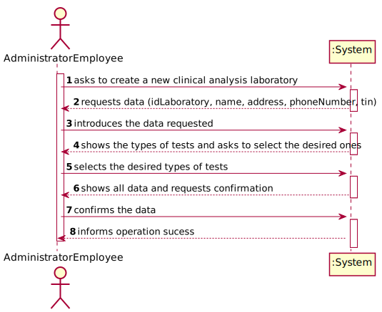
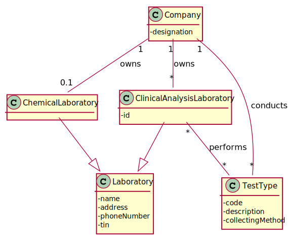
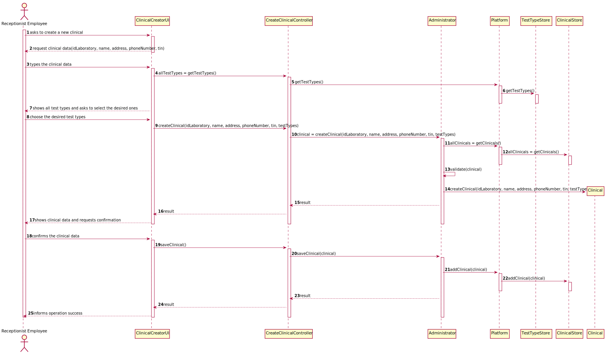
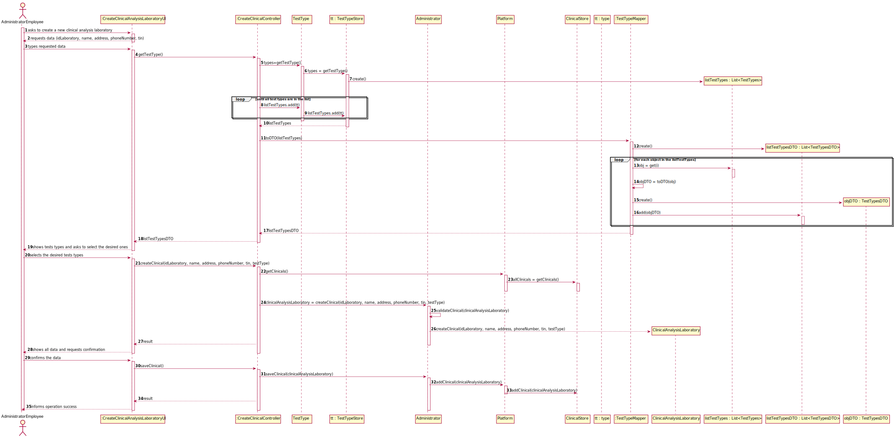
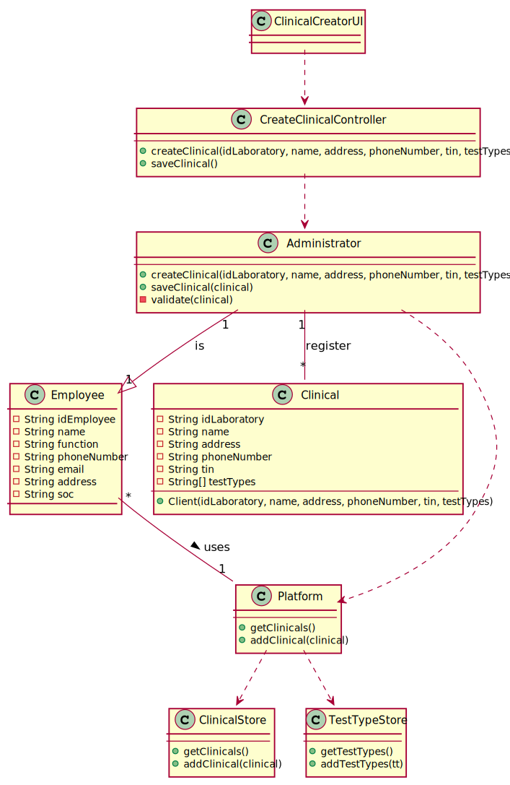
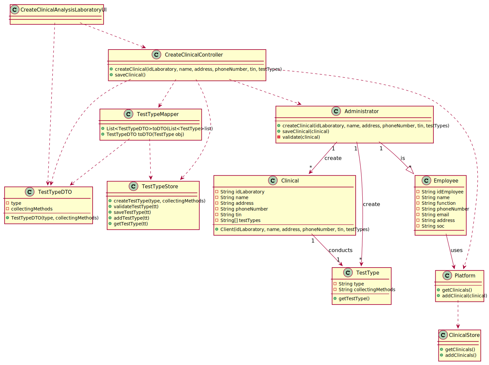

# US 008 - To register a new clinical analysis laboratory 

## 1. Requirements Engineering

### 1.1. User Story Description

As an administrator, I want to register a new clinical analysis laboratory stating which
kind of test(s) it operates.

### 1.2. Customer Specifications and Clarifications 

**From the specifications document:**

>	"All Many Labs clinical analysis laboratories perform clnical blood tests, and a subset of these laboratories also performs Covid-19 tests." 

**From the client clarifications:**

> **Question:** What information is associated with a Clinical Analysis Laboratory?
>
> **Answer:** Each Clinical Analysis Laboratory is characterized by the following attributes: Laboratory ID, Name, Address, Phone Number, Tin

-

> **Question:** Is there a maximum limit of types of tests a clinical analysis laboratory can operate?
>  
> **Answer:** No.
 
-

> **Question:** Are the test types in US8 typed in or selected from those that the program has?
> 
> **Answer:** The test types are selected from a list.
 
-

> **Question:** When creating a new Clinical Analysis Laboratory, should the system automatically record that it operates that type of test or should the person who is creating it select it manually while selecting other types of tests? Or other option?
> 
> **Answer:** The administrator should select, manually, all the types of tests to be performed by the Clinical Analysis Laboratory.

### 1.3. Acceptance Criteria

* **AC1:** Laboratory ID has 5 alphanumeric characters
* **AC2:** Address is a string with no more than 30 characters
* **AC3:** Name is a string with no more than 30 characters
* **AC4:** Phone Number has 11 digit numbers
* **AC5:** A clinical analysis laboratory must always perform clinical blood tests
* **AC6:** TIN number has 10 digit numbers
* **AC7:** All types of test are performed by the lab
* **AC8:** A clinical analysis laboratory cannot be registered without all its attributes

### 1.4. Found out Dependencies

*  No dependencies found.

### 1.5 Input and Output Data

**Input Data:**

* Typed data:
	* idLaboratory, 
	* name, 
	* address,
	* phoneNumber,
	* tin
	
	
* Selected data:
	* Test Type 

**Output Data:**

* New clinical analysis laboratory
* (In)Success of the operation

### 1.6. System Sequence Diagram (SSD)

## 2. OO Analysis

### 2.1. Relevant Domain Model Excerpt 

### 2.2. Other Remarks

n/a

## 3. Design - User Story Realization 

### 3.1. Rationale

SSD - Alternative 1 is adopted.

| Interaction ID | Question: Which class is responsible for... | Answer  | Justification (with patterns)  |
|:-------------  |:--------------------- |:------------|:---------------------------- |
| Step 1- asks to create a new clinical analysis laboratory |	... interacting with the administrator? | ClinicalAnalysisLaboratoryUI   |  Pure Fabrication: there is no reason to assign this responsibility to any existing class in the Domain Model.           |
|  		 		 | ... coordinating the US?   | ClinicalAnalysisLaboratoryController  | Controller  |
| Step 2- system requests the clinical data |    |    |
| Step 3- administrator types the clinical data | ...knowing all clinicals | ClinicalStore | HC + LC, to reduce the number of classes of the platform, we create a clinicalStore class |
|                | ... validating all data (global validation)? | Administrator | IE |
|                |... instantiating a new Clinical? | Administrator | HC + LC + Creator (Rule 1)
|                | ...saving the inputted data? | ClinicalAnalysisLaboratory | IE: instance created in step 1 |
| Step 4- system show the types of tests and asks to choose the desired ones | ... who is responsible for showing the types of tests? | TestType | IE: knows its own types of tests   |
| Step 5- administrator selects the desired types of tests | ...saving the selected types of tests? | ClinicalAnalysisLaboratory    | IE: instance created in step 1     |
| Step 6- system shows all the data and requests confirmation | ...who is responsible for showing all the data?  | ClinicalAnalysisLaboratory | IE: knows all the data from the new clinical |
| Step 7- administrator confirms the data | ... validating all data (local validation)? | Administrator Employee | IE: The administrator knows the data |
|                | ...save the new clinical instance? | Administrator | IE |
| Step 8- system informs operation success | ...informing operation success? | ClinicalAnalysisLaboratoryUI | IE: is responsible for user interactions |

### Systematization ##

According to the taken rationale, the conceptual classes promoted to software classes are: 

 * Administrator
 * ClinicalAnalysisLaboratory
 * UserSession
 * AuthFacade  
 * TestType
 * ClinicalStore

Other software classes (i.e. Pure Fabrication) identified: 

 * CreateClinicalAnalysisLaboratoryUI  
 * CreateClinicalController

## 3.2. Sequence Diagram (SD)
**Alternative 1**

**Alternative 2**

## 3.3. Class Diagram (CD)
**Alternative 1**

**Alternative 2**

# 4. Tests 

**Test 1:** Check that it is not possible to create an instance of the Clinical class with the idLaboratory reference with less than five chars -AC1

	 @Test(expected = IllegalArgumentException.class)
    public void CreateIdLaboratoryWithLessThan5Chars() {
        //Arrange + Act
        String[] testTypes = {"blood tests", "covid tests"};
        Clinical clinical = new Clinical("a12","Clinica", "35092612312", "rua", "1111111111", testTypes);
    }

**Test 2:** Check that it is not possible to create an instance of the Clinical class with the idLaboratory reference with more than five chars -AC1 

	@Test(expected = IllegalArgumentException.class)
    public void CreateIdLaboratoryWithMoreThan5Chars() {
        //Arrange + Act
        String[] testTypes = {"blood tests", "covid tests"};
        Clinical clinical = new Clinical("a12346","Clinica", "35092612312", "rua", "1111111111", testTypes);
    }

**Test 3:** Check that it is not possible to create an instance of the Clinical class with the address reference with more than thirty chars -AC2

	@Test(expected = IllegalArgumentException.class)
    public void CreateAddressWithMoreThan30Chars() {
        //Arrange + Act
        String[] testTypes = {"blood tests", "covid tests"};
        Clinical clinical = new Clinical("12345","Clinicaaaaa", "35092612312", "ruaaaaaaaaaaaaaaaaaaaaaaaaaaaaaaaaaaaaaaaaaaaaaaaaaaaaaaaaaaa", "1111111111", testTypes);
    }

**Test 4:** Check that it is not possible to create an instance of the Clinical class with the name reference with more than thirty chars -AC3

	@Test(expected = IllegalArgumentException.class)
    public void CreateNameWithMoreThan30Chars() {
        //Arrange + Act
        String[] testTypes = {"blood tests", "covid tests"};
        Clinical clinical = new Clinical("12345","Clinicaaaaaaaaaaaaaaaaaaaaaaaaaaaaaaaaaaaaaaaaaaaaaaaaaaaaa", "35092612312", "rua", "1111111111", testTypes);
    }

**Test 5:** Check that it is not possible to create an instance of the Clinical class with the phoneNumber reference with characters that are not numbers -AC4

	@Test(expected = IllegalArgumentException.class)
    public void CreatePhoneNumberWithLettersAndNumbers() {
        //Arrange + Act
        String[] testTypes = {"blood tests", "covid tests"};
        Clinical clinical = new Clinical("12345","clinica", "antonio123", "rua", "1111111111", testTypes);
    }

**Test 6:** Check that it is not possible to create an instance of the Clinical class with the phoneNumber reference with more than eleven digit numbers -AC4

	@Test(expected = IllegalArgumentException.class)
    public void CreatePhoneNumberAbove11Chars() {
        //Arrange + Act
        String[] testTypes = {"blood tests", "covid tests"};
        Clinical clinical = new Clinical("12345","clinica", "3509267345435", "rua", "1111111111", testTypes);
    }

**Test 7:** Check that it is not possible to create an instance of the Clinical class with the Tin reference with more than ten digit numbers -AC6

	@Test(expected = IllegalArgumentException.class)
    public void CreateTinWithLetters() {
        //Arrange + Act
        String[] testTypes = {"blood tests", "covid tests"};
        Clinical clinical = new Clinical("a1234","Clinica", "35092612312", "rua", "11111aaaaa", testTypes);
    }

*It is also recommended to organize this content by subsections.* 

# 5. Construction (Implementation)

## Class CreateClinicalController 

		public CreateClinicalController() {

		}

		public boolean CreateClient(String idLaboratory,String name,String phoneNumber,String address,String tin,String[] testTypes) {

            clinical = admin.CreateClinical(idLaboratory, name, phoneNumber, address, tin, testTypes);
    
            return clinical != null;
        }

		public boolean SaveClinical() {
            return admin.SaveClinical(clinical);
        }

## Class Administrator
	public class Administrator extends Employee {

        public Administrator(String id, String name, String phoneNumber, String email, String address, String soc) {
            super(id, name, phoneNumber, email, address, soc)
        }

        public Clinical CreateClinical(String idLaboratory,String name,String phoneNumber,String address,String tin,String[] testTypes) {
            Clinical clinical = new Clinical(idLaboratory, name, phoneNumber, address, tin, testTypes);
            if (this.Validate(clinical)) {
                return clinical;
            }
            return null;
        }

        public boolean Validate(Clinical clinical) {
            result = //omitted
            if(result){
                return true;
            }else{
                return false;
            }
        }

        public boolean SaveClinical(Clinical clinical) {
            result = //omitted
            if(result){
                return true;
            }else{
                return false;
            }
        }
    }

## Class Platform
		
	class Platform
    {
        public Platform()
        {

        }

        public List<Clinical> getClinicals() {
        	return ClinicalStore.getClinicals();
    	}

        public boolean AddClinicals(Clinical clinical) {
        	ClinicalStore.AddClinical(clinical);
        	return true;
    	}
    }

## Class Clinical

	private String idLaboratory, phoneNumber, address, tin, name;
	private String[] testTypes;

    public Clinical(String idLaboratory, String name, String phoneNumber, String address, String tin, String[] testType) {

        this.idLaboratory = idLaboratory;
        this.name = name;
        this.phoneNumber = phoneNumber;
        this.address = address;
        this.tin = tin;
        this.testType = testType;
    }

## Class ClinicalStore
	
	class ClientsStore
    {
        public Clinical[] getClinicals()
        {
            return // ... (omitted)
        }

        public AddClinical(Clinical clinical)
        {
            try
            {
                // ... (omitted)
                return true;
            }
            catch
            {   
                // ... (omitted)
                return false;
            }
        }
    }

# 6. Integration and Demo 

* Some demo purposes some tasks are bootstrapped while system starts.

* The Controller needs the CurrentUserSession to find out which specific instance of the Receptionist has to invoke, because it was the only way we found out which employee is performing that operation.

# 7. Observations

* Some prefabricated authentication classes have been modified to allow Controllers to gain access to it.

