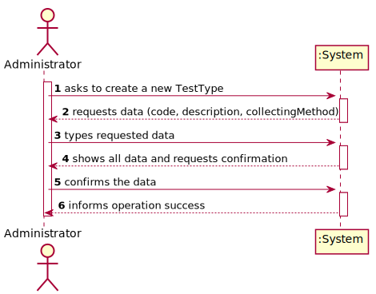
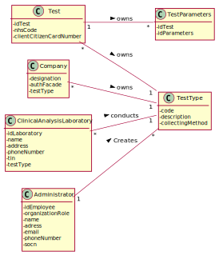
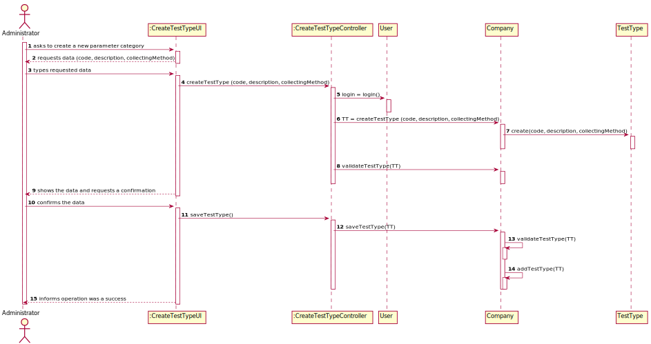
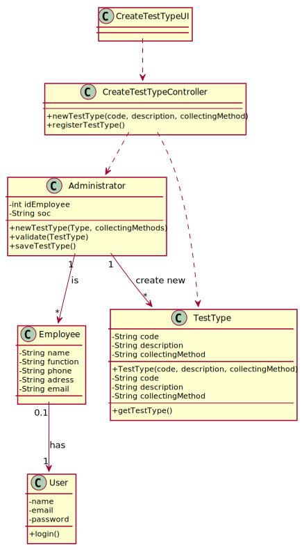

# US 009 - To specify a new type of test.

## 1. Requirements Engineering

### 1.1. User Story Description

As an administrator, I want to specify a new type of test and its collecting methods.

### 1.2. Customer Specifications and Clarifications 

**From the specifications document:**

>	Each type of test is characterized by having a unique reference, a type, an informal and a technical description, an estimated conclusion time and cost as well as the its collecting methods. 

**From the client clarifications:**

Q:
In the US9 what do you mean by the collecting methods and  what collecting methods  are available??

A:
To make a Covid test you need a swab to collect a sample. To make a blood test you need sample tubes and a syringe.
When the administrator (US9) specifies a new type of test, the administrator also specifies the method to collect a sample. The administrator introduces a brief description for each collecting method.

Q: Does a type of test holds any attribute besides it's name and collecting methods?

A: The attributes for a new test type are:
Code: five alphanumeric characters. The code is not automatically generated.
Description: a string with no more than 15 characters.
Collecting Method: a string with no more than 20 characters.
Each test type should have a set of categories. Each category should be chosen from a list of categories.
From a previous post: "Each category has a name and a unique code. There are no subcategories."

There exists only one collection method per test type.

Q: Are the collecting methods stored simpled as a word or a sentence, or does it also must contain it's description, and/or another attributes?

A: From a previous post: "To make a Covid test you need a swab to collect a sample. To make a blood test you need sample tubes and a syringe.
When the administrator (US9) specifies a new type of test, the administrator also specifies the method to collect a sample. The administrator introduces a brief description for specifying the collecting method. "

There exists only one collection method per test type.

### 1.3. Acceptance Criteria

* **AC1:** All required fiels must be filled in.
* **AC2:** Test Type code must have 5 alphanumeric chars.
* **AC3:** When creating a Test Type with an already existing code, the system must reject such operation and the user must have the change to modify the typed code.
* **AC4:** Test Type description must have at most 15 alphanumeric chars.
* **AC5:** Collecting method description must have at most 20 alphanumeric chars.

### 1.4. Found out Dependencies

* There is a dependency to the Class Company since it must exist to the test type being created.

### 1.5 Input and Output Data

**Input Data:**

* Typed data:
	* a code,
	* a description,
	* collecting method

**Output Data:**

* Requested data info
* (In)Success of the operation

### 1.6. System Sequence Diagram (SSD)

**Alternative 1**

**Alternative 2**

**Other alternatives might exist.**

### 1.7 Other Relevant Remarks
 
* The created test type stays in a "not published" state in order to distinguish from "published" test types.

## 2. OO Analysis

### 2.1. Relevant Domain Model Excerpt 

### 2.2. Other Remarks

The list of all test types belongs to the company.

Each clinical analysis lab have some available test types.

## 3. Design - User Story Realization 

### 3.1. Rationale

**SSD - Alternative 1 is adopted.**

| Interaction ID | Question: Which class is responsible for... | Answer  | Justification (with patterns)  |
|:-------------  |:--------------------- |:------------|:---------------------------- |
| Step 1 - asks to create a new Test Type 		 |	... interacting with the actor? | CreateTestTypeUI   |  Pure Fabrication: there is no reason to assign this responsibility to any existing class in the Domain Model.           |
| 			  		 |	... coordinating the US? | CreateTestTypeController | Controller                             |
| 			  		 |	... instantiating a new TestType? | Organization   | Creator (Rule 1): in the DM Organization has a TestType.   |
| 			  		 | ... knowing the user using the system?  | User  | IE: cf. A&A component documentation.  |
| 			  		 |
| Step 2 -  requests data (code, description, collectingMethod)		 |							 |             |                              |
| Step 3  		 |	...saving the inputted data? | TestType  | IE: object created in step 1 has its own data.  |
| Step 4 - shows the data and requests a confirmation		 |	...validating the data locally (e.g.: mandatory vs. non-mandatory data)? | TestType  | IE: knows its own data. |
| 														      | ...validating the data globally (e.g.: duplicated)? | Company | IE: knows all the TestType objects |
| Step 5 - confirms the data 		 |	...saving the created TestType? | Company | IE: records all the TestType objects |
| Step 6 - informs operation success		 |	...informing operation was a success?						 | CreateTestTypeUI          |    IE: responsible for user interaction                            |  

### Systematization ##

According to the taken rationale, the conceptual classes promoted to software classes are: 

 * Company
 * ClinicalAnalysisLaboratory
 * User
 * TestType

Other software classes (i.e. Pure Fabrication) identified: 

 * TestTypeUI  
 * TestTypeController
 * TestTypeStore

## 3.2. Sequence Diagram (SD)

**Alternative 1**

**Alternative 2**

## 3.3. Class Diagram (CD)

**From alternative 1**

# 4. Tests

TestType

Check Invalid Inputs

    //Test Create With Empty Code
        @Test(expected = IllegalArgumentException.class)
        public void CreateWithEmptyCode() {
            System.out.println("Test Create With Empty Code");
            TestType testType = new TestType("", "Blood", "Shot");
        }
    
        //Test Create With Empty Description
        @Test(expected = IllegalArgumentException.class)
        public void CreateWithEmptyDescription() {
            System.out.println("Test Create With Empty Description");
            TestType testType = new TestType("12345", "", "Shot");
        }
    
        //Test Create With Empty Collecting Methods
        @Test(expected = IllegalArgumentException.class)
        public void CreateWithEmptyCollectingMethods() {
            System.out.println("Test Create With Empty Collecting Methods");
            TestType testType = new TestType("12345", "Blood", "");
        }
    
        //Test Create With Code Overflow
        @Test(expected = IllegalArgumentException.class)
        public void CreateWithCodeOverflow() {
            System.out.println("Test Create With Code Overflow");
            TestType testType = new TestType("12365498", "Blood", "Shot");
        }
    
        //Test Create With Description Overflow
        @Test(expected = IllegalArgumentException.class)
        public void CreateWithDescriptionOverflow() {
            System.out.println("Test Create With Description Overflow");
            TestType testType = new TestType("12345", "askdjuh asdkjhsajdho9i", "Shot");
        }
    
        //Test Create With Collecting Methods Overflow
        @Test(expected = IllegalArgumentException.class)
        public void CreateWithCollectingMethodsOverflow() {
            System.out.println("Test Create With Collecting Methods Overflow");
            TestType testType = new TestType("12345", "Blood", "aasdjhg dsakiuha8dysdiuhsdkjh");
        }
    
        //Test Create With Empty Code
        @Test(expected = IllegalArgumentException.class)
        public void CreateCodeWithNo5Chars() {
            System.out.println("Test Create With Empty Code");
            TestType testType = new TestType("1234", "Blood", "Shot");
        }
    
Check Null Object   
    
        //Test Not Null Object
        @Test
        public void TestNotNull() {
            System.out.println("Test Not Null Object");
            TestType instance = new TestType("12345", "Blood", "Shot");
            assertNotNull(instance);
        }
    
Check Getters
    
        //Test Get Code
        @Test
        public void CheckGetCode() {
            System.out.println("Test Get Code");
            String expected = "12345";
            String actual;
            TestType testType = new TestType("12345", "Blood", "Shot");
            actual = testType.getCode();
            assertEquals(expected, actual);
        }
    
        //Test Get Description
        @Test
        public void CheckGetDescription() {
            System.out.println("Test Get Description");
            String expected = "Blood";
            String actual;
            TestType testType = new TestType("12345", "Blood", "Shot");
            actual = testType.getDescription();
            assertEquals(expected, actual);
        }
    
        //Test Get Collecting Methods
        @Test
        public void CheckGetCollectingMethods() {
            System.out.println("Test Get Collecting Methods");
            String expected = "Shot";
            String actual;
            TestType testType = new TestType("12345", "Blood", "Shot");
            actual = testType.getCollectingMethods();
            assertEquals(expected, actual);
        }
        
TestTypeStore        
        
    // Test Check Create Test Type Store
    @Test
    public void CheckCreatTestTypeStore() {
        TestTypeStore testTypeStore;

        testTypeStore = new TestTypeStore();
    }

    // Test Check Save Test Type
    @Test
    public void CheckSaveTestType() {
        TestTypeStore testTypeStore;
        testTypeStore = new TestTypeStore();

        TestType testType = new TestType("a1234", "para teste","recolha base");

        testTypeStore.AddTestType(testType);
    }
    
TestTypeController

    // Test Controller Create Test Type
    @Test
    public void createTestType() {
        System.out.println("Test Controller Create Test Type");
        TestTypeController test = new TestTypeController();
        Assert.assertTrue(test.createTestType("A123B","Blood","Shot"));
    }

    // Test Controller Validate Test Type Code
    @Test
    public void validateCode() {
        System.out.println("Test Controller Validate Test Type Code");
        TestTypeController test = new TestTypeController();
        test.createTestType("12345","Covid","Swab");
        test.saveTestType();
        String code = "12345";
        assertFalse(test.validateCode(code));
    }

    // Test Controller Saving Test Type
    @Test
    public void saveTestType() {
        System.out.println("Test Controller Saving Test Type");
        TestTypeController test = new TestTypeController();
        test.createTestType("11111","Blood","Shot");
        assertTrue(test.saveTestType());
    }

    // Test Controller getList of Test Type
    @Test
    public void getList() {
        System.out.println("Test Controller getList of Test Type");
        TestTypeController test = new TestTypeController();
        test.createTestType("22222","Blood","Shot");
        test.saveTestType();
        assertTrue(TestType.class.isInstance(test.getList().getTestTypeList().get(0)));
    }

# 5. Construction (Implementation)

## Class TestTypeController

		public boolean createTestType(String code, String description, String collectingMethods) {
                if (!validateCode(code))
                    throw new IllegalArgumentException("Code already exists");
                testType = new TestType(code, description, collectingMethods);
                return true;
            }

## Class Platform

		public static boolean AddTestType(TestType testType) {
                TestTypeStore.TestTypeList.add(testType);
                return true;
            }

## Class TestTypeStore

            public static boolean AddTestType(TestType tt){
                return TestTypeList.add(tt);
            }

# 6. Integration and Demo 

* A new option on Test Type menu options was added.

# 7. Observations

Platform class own the list of test types by using TestTypeStore Class. 

