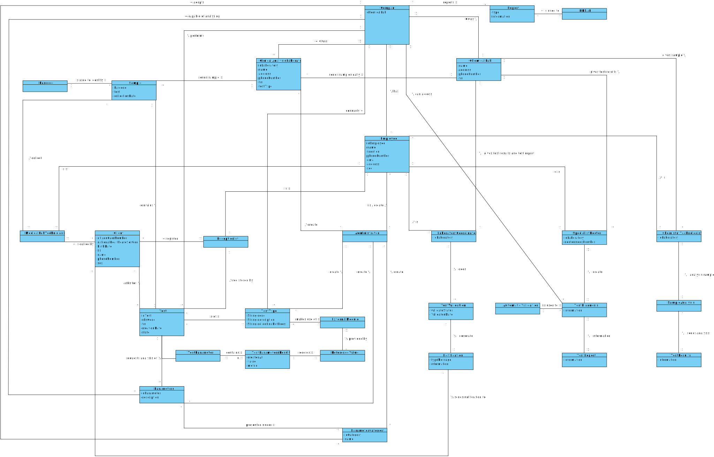

# OO Analysis #

The construction process of the domain model is based on the client specifications, especially the nouns (for _
concepts_) and verbs (for _relations_) used.

## Rationale to identify domain conceptual classes ##

### _Conceptual Class Category List_ ###

**Business Transactions**

* Tests

---

**Transaction Line Items**

* Samples

---

**Product/Service related to a Transaction or Transaction Line Item**

* Blood Analysis
* Covid-19 Tests

---

**Transaction Records**

* Test Register to ChemistryTechnologist
* Tests Results to Specialist Doctor
* Diagnosis and Tests Results to Laboratory Coordinator
* Diagnosis and Tests Results to client
* Covid-19 Reports to NHS
* Diary Reports to NHS

---  

**Roles of People or Organizations**

* Client
* Administrator
* Receptionist
* Medical Lab Technician
* Clinical Chemistry Technologist
* Specialist Doctor
* Laboratory Coordinator

---

**Places**

* Company's Headquarters
* Chemical Laboratory
* Clinical Analysis Laboratory

---

**Noteworthy Events**

* Chemical Analysis
* Client Register

---

**Physical Objects**

* Needle
* Swab

---

**Descriptions of Things**

* Type of Test
* Parameters of Test
* Category of Test
* Sample Identification

---

**Organizations**

* Many Labs
* NHS

---

**Other External/Collaborating Systems**

* NHS API
* Module Automatic Validation
* Barcode External API

---

**Records of finance, work, contracts, legal matters**

* Test Results
* Diagnosis
* CovidReport
* NHSReport
* Covid Tests Exclusivity
* Performance Report

---

**Documents mentioned/used to perform some work/**

* Lab Order
* Test Register
* Client Notification
* User Manual

---

### **Rationale to identify associations between conceptual classes**###

| Concept (A)         |  Association       |  Concept (B) |
|----------           |:-------------:     |------:       |
|Administrator|create|ParameterCategory|
|Administrator|create|Parameters|
|Administrator|create|TestType|
|Administrator|create|ClinicalAnalysisLaboratory|
|Administrator|is/create|Employee|
|AutomaticValidation | is used to | TestDiagnosis |
|Barcode | is used to identify | Sample |
|ChemicalLab | gives sample | ChemistryTechnologist |
|ChemicalLab | gives test results and test report | LaboratoryCoordinator |
|ChemicalLab | gives test results | SpecialistDoctor |
|ChemistryTechnologist | analysis sample | SampleAnalysis |
|ChemistryTechnologist | is | Employee |
|Client | is called by | MedicalLabTechnicians |
|Client | asks for | Test |
|ClinicalAnalysisLaboratory| sends samples daily | ChemicalLab |
|Company | owns | ChemicalLab |
|Company | owns | ClinicalAnalysisLaboratory |
|Company | reports |Report |
|Company |performs| Test|
|Company | has | Employee |
|Company | adopts | ParameterCategory |
|Company |capable of analysing | Parameters |
|Company | conducts |TestType |
|Company | can access | TestDiagnosis |
|Company | reports |PerformanceReport |
|ExternalModule|provided by|ReferenceValue|
|LaboratoryCoordinator | does | TestValidation |
|LaboratoryCoordinator | runs | PerformanceReport |
|LaboratoryCoordinator | is | Employee |
|MedicalLabTechnicians | collect | Sample |
|MedicalLabTechnicians | is | Employee |
|NHSAPI | is used to |Report|
|Notification | sends notification to | Client |
|Parameters | presented under | ParameterCategory |
|Parameters | request analysis for | TestParameter |
|PerformanceData | is part of | PerformanceReport |
|Receptionist|register|Client|
|Receptionist|is|Employee|
|Sample | sends sample | ClinicalAnalysisLaboratory|
|Sample|contains|Test|
|SampleAnalysis | sends analysis | TestResults |
|SpecialistDoctor | create | TestDiagnosis |
|SpecialistDoctor | is | Employee |
|Test | registered by | Receptionist |
|Test | is of | TestType |
|TestParameter | request analysis for | Parameters | 
|TestParameter | contains | TestParametersResult | 
|TestParametersResult|records |ReferenceValue|
|TestDiagnosis | information | TestReport |
|TestType|makes use of |ExternalModule|
|TestValidation | generate |Notification |

## Domain Model

