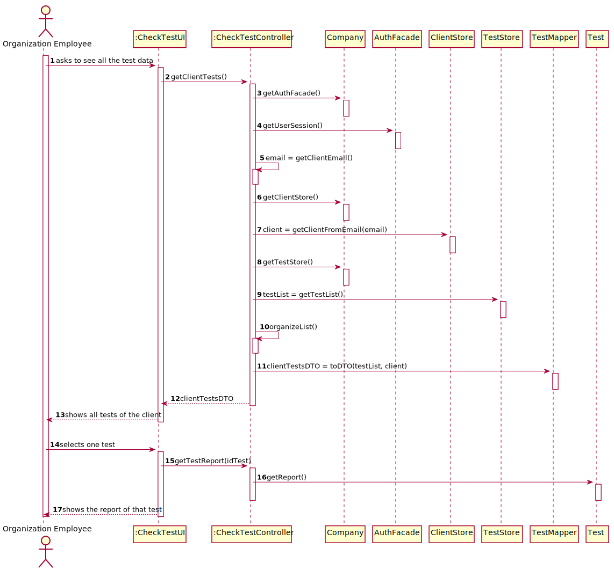

# US 001 - View Test Results

## 1. Requirements Engineering

### 1.1. User Story Description

As a client, I want to access the application to view the results of the tests I have performed.

### 1.2. Customer Specifications and Clarifications 

**From the specifications document:**

* The client receives a notification alerting that the results are already available in the central application and informing that he/she must access the application to view those results.

**From the client clarifications:**

> **Question:** Which date should be used to arrange the tests in order? The date the test is done or the validation date?
>  
> **Answer:** The test registration date.

### 1.3. Acceptance Criteria

* **AC1:** The client needs to be logged in the system.
* **AC2:** The tests need to be organized by registration date.
* **AC3:** The tests need to be in Validated state.
* **AC4:** The test report should only appear after the client selects the test

### 1.4. Found out Dependencies

* There is a dependency to "US003 Register a Client" since the client needs to be able to register in the system to have any tests.
* There is a dependency to "US004 Register a Client" because for the client to have any information on any test, they need to be registered first.

### 1.5 Input and Output Data

**Input Data:**

* Selected
    * Test

**Output Data:**

* Tests with Validated State
* Test Report

### 1.6. System Sequence Diagram (SSD)

## 2. OO Analysis

### 2.1. Relevant Domain Model Excerpt 

## 3. Design - User Story Realization 

### 3.1. Rationale

| Interaction ID                                              | Question: Which class is responsible for...    | Answer              | Justification (with patterns)                                                                                                         |
| :-------------                                              | :---------------------                         | :------------       | :----------------------------                                                                                                         |
| **Step 1 -** *Client* asks to see all the tests             | ... interacting with the actor?                | CheckTestUI         | **Pure Fabrication:** there is no reason to assign this responsibility to any existing class in the Domain Model.                     |
|                                                             | ... coordinating the US?                       | CheckTestController | **Controller**                                                                                                                        |
|                                                             | ... knowing the user using the system?         | AuthFacade          | **IE:** cf. A&A component documentation.                                                                                              |
|                                                             | ... instantiating the ClientStore              | Company             | **HC + LC:** Company knows the ClientStore to which it is delegating some tasks                                                       |
|                                                             | ... getting the Client object needed?          | ClientStore         | **IE:** class stores the information of the Client class which has its own data                                                       |
|                                                             | ... instantiating the TestStore                | Company             | **HC + LC:** Company knows the TestStore to which it is delegating some tasks                                                         |
|                                                             | ... getting the list of tests                  | TestStore           | **IE:** class stores the information of the Test class which has its own data                                                         |
|                                                             | ... transfer the data on the domain to the UI? | TestDTO             | **DTO:** When there is so much data to transfer, it is better to opt by using a DTO in order to reduce coupling between UI and domain |
| **Step 2 -** *System* shows all the test data of the client |                                                |                     |                                                                                                                                       |
| **Step 3 -** *Client* selects one test                      | ...getting the test report                     | Test                | **IE:** The test contains its own report                                                                                              |
| **Step 4 -** *System* shows the report of that test         |                                                |                     |                                                                                                                                       |

### Systematization ##

According to the taken rationale, the conceptual classes promoted to software classes are: 

 * Company
 * Client
 * Test

Other software classes identified: 

 * CheckTestUI  
 * CheckTestController
 * AuthFacade
 * ClientStore
 * TestStore
 * TestDTO

## 3.2. Sequence Diagram (SD)

## 3.3. Class Diagram (CD)

# 4. Tests

* This US was entirely done on a controller, so there are no tests

# 5. Construction (Implementation)

## Class CheckTestsController 

    public CheckTestsController() {
        clientsStore = company.getClientStore();
        authFacade = company.getAuthFacade();
        
        testStore = company.getTestStore();
        clientStore = company.getClientStore();
    }

    public List<Test> getClientTests() {
        String email = authfacade.getCurrentUserSession().getEmail();
        client = clientStore.getClientFromEmail(email);
  
        testList = testStore.getTests();

        for (Test test : testList) {
            if (test.getTin().equalsIgnoreCase(client.getTin())) {
                clientTestList.add(test);
            }
        }
        return clientTestList;
    }

    public List<Test> organizeClientTestList(List<Test> clientTestList) {

        //ommited

        return clientTestList;
    }

    public TestReport getTestReport(String nhsCode) {
        for(Test test : testList) {
            if(test.getNhsCode().equalsIgnoreCase(nhsCode)){
                return test.getReport();
            }
        }
        return null;
    }

# 6. Integration and Demo 

* A new option on the Client menu options was added.

* Some demo purposes some tasks are bootstrapped while system starts.

# 7. Observations

* Nothing to appoint.

