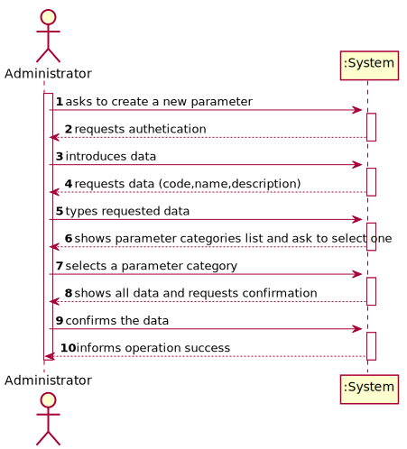
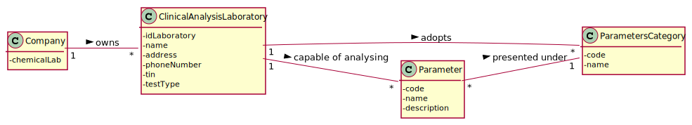
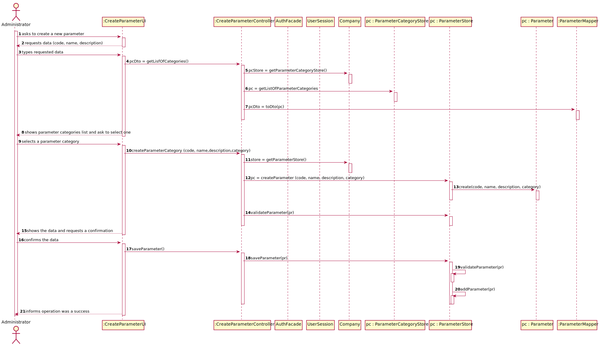
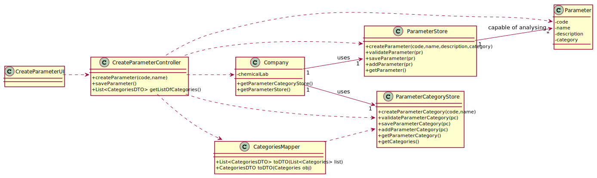

# US 006 - To create a Task 

## 1. Requirements Engineering

### 1.1. User Story Description

As an administrator, I want to specify a new parameter and categorize it.

### 1.2. Customer Specifications and Clarifications 

**From the specifications document:**

>	"the lab order (which contains the type of test and parameters to be measured)"

>	"Blood tests are frequently characterized by measuring several parameters which for presentation/reporting purposes are organized by categories"

>	"For example, parameters such as the number of Red Blood Cells (RBC), White Blood Cells (WBC) and Platelets (PLT) are
usually presented under the blood count (Hemogram) category"

> "Covid tests are characterized by measuring a single parameter stating whether it is a positive
or a negative result."

**From the client clarifications:**

> **Question:** Can a parameter be classified in more than one parameter category?
>  
> **Answer:** No. Each parameter has only one category. There are no subcategories.

-

> **Question:** Monetary data is expressed in any particular currency?
>  
> **Answer:** Monetary data (e.g. estimated cost of a task) is indicated in POTs (virtual currency internal to the platform).

-

> **Question:** Is the categorization of a parameter mandatory or optional?
>
> **Answer:** Yes.

- 

> **Question:** How does the assignment of a parameter category works? Does he have to select the category or he have the option to create in the moment?
>
> **Answer:** There exists a user story to specify a new parameter category. Therefore, the administrator should select one category when creating a parameter.

- 

> **Question:** Does the administrator need to log in order to create a parameter and categorize it?
>
> **Answer:** Yes.

-

> **Question:** What is the data that characterize a parameter? Should we follow the same data as the parameter category, for example, would each parameter have its own code, description and NHS identifier?
>
> **Answer:** Each parameter is associated with one category. Each parameter has a Code, a Short Name and a Description.

### 1.3. Acceptance Criteria

* **AC1:** The Code are five alphanumeric characters.
* **AC2:** The Short Name is a String with no more than 8 characters.
* **AC3:** The Description is a String with no more than 20 characters.
* **AC4:** All the parameters created need to be categorized in only one parameter category

### 1.4. Found out Dependencies

* There is a dependency to "US11 Create a new parameter category" since every single parameter is only created if they are categorized in only one parameter category.

### 1.5 Input and Output Data

**Input Data:**

* Typed data:
	* a code, 
	* a name,
	* a description

* Selected data:
	* Parameter Category 

**Output Data:**

* The list of parameter categories
* (In)Success of the operation

### 1.6. System Sequence Diagram (SSD)

**Alternative 1**

**Other alternatives might exist.**

## 2. OO Analysis

### 2.1. Relevant Domain Model Excerpt 

## 3. Design - User Story Realization 

### 3.1. Rationale

**SSD - Alternative 1 is adopted.**

| Interaction ID | Question: Which class is responsible for... | Answer  | Justification (with patterns)  |
|:-------------  |:--------------------- |:------------|:---------------------------- |
| Step 1 - asks to create a new parameter 		 |	... interacting with the actor? | CreateParameterUI   |  Pure Fabrication: there is no reason to assign this responsibility to any existing class in the Domain Model.           |
| 			  		 |	... coordinating the US? | CreateParameterController | Controller                             |
| 			  		 |	... instantiating a new Task? | ClinicalAnalysisLaboratory or ParameterStore   | Creator: R1/2.   |
| Step 2 - requests for authentication	  		 | ... ask the use to login in the system?  | AuthFacade  | IE: cf. A&A component documentation.  |
| Step 3 - introduces data 		 |	... knowing which use is using the system		 | UserSession        | IE: cf. A&A component documentation.                             |
| Step 4 - requests data (code,name,description) 		 |							 |             |                              |
| Step 5 - typed requested data 		 |	...saving the inputted data? | Parameter  | IE: object created in step 1 has its own data.  |
| Step 6 - shows parameter categories list and ask to select one 		 |	...knowing the parameter categories to show? | ParameterCategoryStore  | IE: Parameter Categories are defined by the ParameterCategory class. |
| Step 7 - selects a parameter category 		 |	... saving the selected category? | Parameter  | IE: object created in step 1 is classified in one Category.  |
| Step 8 - shows all data and requests confirmation 		 |							 |             |                              |              
| Step 9 - confirms data 		 |	... validating all data (local validation)? | Parameter | IE: owns its data.| 
| 			  		 |	... validating all data (global validation)? | ClinicalAnalysisLaboratory | IE: knows all its tasks.| 
| 			  		 |	... saving the created parameter? | ClinicalAnalysisLaboratory | IE: owns all its tasks.| 
| Step 10  		 |	... informing operation success?| CreateTaskUI  | IE: is responsible for user interactions.  | 

### Systematization ##

According to the taken rationale, the conceptual classes promoted to software classes are: 

 * ClinicalAnalysisLaboratory
 * Parameter
 * UserSession
* AuthFacade

Other software classes (i.e. Pure Fabrication) identified: 

 * CreateParameterUI  
 * CreateParameterController
 * ParameterStore
* ParameterCategoryStore

## 3.2. Sequence Diagram (SD)

**Alternative 1**

## 3.3. Class Diagram (CD)

**From alternative 1**

# 4. Tests 

**Test 1:** Check that it is not possible to create an instance of the Parameter class with null values. 

    @Test(expected = IllegalArgumentException.class)
    public void createParameterNullv1() {
        ParameterStore test = new ParameterStore();

        test.createParameter(null,null,null,null);
    }

**Test 2:** Check that it is not possible to create an instance of the Parameter class with a code containing less than 5 chars - AC1.

	@Test(expected = IllegalArgumentException.class)
    public void createParameterCategoryNullV2() {
        ParameterCategoryStore test = new ParameterCategoryStore();

        test.createParameterCategory("12345",null);
    }

**Test 3:** Check that it is not possible to create an instance of the Parameter class with a code containing more than 5 chars - AC1.

	@Test(expected = IllegalArgumentException.class)
    public void createParameterAC1v2() {
        ParameterStore test = new ParameterStore();
        ParameterCategory cat = new ParameterCategory("12345","name");

        test.createParameter("1","name","description",cat);
    }

**Test 4:** Check that it is not possible to create an instance of the Parameter class with a name containing more than 8 chars - AC2.
	
	@Test(expected = IllegalArgumentException.class)
    public void createParameterAC2() {
        ParameterStore test = new ParameterStore();
        ParameterCategory cat = new ParameterCategory("12345","name");

        test.createParameter("12345","very big name","description",cat);
    }

**Test 4:** Check that it is not possible to create an instance of the Parameter class with a description containing more than 20 chars - AC3.

	@Test(expected = IllegalArgumentException.class)
    public void createParameterAC3() {
        ParameterStore test = new ParameterStore();
        ParameterCategory cat = new ParameterCategory("12345","name");

        test.createParameter("12345","name","description with more than twenty chars",cat);
    }

**Test 5:** Check that it is not possible to create an instance of the Parameter class with a ParameterCategory object null - AC4.
	
	@Test(expected = IllegalArgumentException.class)
    public void createParameterNullv4() {
        ParameterStore test = new ParameterStore();

        test.createParameter("12345","name","description",null);
    }

*It is also recommended to organize this content by subsections.* 

# 5. Construction (Implementation)

## Class Parameter

		public class Parameter {
			private final String code;
			private final String name;
			private final String description;
			private final ParameterCategory cat;
		

			public Parameter(String code, String name, String description, ParameterCategory cat) {
				checkCodeRules(code);
				checkNameRules(name);
				checkDescriptionRules(description);
				checkCategoryRules(cat);
				this.code = code;
				this.name = name;
				this.description = description;
				this.cat = cat;
			}

			public String getCode() {
				return code;
			}
		

			public String getName() {
				return name;
			}
		

			public String getDescription() {
				return description;
			}

			public ParameterCategory getCat() {
				return cat;
			}
		

			private void checkCodeRules(String code) {
				if (StringUtils.isBlank(code))
					throw new IllegalArgumentException("Code cannot be blank.");
				if ( (code.length() != 5))
					throw new IllegalArgumentException("Code must have 5 chars.");
			}
		

			private void checkNameRules(String name){
				if (StringUtils.isBlank(name)){
					throw new IllegalArgumentException("Name cannot be blank.");
				}
				if ( (name.length() > 8))
					throw new IllegalArgumentException("Name mustn't have more than 8 characters.");
			}
		

			private void checkDescriptionRules(String description){
				if (StringUtils.isBlank(description)){
					throw new IllegalArgumentException("Description cannot be blank.");
				}
				if ( (description.length() > 20))
					throw new IllegalArgumentException("Name mustn't have more than 20 characters.");
			}
		

			private void checkCategoryRules(ParameterCategory cat){
				if(cat == null){
					throw new IllegalArgumentException("Category cannot be blank.");
				}
			}
		}

## Class ParameterStore

		public class ParameterStore {
			private static final List<Parameter> parameterList = new ArrayList<Parameter>();
			private static Parameter pr;
		

			public static Parameter createParameter(String code, String name, String description, ParameterCategory cat) {
				pr = new Parameter(code, name, description, cat);
				return pr;
			}
		

			public static boolean validateParameter(Parameter pc) {
				if (pc == null)
					return false;
		
				for (Parameter cat : parameterList){
					if (pc.getCode().equalsIgnoreCase(cat.getCode())){
						return false;
					}
				}
				return true;
			}

			public static boolean saveParameter(Parameter pc) {
				if (!validateParameter(pc))
					return false;
				return parameterList.add(pc);
			}

			public static List<ParameterCategory> getParameterCategory(ParameterCategoryStore store){
				return store.getPcList();
			}

			public static Parameter getPr(){
				return pr;
			}

			public String toString(){
				StringBuilder sb = new StringBuilder();
				for (Parameter par : this.parameterList){
					sb.append("Code: " + par.getCode() + "\nName: " + par.getName() + "\nDescription: " + par.getDescription() + "\nParameter Category Code: " + par.getCat().getCode() + "\nParameter Category Name: " + par.getCat().getName() + "\n\n");
				}
				return sb.toString();
			}
		}

## Class ParameterController 

	public class ParameterController {
	
		private Parameter pc;
		private ParameterStore list;

		public ParameterController() {
			this.pc = null;
		}
	
		
		public boolean createParameter(String code, String name, String description, ParameterCategory cat) {
			list = Platform.getParameter();
			pc = list.createParameter(code,name,description,cat);
			return true;
		}
	
		
		public boolean saveParameter() {
			return this.list.saveParameter(pc);
		}
	
		
		public ParameterStore getList(){
			return list;
		}
	
	}

## Class Platform

		public class ClinicalAnalysisLaboratory {
			private static ParameterStore parameterList;

			public static ParameterStore getParameter(){
				return parameterList = new ParameterStore();
			}
			
			
		}

# 6. Integration and Demo 

* A new option on the Employee menu options was added.

* Some demo purposes some tasks are bootstrapped while system starts.

# 7. Observations

Platform and Organization classes are getting too many responsibilities due to IE pattern and, therefore, they are becoming huge and harder to maintain. 

Is there any way to avoid this to happen?

