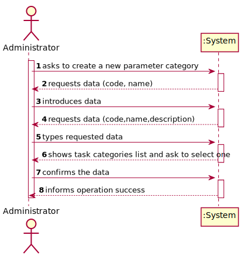
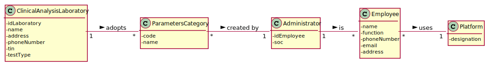
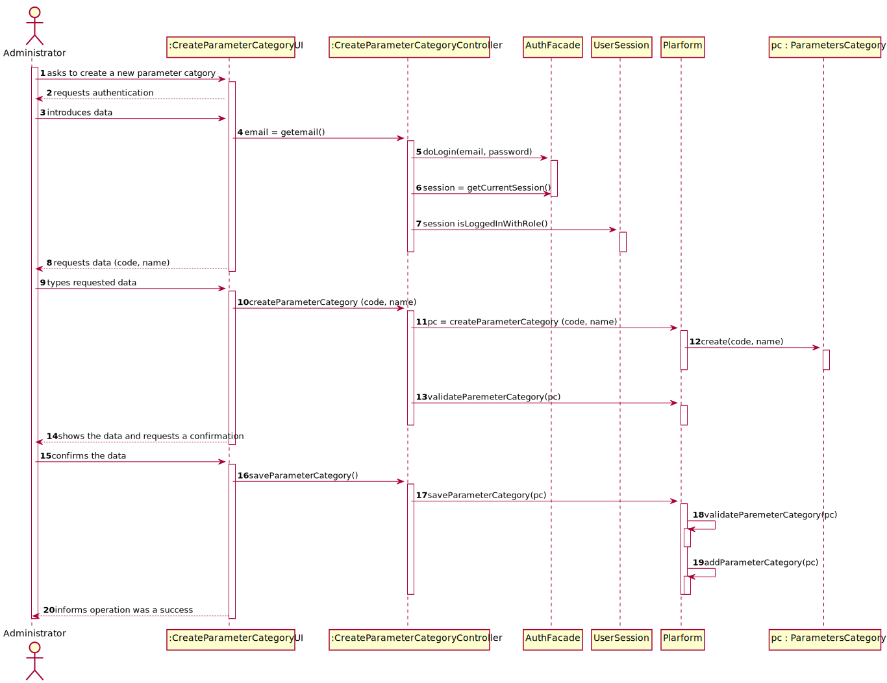
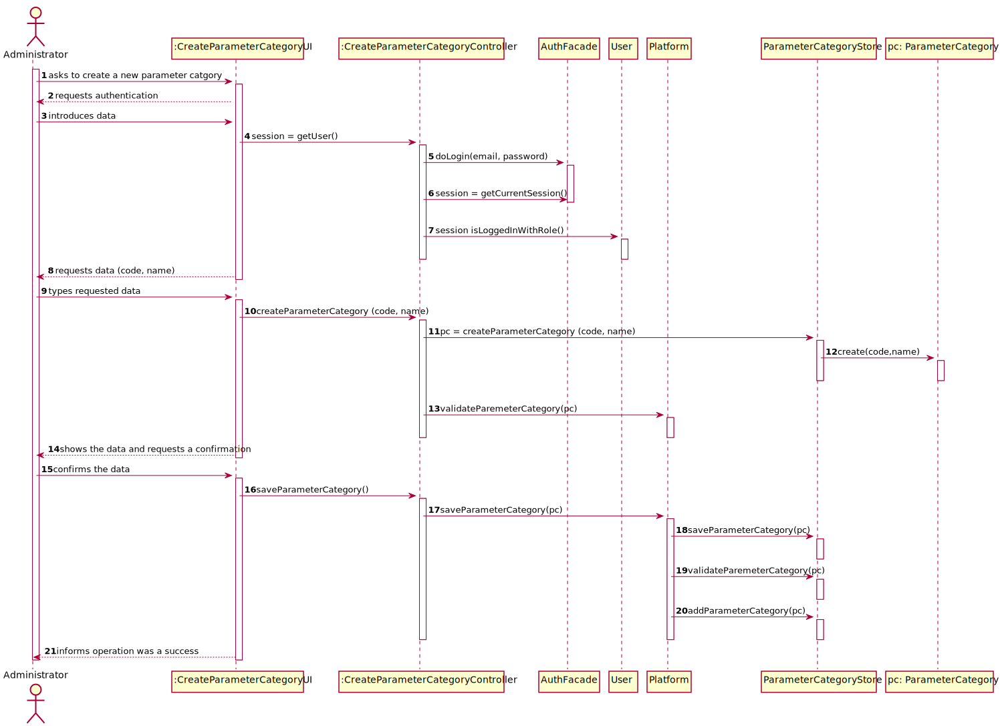
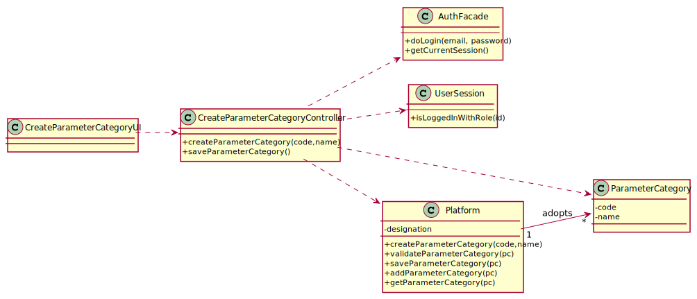
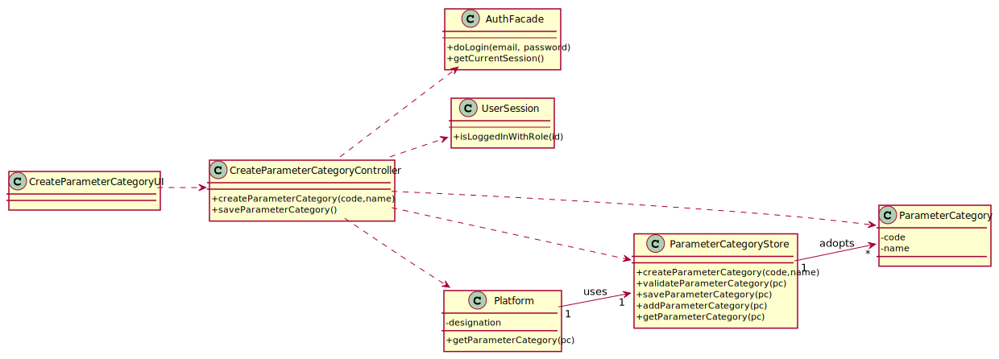

# US 006 - To create a Task 

## 1. Requirements Engineering

### 1.1. User Story Description

As an administrator, I want to specify a new parameter category.

### 1.2. Customer Specifications and Clarifications 

**From the specifications document:**

>	“Blood tests are frequently characterized by measuring several parameters which for presentation/reporting purposes are organized
by categories. For example, parameters such as the number of Red Blood Cells (RBC), White Blood Cells (RBC) and Platelets (PLT) are
usually presented under the blood count (Hemogram) category.”

>	“Regardless, such tests rely on measuring one or more parameters that can be grouped/organized by categories.”

**From the client clarifications:**

> **Question:** What are the data that characterize a parameter category?
>  
> **Answer:** Simply consider a code, a description and an NHS identifier

-

> **Question:** What are the information related to Parameter Category?
>  
> **Answer:** Each category has a name and a unique code

### 1.3. Acceptance Criteria

* **AC1**: Code must be unique having 4 to 8 chars
* **AC2**: Code cannot contain letters
* **AC3**: Name cannot be empty and has, at maximum, 40 chars

### 1.4. Found out Dependencies

* No dependencies were found.

### 1.5 Input and Output Data

**Input Data:**

* Typed data:
	* a code, 
	* a name
	
* Selected data:
	* none 

**Output Data:**

* (In)Success of the operation

### 1.6. System Sequence Diagram (SSD)

**Alternative 1**

**Other alternatives might exist.**

## 2. OO Analysis

### 2.1. Relevant Domain Model Excerpt 

### 2.2. Other Remarks

n/a

## 3. Design - User Story Realization 

### 3.1. Rationale

**SSD - Alternative 1 is adopted.**

| Interaction ID | Question: Which class is responsible for... | Answer  | Justification (with patterns)  |
|:-------------  |:--------------------- |:------------|:---------------------------- |
| Step 1 - asks to create a new paremeter category  		 |	... interacting with the actor? | CreateParameterCategoryUI   |  Pure Fabrication: there is no reason to assign this responsibility to any existing class in the Domain Model.           |
| 			  		 |	... coordinating the US? | CreateParameterCategoryController | Controller                             |
| 			  		 |	... instantiating a new Parameter Category? | ClinicalAnalysisLaboratory   | Creator: R1/2   |
| Step 2 - requests for authentication	  		 | ... ask the use to login in the system?  | AuthFacade  | IE: cf. A&A component documentation.  |
| Step 3 - introduces data 		 |	... knowing which use is using the system		 | UserSession        | IE: cf. A&A component documentation.                             |
| Step 4 - requests data (code, name)		 |							 |             |                              |
| Step 5 - types requested data		 |	...saving the inputted data? | ParameterCategory  | IE: object created in step 1 has its own data.  |
| Step 6 - shows the data and requests a confirmation		 |	...validating the data locally (e.g.: mandatory vs. non-mandatory data)? | ParameterCategory  | IE: knows its own data. |
| 														      | ...validating the data globally (e.g.: duplicated)? | ClinicalAnalysisLaboratory | IE: knows all the ParameterCategory objects |
| Step 7 - confirms the data 		 |	...saving the created parameter category? | ClinicalAnalysisLaboratory  | IE: records all the ParameterCategory objects |
| Step 8 - informs operation success		 |	...informing operation was a success?						 | CreateParameterCategoryUI          |    IE: responsible for user interaction                            |              

### Systematization ##

According to the taken rationale, the conceptual classes promoted to software classes are: 

 * ClinicalAnalysisLaboratory
 * UserSession
* AuthFacade
 * ParameterCategory

Other software classes (i.e. Pure Fabrication) identified: 

 * CreateParameterCategoryUI 
 * CreateParameterCategoryController

## 3.2. Sequence Diagram (SD)

**Alternative 1**

**Alternative 2**

## 3.3. Class Diagram (CD)

**From alternative 1**

**From alternative 2**

# 4. Tests 

**Test 1:** Check that it is not possible to create an instance of the ParameterCategory class with null values. 

    @Test(expected = IllegalArgumentException.class)
    public void createParameterCategoryNull() {
        ParameterCategoryStore test = new ParameterCategoryStore();

        test.createParameterCategory(null,null);
    }

**Test 2:** Check that it is not possible to create an instance of the ParameterCategory class with one value null.

	@Test(expected = IllegalArgumentException.class)
    public void createParameterCategoryNullV2() {
        ParameterCategoryStore test = new ParameterCategoryStore();

        test.createParameterCategory("12345",null);
    }

**Test 3:** Check that it is not possible to create an instance of the ParameterCategory class with a code containing less than 5 chars - AC1. 

	@Test(expected = IllegalArgumentException.class)
    public void createParameterCategoryAC1v1() {
        ParameterCategoryStore test = new ParameterCategoryStore();

        test.createParameterCategory("1","name");
    }

**Test 4:** Check that it is not possible to create an instance of the ParameterCategory class with a code containing more than 5 chars - AC1.

	@Test(expected = IllegalArgumentException.class)
	public void createParameterCategoryAC1v2() {
		ParameterCategoryStore test = new ParameterCategoryStore();

        test.createParameterCategory("123456","name");
    }

**Test 5:** Check that it is not possible to create an instance of the ParameterCategory class with a name containing more than 10 chars - AC2.

	@Test(expected = IllegalArgumentException.class)
    public void createParameterCategoryAC2() {
        ParameterCategoryStore test = new ParameterCategoryStore();

        test.createParameterCategory("12345","name with more than 10 chars");
    }
	

*It is also recommended to organize this content by subsections.* 

# 5. Construction (Implementation)

## Class ParameterCategory

		public class ParameterCategory {

			private final String code;
			private final String name;
		
	
			public ParameterCategory(String code, String name) {
				checkCodeRules(code);
				checkNameRules(name);
				this.code = code;
				this.name = name;
			}
		

			public String getCode() {
				return code;
			}
		

			public String getName() {
				return name;
			}
		

			private void checkCodeRules(String code) {
				if (StringUtils.isBlank(code))
					throw new IllegalArgumentException("Code cannot be blank.");
				if ( (code.length() != 5))
					throw new IllegalArgumentException("Code must have 4 to 8 chars.");
			}
		

			private void checkNameRules(String name){
				if (StringUtils.isBlank(name)){
					throw new IllegalArgumentException("Name cannot be blank.");
				}
				if ( (name.length() > 10))
					throw new IllegalArgumentException("Name mustn't have more than 40 characters.");
			}
		
		}

## Class ParameterCategoryStore

		public class ParameterCategoryStore {
		
			private static final List<ParameterCategory> parameterCategoryList = new ArrayList<>();
			private static ParameterCategory pc;
		
			
			public static ParameterCategory createParameterCategory(String code, String name) {
				pc = new ParameterCategory(code, name);
				return pc;
			}
		
			public static boolean validateParameterCategory(ParameterCategory pc) {
				if (pc == null)
					return false;
		
				for (ParameterCategory cat : parameterCategoryList){
					if (pc.getCode().equalsIgnoreCase(cat.getCode())){
						return false;
					}
				}
				return true;
			}

			public static boolean saveParameterCategory(ParameterCategory pc) {
				if (!validateParameterCategory(pc))
					return false;
				return parameterCategoryList.add(pc);
			}
		
			public static ParameterCategory getPc(){
				return pc;
			}

			public static List<ParameterCategory> getPcList(){
				return parameterCategoryList;
			}

			public String toString(){
				StringBuilder sb = new StringBuilder();
				 for (ParameterCategory cat : parameterCategoryList){
					 sb.append("Code: " + cat.getCode() + "\nName: " + cat.getName() + "\n\n");
				 }
				 return sb.toString();
			}
		
		}

## Class Platform

		public class ClinicalAnalysisLaboratory {

			private static ParameterCategoryStore parameterCategoryList;

			public static ParameterCategoryStore getParameterCategory(){
				return parameterCategoryList = new ParameterCategoryStore();
			}
			
			
		}

## Class ParameterCategoryController

		public class ParameterCategoryController {

			private ParameterCategory pc;
			private ParameterCategoryStore list;
		

			public ParameterCategoryController() {
				this.pc = null;
			}
		

			public boolean createParameterCategory(String code, String name) {
				list = Platform.getParameterCategory();
				pc = list.createParameterCategory(code,name);
				return true;
		
			}
		

			public boolean saveParameterCategory() {
				return list.saveParameterCategory(pc);
			}
		

			public ParameterCategoryStore getList(){
				return list;
			}
		

			public String toString(){
				return list.toString();
			}
		}

# 6. Integration and Demo 

* A new option on the Employee menu options was added.

* Some demo purposes some tasks are bootstrapped while system starts.

# 7. Observations

SD and CD might be confusing

Will it be enough to use only the ClinicalAnalysisLaboratory class or using a support class like ParameterCategoryStore will be better?

