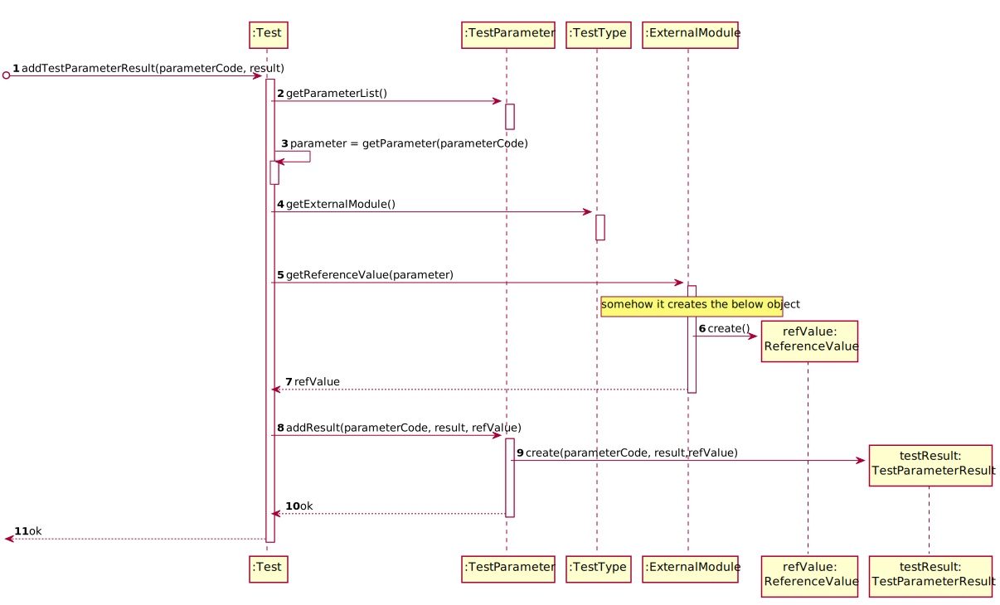

# US 12 -  Record the Tests Results

## 1. Requirements Engineering

### 1.1. User Story Description

As a clinical chemistry technologist, I intend to record the results of a given test.

### 1.2. Customer Specifications and Clarifications 

**From the specifications document:**
* "the clinical chemistry technologist receives the samples (delivered by a courier) and performs the chemical analysis, recording the results in the software application."
* "the application uses an external module that is responsible for doing an automatic validation using test reference values."
* "the results are also available in the central application where the clinical chemistry technologist can check them"
* "All those who wish to use the application must be authenticated with a password holding seven alphanumeric characters, including three capital letters and two digits."

**From the client clarifications:**
> **Question:** "When the Clinical Chemistry Technologist wants to record the results of a test, how does he has access to that test? By internal code, NHS code?"
>  
> **Answer:** "Each sample has a unique barcode. The clinical chemistry technologist should use the sample barcode number to find the test for which the sample was collected."
-
> **Question:** "Should the system present a result for each test parameter or a single result for the test to be recorded?"
> 
> **Answer:** "The Clinical Chemistry Technologist should register a value/result for each parameter of the test."
-
> **Question:** "Does this 'at most' express that there are some parameters of the API request that are optional? If so, could you clarify the parameters that are optional?"
> 
> **Answer:** " 'At most' means the maximum number of parameters that will be used. Depending on the API being used, all parameters above may be required or some may be optional."
-
> **Question:** "When you intend to record the results of the Blood Test, do you want to introduce all results for all parameters or just only one?"
> 
> **Answer:** "The clinical chemistry technologist should record all results related to a test at a given time/moment."
-
> **Question:** "The results of the tests can be negative or there are any restriction in this particular variable?"
>
> **Answer:** "The result/value of one parameter is related with the type of parameter we are measuring. To get an idea, please check the values returned by the external modules (jar APIs)."

### 1.3. Acceptance Criteria

* **AC1:** The application should use an external module that is responsible for providing the test reference values.
* **AC2:** The result is characterized by reference value, metric and result value.
* **AC3:** The Clinical Chemistry Technologist should use the sample barcode number to find the test for which the sample was collected.
* **AC4:** The Clinical Chemistry Technologist should register a value/result for each parameter of the test.
* **AC5:** The Clinical Chemistry Technologist should record all results related to a test at a given time/moment.

### 1.4. Found out Dependencies

* Has a dependency on US4, as the receptionist needs to register the test first.
* Has a dependency on US5, as the medical lab technician needs to collect and record the sample first.
* Has a dependency on US7, as the administrator needs to create a clinical chemistry technologist first.

### 1.5 Input and Output Data

**Input Data:**

* Type Data
    * Sample Barcode
    * Value
  

* Select Data
    * (none)

**Output Data:**
* Creation of a test result
* (in)success of the operation 

### 1.6. System Sequence Diagram (SSD)

## 2. OO Analysis

### 2.1. Relevant Domain Model Excerpt 

## 3. Design - User Story Realization 

### 3.1. Rationale

**The rationale grounds on the SSD interactions and the identified input/output data.**

| Interaction ID | Question: Which class is responsible for... | Answer  | Justification (with patterns)  |
|:-------------  |:--------------------- |:------------|:---------------------------- |
| **Step 1 -** *Chemistry Technologist* asks to record the results of a given test |... interacting with the chemistry technologist?| TestResultsRecordUI| 	**Pure Fabrication:** There is no reason to assign this responsibility to any existing class in the Domain Model.|
| |... coordinating the US?|TestResultsRecordController|**Controller**|
| **Step 2 -** *System* requests the sample barcode| | | |
| **Step 3 -** *Chemistry Technologist* types the sample barcode|  ... knows TestStore?	 |  Company   |  **HC + LC:** Company knows the TestStore to which it is delegating some tasks |
| | ... knowing all tests?|TestsStore|**IE:** knows its own tests|
| |  ... knows SampleStore?	 |  Company   |  **HC + LC:** Company knows the SampleStore to which it is delegating some tasks |
| | ... knowing all samples?|SampleStore|**IE:** knows its own samples|
| |... verified if the tests already have results|Test|**IE:** the test knows what state it is in|
| |...transfer the date between the domain and the UI?|TestParameterDTO|**DTO:** When there is so much data to transfer, it is better to opt by using a DTO in order to reduce coupling between UI and domain|
| **Step 4 -** *System* shows one parameter at a time and request the respective result value| | | | |
| **Step 5 -** *Chemistry Technologist* types the result value| ... reference values?| ExternalModule | **Protected Variations:** The system needs adapts the different API's|
| |... getting the external module?| TestType| **IE:** know which API has to getting|  
| |... saving the data?|ReferenceValue|**IE:**  ReferenceValue knows its own data|
| |... create the TestParameterResult object| TestParameter | **Creator:** TestParameter object contains TestParameterResult object|
| **Step 6 -** *System* shows all data and request confirmation| | | |
| **Step 7 -** *Chemistry Technologist* confirm the data | ... change the state of the test?| Test | **IE:** the test can change its own state|
| **Step 8** - *System* informs operation success| ... informing operation success? | TestResultsRecordUI | **IE:** is responsible for user interactions|

### Systematization ##

According to the taken rationale, the conceptual classes promoted to software classes are: 

 * Company
 * TestsStore
 * SampleStore
 * Test
 * TestType
 * ReferenceValue
 * TestParameter

Other software classes (i.e. Pure Fabrication) identified: 
 * TestResultsRecordUI  
 * TestResultsRecordController
 * TestParameterDTO
 * TestParameterMapper

## 3.2. Sequence Diagram (SD)

## 3.3. Class Diagram (CD)

# 4. Tests 

    Tests related to AC1

    @Test
    public void checkGetMetric(){
        String expected = "mm/hr";
        Assert.assertEquals(expected, refValue.getMetric());
    }

    @Test
    public void checkGetMetricWrong(){
        String expected = "mm";
        Assert.assertNotEquals(expected, refValue.getMetric());
    }

    @Test
    public void checkGetRefMin(){
        String expected = "1.0";
        Assert.assertEquals(expected, String.valueOf(refValue.getMinRefValue()));
    }

    @Test
    public void checkGetRefMinWrong(){
        String expected = "0.0";
        Assert.assertNotEquals(expected, String.valueOf(refValue.getMinRefValue()));
    }

    @Test
    public void checkGetRefMax(){
        String expected = "10.0";
        Assert.assertEquals(expected, String.valueOf(refValue.getMaxRefValue()));
    }

    @Test
    public void checkGetRefMaxWrong(){
        String expected = "0.0";
        Assert.assertNotEquals(expected, String.valueOf(refValue.getMaxRefValue()));
    }

    
    Tests related to AC2

    @Test
    public void getRefValue(){
        RefValue expected = new RefValue("mm/hr", 1.0, 10.0);

        TestParameterResult testParameterResult = new TestParameterResult("WBC00",5.0);
        testParameterResult.setRefValue(expected);

        RefValue actual = testParameterResult.getRefValue();

        assertEquals(expected, actual);
    }

    @Test
    public void getRefValueWrong(){
        TestParameterResult testParameterResult = new TestParameterResult("WBC00",5.0);

        RefValue refvalue = testParameterResult.getRefValue();

        Assert.assertNull(refvalue);
    }

    @Test
    public void setRefValue(){
        RefValue refValue = new RefValue("mm/hr", 1.0, 10.0);
        TestParameterResult testParameterResult = new TestParameterResult("WBC00",5.0);
        Assert.assertTrue(testParameterResult.setRefValue(refValue));
    }

    @Test
    public void getMetric(){
        double expected = 5.0;
        TestParameterResult testParameterResult = new TestParameterResult("WBC00", expected);

        assertEquals(String.valueOf(expected), String.valueOf(testParameterResult.getResult()));
    }

# 5. Construction (Implementation)

## RecordTestResultController

    public class RecordTestResultController {
    
        TestStore testStore;
        Test test;
    
    
        public TestStore getTestStore() {
            return testStore;
        }
    
        public Test getTest() {
            return test;
        }
    
        public RecordTestResultController() {
            App app = App.getInstance();
            Company company = app.getCompany();
            testStore = company.getTestStore();
        }
    
    
        private boolean findTest(String sampleBarcode) {
            String idTest = //omitted
    
            List<Test> testList = testStore.getTests();
    
            for (Test test : testList) {
                if (test.getTestCode().equals(idTest)) {
                    this.test = test;
                    return true;
                }
            }
            return false;
        }
    
    
        public List<Parameter> getParameters(String sampleBarcode) {
            findTest(sampleBarcode);
    
            if (test == null) {
                return null;
            }
    
            return test.getParameterList();
        }
    
        public boolean addTestParameterResult(String parameterCode, double result){
            try {
                test.addTestParameterResult(parameterCode, result);
            }catch (Exception e){
                return false;
            }
    
            return true;
        }
    
        public void setState(String idTest){
            test.setState("ANALYZED");
        }
    }

## TestStore

    public class TestStore {  
        private final List<Test> testList = new ArrayList<>();

        public List<Test> getTests() {
            return testList;
        }
    }

## TestParameter

    public class TestParameter {
        private String idTest;
        private Parameter parameter;
        private TestParameterResult testParameterResult;

        public TestParameter(String idTest, Parameter parameter){
            this.idTest = idTest;
            this.parameter = parameter;
            testParameterResult = null;
        }

        public String getIdTest() {
            return idTest;
        }

        public Parameter getParameter() {
            return parameter;
        }

        public TestParameterResult getTestParameterResult() {
            return testParameterResult;
        }

        public boolean setTestParameterResult(TestParameterResult testParameterResult) {
            this.testParameterResult = testParameterResult;
            return true;
        }
    }

## TestParameterResult

    public class TestParameterResult {
        private String idParameter;
        private double result;
        private RefValue refValue;
    
        public TestParameterResult(String idParameter, double result) {
            this.idParameter = idParameter;
            this.result = result;
        }
    
        public double getResult() {
            return result;
        }
    
        public String getIdParameter() {
            return idParameter;
        }
    
        public RefValue getRefValue() {
            return refValue;
        }
    
        public void setRefValue(RefValue refValue) {
            this.refValue = refValue;
        }
    }

## RefValue

    public class RefValue {
        private String metric;
        private double minRefValue, maxRefValue;
    
        public RefValue(String metric, double minRefValue, double maxRefValue) {
            this.metric = metric;
            this.minRefValue = minRefValue;
            this.maxRefValue = maxRefValue;
        }

        public String getMetric() {
            return metric;
        }

        public double getMinRefValue() {
            return minRefValue;
        }

        public double getMaxRefValue() {
            return maxRefValue;
        }
    }

# 6. Integration and Demo 

* A new option to the chemistry technologist menu was added.

# 7. Observations

* When a test type is created, it will not have an associated API, so when the results of the parameters are entered the following message will appear: "There is no API for this type of test".

