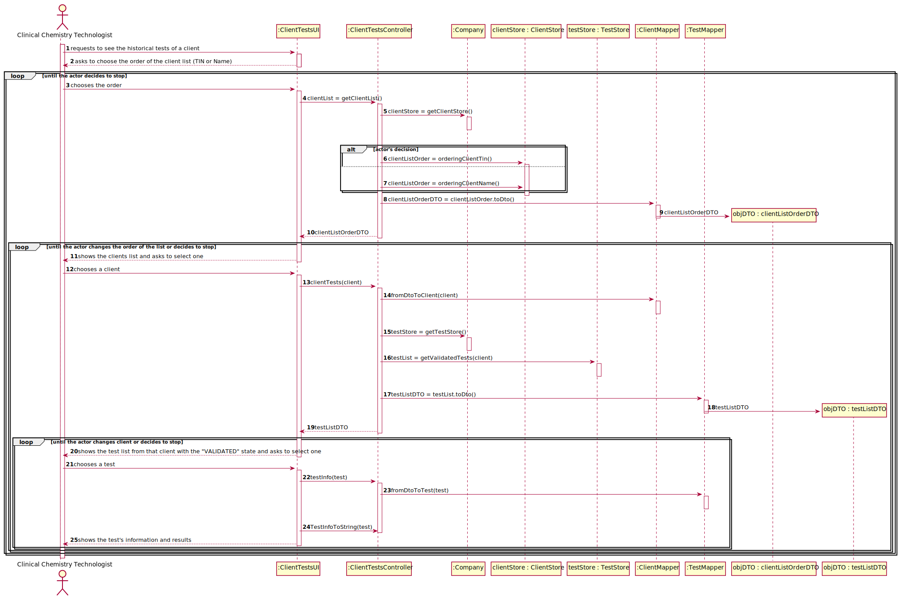

# US 013 - Consult the historical tests from a client

## 1. Requirements Engineering

### 1.1. User Story Description

As a clinical chemistry technologist, I intend to consult the historical tests performed by a particular client and to be able to check tests details/results.

### 1.2. Customer Specifications and Clarifications 

**From the specifications document:**

> To facilitate the access to the results, the application must allow ordering the clients by TIF and by
name. The ordering algorithm to be used by the application must be defined through a configuration
file. It is intended that the choice of the ordering algorithm is based on the algorithm complexity
(mainly the execution time). Therefore, at least two sorting algorithms should be evaluated and
documented in the application user manual (in the annexes) that must be delivered with the
application.

>At the same time the results are also available in the central application where the medical lab technicians
who collect the samples, the clinical chemistry technologist, the specialist doctor, and the laboratory
coordinator can check them.

**From the client clarifications:**

### 1.3. Acceptance Criteria

* **AC1:**  The application must allow ordering the clients by TIN and
  by name to help the clinical chemistry technologist choose the target client. The
  ordering algorithm to be used by the application must be defined through a
  configuration file. At least two sorting algorithms should be available.
  
* **AC2:** For a test to be shown, its state needs to be "VALIDATED".

### 1.4. Found out Dependencies

* There is a dependency to "US3: As a receptionist, I want to register a new client." because it is needed for the system to have at least one client registered to be possible to check their tests
* There is a dependency to "US7: As an administrator, I want to register a new employee." because it is needed at least one clinical chemistry technologist registered in the system to check a client's tests.
* There is a dependency to "US4: Register a test to be performed to a registered client" because it is needed the list of tests for the clinical chemistry technologist to be able to check a client's tests
* There is a dependency to "US12: As a clinical chemistry technologist, I intend to record the results of a given test." since the clinical chemistry technologist wants to check the results of the tests of a certain client.
* There is a dependency to "US15: As a laboratory coordinator, I want to validate the work done by the clinical chemistry technologist and specialist doctor." since the tests need to be validated to be shown

### 1.5 Input and Output Data

**Input Data:**

* Typed data:

* Selected data:
    * Client List Order
    * Client
    * Test

**Output Data:**
* Order Choice: TIN or Name
* Client List
* Test List from the client chosen before with the "VALIDATED" state
* Test's information and results

### 1.6. System Sequence Diagram (SSD)

## 2. OO Analysis

### 2.1. Relevant Domain Model Excerpt 

### 2.2. Other Remarks

## 3. Design - User Story Realization 

### 3.1. Rationale

| Interaction ID | Question: Which class is responsible for... | Answer  | Justification (with patterns)  |
|:-------------  |:--------------------- |:------------|:---------------------------- |
| Step 1 - requests to see the historical tests of a client | ... interacting with the actor? |  ClientTestsUI |  Pure Fabrication: there is no reason to assign this responsibility to any existing class in the Domain Model.  |
|                                                           | ... controlling the US |  ClientTestsController |  Controller  |
|                                                           | ... initializing the client store |  Company |  IE: it knows all data  |
|                                                           | ... getting the client list and ordering it |  ClientStore |  IE: contains a list of all the Client objects and knows all their data  |
|                                                           | ... transfer the data from domain to the UI |  ClientMapper |  DTO: When there is so much data to transfer, it is better to opt by using a DTO in order to reduce coupling between UI and domain  |
| Step 2 - shows the clients list and asks to select one | n/a | n/a  |  n/a  |
| Step 3 - chooses a client | ... transfer the data from UI to the domain |  ClientMapper |  DTO: When there is so much data to transfer, it is better to opt by using a DTO in order to reduce coupling between UI and domain  |
|                                                           | ... initializing the test store |  Company |  IE: it knows all data  |
|                                                           | ... getting the test list with validated tests |  TestStore |  IE: contains a list of all the Test objects and knows all their data  |
|                                                           | ... transfer the data from domain to the UI |  TestMapper |  DTO: When there is so much data to transfer, it is better to opt by using a DTO in order to reduce coupling between UI and domain  |
| Step 4 - shows the test list from that client with the "ANALYZED" state and asks to select one | n/a | n/a  | n/a   |
| Step 5 - chooses a test | ... transfer the data from UI to the domain |  TestMapper |  DTO: When there is so much data to transfer, it is better to opt by using a DTO in order to reduce coupling between UI and domain  |
|                                                           | ... collecting all the test info needed | ClientTestsController |  IE: can get the necessary data  |
| Step 6 - shows the test's information and results | n/a | n/a | n/a |

### Systematization ##

According to the taken rationale, the conceptual classes promoted to software classes are: 

 * Client
 * Test
 * Company

Other software classes (i.e. Pure Fabrication) identified:

 * ClientTestsUI
 * ClientTestsController
 * TestStore
 * TestMapper
 * ClientStore
 * ClientMapper

## 3.2. Sequence Diagram (SD)

## 3.3. Class Diagram (CD)

# 4. Tests 

**Test 1:** Test of the first ordering algorithm - order by TIN

    @Test
    public void checkGetClientOrderTin() throws ParseException{
        String dateStr = "11/11/2000";
        SimpleDateFormat dateFormat = new SimpleDateFormat("dd/MM/yyyy");
        Date date = dateFormat.parse(dateStr);
        ClientsStore store = new ClientsStore();
        List<Client> orderList = new ArrayList<>();

        Client client2 = store.createClient("2222222222222222", "2222222222", date, "2222222222", "dliente", "22222222222", "male");
        store.saveClient(client2);

        Client client = store.createClient("1111111111111111", "1111111111", date, "1111111111", "cliente", "11111111111", "male");
        store.saveClient(client);

        Client client3 = store.createClient("3333333333333333", "3333333333", date, "3333333333", "eliente", "33333333333", "male");
        store.saveClient(client3);

        orderList.add(client);
        orderList.add(client2);
        orderList.add(client3);

        Assert.assertEquals(orderList,store.getClientOrderTin());
    }

**Test 2:** Test of the first ordering algorithm - order by name

    @Test
    public void checkGetClientOrderName() throws ParseException{
        String dateStr = "11/11/2000";
        SimpleDateFormat dateFormat = new SimpleDateFormat("dd/MM/yyyy");
        Date date = dateFormat.parse(dateStr);
        ClientsStore store = new ClientsStore();
        List<Client> orderList = new ArrayList<>();

        Client client2 = store.createClient("2222222222222222", "2222222222", date, "2222222222", "dliente", "22222222222", "male");
        store.saveClient(client2);

        Client client = store.createClient("1111111111111111", "1111111111", date, "1111111111", "cliente", "11111111111", "male");
        store.saveClient(client);

        Client client3 = store.createClient("3333333333333333", "3333333333", date, "3333333333", "eliente", "33333333333", "male");
        store.saveClient(client3);

        orderList.add(client);
        orderList.add(client2);
        orderList.add(client3);

        Assert.assertEquals(orderList,store.getClientOrderName());
    }

# 5. Construction (Implementation)

## Class ClientTestsController

    public class ClientTestsController {
    
        ClientsStore clientsStore;
        TestStore testStore;
        List<Client> clientListOrder;
        Client client;
    
        public ClientTestsController(){
            App app = App.getInstance();
            Company company = app.getCompany();
            clientsStore = company.getClientStore();
            testStore = company.getTestStore();
            clientListOrder = new ArrayList<>();
        }
    
        public List<Client> getClientListTin(){
            clientListOrder = new ArrayList<>();
            clientListOrder.addAll(clientsStore.getClientOrderTin());
            return clientListOrder;
        }
    
        public List<Client> getClientListName(){
            clientListOrder = new ArrayList<>();
            clientListOrder.addAll(clientsStore.getClientOrderName());
            return clientListOrder;
        }
    
        public Client getClientChosen(String tin){
            for (Client c : clientListOrder){
                try{
                    if (tin.equalsIgnoreCase(c.getTin())){
                        client = c;
                    }
                } catch (Exception e) {
                    //empty
                }
    
            }
    
            return client;
        }
    
        public List<Test> getValidatedTests(Client c){
            return testStore.getValidatedTests(c);
        }
    
        public Test getTestChosen(String tin, List<Test> testList){
            Test test = null;
    
            for (Test t : testList){
                if (tin.equalsIgnoreCase(t.getTin())){
                    test = t;
                }
            }
    
            return test;
        }
    
        public String toString(Test t){
            StringBuilder sb = new StringBuilder();
            sb.append("Test ID: ").append(t.getTestCode()).append("\nClient Tin: ").append(t.getTin()).append("\nNHS code: ").append(t.getNhsCode()).append("\nTest Type: ").append(t.getTestType().getDescription()).append("\nDeliver Data: ").append(t.getValidationDate().toString()).append("\nTest Result: ");
    
            for(TestParameter tp : t.getTestParameterList()){
                sb.append("\n").append(tp.getParameter().getName()).append(": result = ").append(tp.getTestParameterResult().getResult()).append("; min reference value = ").append(tp.getTestParameterResult().getRefValue().getMinRefValue()).append("; max reference value = ").append(tp.getTestParameterResult().getRefValue().getMaxRefValue());
            }
    
            return sb.toString();
        }
    
    }

## Class ClientStore

    public class ClientsStore implements java.io.Serializable {
    
        private List<Client> clientList;

        public List<Client> getClientOrderTin() {
    
            List<Client> clientListOrder = new ArrayList<>(clientList);
    
            for(int i = 0; i<clientListOrder.size(); i++){
                for (int j = i+1; j<clientListOrder.size();j++){
                    Client aux = null;
                    if (clientListOrder.get(j).getTin().compareTo(clientListOrder.get(i).getTin()) < 0){
                        aux = clientListOrder.get(i);
                        clientListOrder.set(i,clientListOrder.get(j));
                        clientListOrder.set(j,aux);
                    }
                }
            }
    
            return clientListOrder;
        }
    
        public List<Client> getClientOrderName() {
    
            List<Client> clientListOrder = new ArrayList<>(clientList);
    
            for(int i = 0; i<clientListOrder.size(); i++){
                for (int j = i+1; j<clientListOrder.size();j++){
                    Client aux = null;
                    if (clientListOrder.get(j).getName().compareTo(clientListOrder.get(i).getName()) < 0){
                        aux = clientListOrder.get(i);
                        clientListOrder.set(i,clientListOrder.get(j));
                        clientListOrder.set(j,aux);
                    }
                }
            }
    
            return clientListOrder;
        }
    
    }

# Class TestStore

    public class TestStore implements java.io.Serializable{
        private List<Test> testList = new ArrayList<>();

        public List<Test> getValidatedTests(Client c){
            List<Test> validatedTest = new ArrayList<>();
    
            for (Test t : testList){
                if (c.getTin().equalsIgnoreCase(t.getTin()) && t.getState().equals(Test.State.VALIDATED)){
                    validatedTest.add(t);
                }
            }
    
            return validatedTest;
        }
    
    }

# 6. Integration and Demo

# 7. Observations

