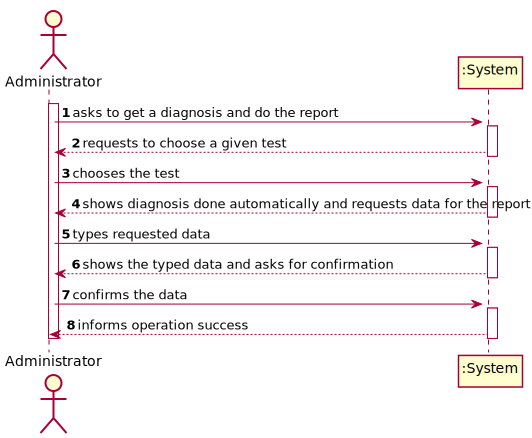
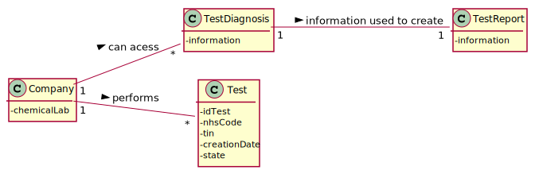
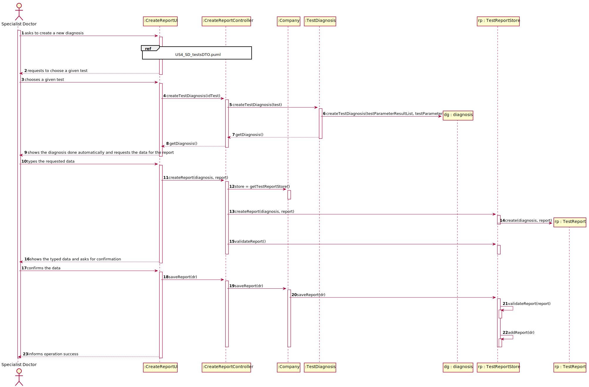
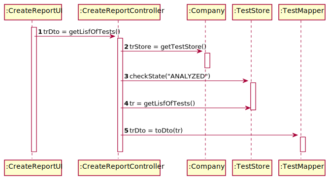
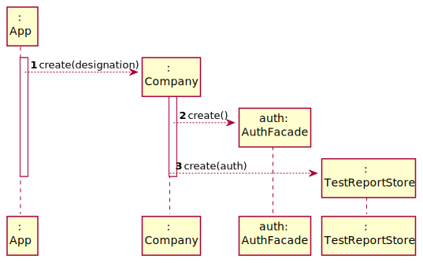
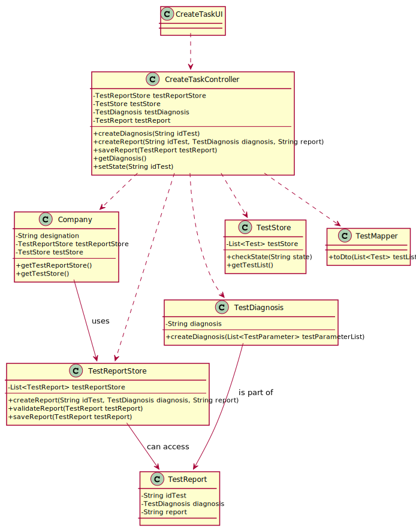

# US 14 - To create a new diagnosis and report 

## 1. Requirements Engineering

### 1.1. User Story Description

As a specialist doctor, I intend to make the diagnosis and write a report for a given test.

### 1.2. Customer Specifications and Clarifications 

**From the specifications document:**

>	Each task is characterized by having a unique reference per organization, a designation, an informal and a technical description, an estimated duration and cost as well as the its classifying task category. 

>	As long as it is not published, access to the task is exclusive to the employees of the respective organization. 

>	After completing the chemical analysis, the results of all chemical analyses are analysed by a
specialist doctor who makes a diagnosis and writes a report that afterwards will be delivered to the
client.

>	To facilitate and simplify the validation work performed by the specialist doctor, the application
uses an external module that is responsible for doing an automatic validation using test reference
values.

**From the client clarifications:**

> **Question** :When Starting a new report how does the specialist doctor interacts with the system? by choosing a client with a test result(that doesn´t have a report yet) or a test result from a client? and how do you want the system to show that information?
>
> **Answer** : I already answered this question.

-

> **Question** : Is there a limit of characters for the report and the diagnosis that will be made by the Specialist Doctor?
>
> **Answer** : Yes, at most 400 words.

-

> **Question** : Regarding the tests that the Specialist Doctor can write a report about. Should the SD chose from a list of tests? and Should him only receive a list of test that have completed all the previous steps?
>
> **Answer** : The system shows all tests ready (that have completed all the previous steps) to make the diagnosys and the Specialist Doctor selects one test. Then, the Specialist Doctor writes the report for the selected test.

-

> **Question** : Can the Specialist Doctor edit a report once it has already been written? If yes, in what occasion should he be able to edit? Can he edit after the Laboratory Coordinator has already approved the report?
>
> **Answer** : No. No.

### 1.3. Acceptance Criteria

* **AC1:** All required fields must be filled in.
* **AC2:** It's needed to select a test with the chemical analysis results already recorded to start a diagnosis.
* **AC3:** The report shall not have more than 400 chars.

### 1.4. Found out Dependencies

* There is a dependency to "US7: As an administrator, I want to register a new employee." because it is needed at least one specialist doctor registered in the system to diagnose any test.
* There is a dependency to "US4: Register a test to be performed to a registered client" because it is needed the list of tests for the specialist doctor to choose which one it is going to be diagnosed.
* There is a dependency to "US12: As a clinical chemistry technologist, I intend to record the results of a given test." since, to do the diagnosis, it is needed the results of the chemical analysis, and it is not possible to do the report without the diagnosis.

### 1.5 Input and Output Data

**Input Data:**

* Typed data:
	* a report, 
	* a diagnosis.
	
* Selected data:
	* Test with the chemical analysis results already recorded

**Output Data:**

* Tests with the results done
* Diagnosis and report
* (In)Success of the operation

### 1.6. System Sequence Diagram (SSD)

**Alternative 1**

### 1.7 Other Relevant Remarks

* The created task stays in a "not published" state in order to distinguish from "published" tasks.

## 2. OO Analysis

### 2.1. Relevant Domain Model Excerpt 

## 3. Design - User Story Realization 

### 3.1. Rationale

**SSD - Alternative 1 is adopted.**

| Interaction ID | Question: Which class is responsible for... | Answer  | Justification (with patterns)  |
|:-------------  |:--------------------- |:------------|:---------------------------- |
| Step 1 - asks to get a diagnosis and do the report		 |	... interacting with the actor? | CreateReportUI   |  Pure Fabrication: there is no reason to assign this responsibility to any existing class in the Domain Model.           |
| 			  		 |	... coordinating the US? | CreateReportController | Controller                             |
| Step 2 - requests to choose a test 		 |	... knowing the TestStore | Company | IE: Company knows the TestStore to which it is delegating some tasks                              |
| 			  		 |	... knowing the tests to show | TestStore   | IE: Test Results are defined by the TestResult class and are stored in the TestResultStore class.  |
| 			  		 |	... knowing which tests can be diagnosed | TestStore | IE: has all tests |
| 			  		 |	... sending the tests to be shown to the UI | TestMapper | DTO: It is sent a list of tests from TestStore (Domain Layer) to the CreateReportUI (UI layer) |
| Step 3 - chooses the test 		 |	... saving the selected test? | CreateReportController  | IE: object created in step 1 has its own data.  |
| 			  		 |	... creating the diagnosis | TestDiagnosis | IE: has its own data and knows how to create the object |
| Step 4 - shows the diagnosis done automatically and requests data for report | ... showing the diagnosis to the user? | CreateReportUI  | IE: is responsible for user interactions. |
| Step 5 - types requested data |	... saving the typed data and diagnosis? | TestReport  | IE: class has its own data  |
| 			  		 |	... instantiating a new TestReport object | TestReportStore | Creator (R1) and HC+LC: By the application of the Creator (R1) it would be the "Company". But, by applying HC + LC to the "Company", this delegates that responsibility to the "TestReportStore" |
| Step 6 - shows the typed data and asks for confirmation |							 |             |                              |              
| Step 7 - confirms data |	... validating all data (local validation)? | TestReport | IE: related to the classes TestDiagnosis and TestReport that have their own data.| 
| 			  		 |	... validating all data (global validation)? | TestReportStore | IE: knows all its diagnosis and reports.| 
| 			  		 |	... saving the created diagnosis and report? | TestReportStore | IE: owns all its diagnosis and reports.| 
| Step 8 - informs operation success |	... informing operation success?| CreateReportUI  | IE: is responsible for user interactions.  | 

### Systematization ##

According to the taken rationale, the conceptual classes promoted to software classes are: 

 * TestDiagnosis
 * TestReport
 * Company

Other software classes (i.e. Pure Fabrication) identified: 

 * CreateReportUI  
 * CreateReportController
 * TestReportStore
 * TestStore
 * TestMapper

## 3.2. Sequence Diagram (SD)

**Alternative 1**

+ US14_SD

+ US14_SD_testsDTO

+ US14_SD_CreatingTestReportStore

## 3.3. Class Diagram (CD)

**From alternative 1**

# 4. Tests 

**Test 1:** Check that it is not possible to create an instance of the TestReport class with null values for the test id. - AC1 version 1

    @Test(expected = IllegalArgumentException.class)
    public void createInvalidReportNull1(){
        TestReportStore test = new TestReportStore();
        test.createTestReport(null,null,null, date);
    }
	

**Test 2:** Check that it is not possible to create an instance of the TestReport class with null values for the TestDiagnosis. - AC1 version 2 

    @Test(expected = IllegalArgumentException.class)
    public void createInvalidReportNull2(){
        TestReportStore test = new TestReportStore();
        test.createTestReport("0001",null,null, date);
    }

**Test 3:** Check that it is not possible to create an instance of the TestReport class with null values for the report text. - AC1 version 3

    @Test(expected = IllegalArgumentException.class)
    public void createInvalidReportNull3(){
        TestDiagnosis td = new TestDiagnosis("aaa");
        TestReportStore test = new TestReportStore();
        test.createTestReport("0001",td,null, date);
    }

**Test 4:** Check that it is not possible to create an instance of the TestReport class with the report text having more than 400 chars. - AC3

    @Test(expected = IllegalArgumentException.class)
    public void createInvalidReportAC3V1(){
        TestDiagnosis td = new TestDiagnosis("aaa");
        TestReportStore test = new TestReportStore();

        test.createTestReport("0001",td,"aaaaaaaaaaaaaaaaaaaaaaaaaaaaaaaaaaaaaaaaaaaaaaaaaaaaaaaaaaaaaaaaaaaaaaaaaaaaaaaaaaaaaaaaaaaaaaaaaaaaaaaaaaaaaaaaaaaaaaaaaaaaaaaaaaaaaaaaaaaaaaaaaaaaaaaaaaaaaaaaaaaaaaaaaaaaaaaaaaaaaaaaaaaaaaaaaaaaaaaaaaaaaaaaaaaaaaaaaaaaaaaaaaaaaaaaaaaaaaaaaaaaaaaaaaaaaaaaaaaaaaaaaaaaaaaaaaaaaaaaaaaaaaaaaaaaaaaaaaaaaaaaaaaaaaaaaaaaaaaaaaaaaaaaaaaaaaaaaaaaaaaaaaaaaaaaaaaaaaaaaaaaaaaaaaaaaaaaaaaaaaaaaaaaaaaaaaaaaaaaa", date);
    }

*It is also recommended to organize this content by subsections.* 

# 5. Construction (Implementation)

## Class CreateReportController 

		public class CreateReportController {

			private TestReportStore testReportStore;
			private TestStore testStore;
			private TestDiagnosis testDiagnosis = new TestDiagnosis();
			private TestReport testReport;
			private String date;

			public CreateReportController() {
				App app = App.getInstance();
				Company company = app.getCompany();
				testReportStore = company.getTestReportStore();
				testStore = company.getTestStore();
			}
		

			public TestStore getTestStore() {
				return testStore;
			}
		

			public boolean createTestReport(String idTest, TestDiagnosis diagnosis, String report) {
				DateTimeFormatter dtf = DateTimeFormatter.ofPattern("yyyy/MM/dd HH:mm:ss");
				LocalDateTime now = LocalDateTime.now();
				date = dtf.format(now);
		
				testReport = testReportStore.createTestReport(idTest, diagnosis, report, date);
				return testReport != null;
			}
		

			public boolean saveTestReport() {
				return testReportStore.saveTestReport(testReport);
			}
		

			public void setState(String idTest) {
				for (Test test : testStore.getTests()) {
					if (idTest.equalsIgnoreCase(test.getTestCode())) {
						test.setState(Test.State.DIAGNOSED);
					}
				}
			}
		

			public TestDiagnosis createTestDiagnosis(String idTest) {
		
				for (Test test : testStore.getTests()) {
					if (test.getTestCode().equalsIgnoreCase(idTest)) {
						return testDiagnosis.createTestDiagnosis(test.getTestParameterList());
					}
				}
		
				return null;
		
			}
		

			public TestReportStore getTestReportStore() {
				return testReportStore;
			}

			public String getDate() {
				return date;
			}
		}

## Class TestReport

		public class TestReport {
		
			private String idTest;
			private TestDiagnosis diagnosis;
			private String report;
			private String date;

			public TestReport(String idTest, TestDiagnosis diagnosis, String report, String date) {
				boolean error = false;
		
				try {
					checkDiagnosisRules(diagnosis);
				} catch (Exception e) {
					error = true;
					System.out.println(e.getMessage());
				}
		
				try {
					checkReportRules(report);
				} catch (Exception e) {
					error = true;
					System.out.println(e.getMessage());
				}
		
				if (!error) {
					this.idTest = idTest;
					this.diagnosis = diagnosis;
					this.report = report;
					this.date = date;
				} else {
					throw new IllegalArgumentException("Error with creation");
				}
		
			}
		

			public String getIdTest() {
				return idTest;
			}
		

			public TestDiagnosis getDiagnosis() {
				return diagnosis;
			}

			public String getReport() {
				return report;
			}

			public String getDate() {
				return date;
			}

			private void checkDiagnosisRules(TestDiagnosis diagnosis) {
				if (diagnosis == null) {
					throw new IllegalArgumentException("The diagnosis can't be null");
				}
			}

			private void checkReportRules(String report) {
				if (report == null) {
					throw new IllegalArgumentException("The report can't be null");
				}
				if (report.length() > Constants.REPORT_LENGTH) {
					throw new IllegalArgumentException("The report mustn't have more than " + Constants.REPORT_LENGTH + " chars");
				}
			}
		
		}

## Class TestDiagnosis

		public class TestDiagnosis {
		
			private String diagnosis;
		
			public TestDiagnosis(String diagnosis){
				this.diagnosis = diagnosis;
			}
		
			public TestDiagnosis(){
		
			}
		
			public TestDiagnosis createTestDiagnosis(List<TestParameter> testParameterList){
				StringBuilder sb = new StringBuilder();
		
				for (TestParameter tp : testParameterList){
					if(tp.getTestParameterResult().getResult() >= tp.getTestParameterResult().getRefValue().getMinRefValue() && tp.getTestParameterResult().getResult() <= tp.getTestParameterResult().getRefValue().getMaxRefValue()){
						sb.append(tp.getParameter().getName() + " ---- Normal Result\n");
					} else {
						sb.append(tp.getParameter().getName() + " ---- Abnormal Result\n");
					}
				}
		
				return new TestDiagnosis(sb.toString());
			}
		
			public String getDiagnosis() {
				return diagnosis;
			}
		}

## Class TestReportStore

		public class TestReportStore {

			private List<TestReport> testReportList;
	
			public TestReportStore(){
				testReportList = new ArrayList<>();
			}

			public TestReport createTestReport(String idTest, TestDiagnosis diagnosis, String report, String date){
				return new TestReport(idTest,diagnosis,report, date);
			}
		
	
			public boolean validateTestReport(TestReport testReport){
				if(testReport == null){
					return false;
				}
		
				for(TestReport tr : testReportList){
					if(testReport.getIdTest().equalsIgnoreCase(tr.getIdTest())){
						return false;
					}
				}
		
				return true;
			}
		
			
			public boolean saveTestReport(TestReport testReport){
				if(!validateTestReport(testReport)){
					return false;
				}
				return testReportList.add(testReport);
			}

			public List<TestReport> getTestReportList() {
				return testReportList;
			}
		}

## Class Company

		public class Company {
			private final String designation;
			private final AuthFacade authFacade;

			private TestStore testStore;
			private TestReportStore testReportStore;
		

			public Company(String designation) {
				if (StringUtils.isBlank(designation))
					throw new IllegalArgumentException("Designation cannot be blank.");
		
				this.designation = designation;
				this.authFacade = new AuthFacade();

				testStore = new TestStore();
				testReportStore = new TestReportStore();
			}

			public TestStore getTestStore() {
				return testStore;
			}

			public TestReportStore getTestReportStore() {
				return testReportStore;
			}
		
		}

## Class TestStore

		public class TestStore {
			private List<Test> testList = new ArrayList<>();

			public List<Test> getTests() {
				return testList;
			}
		}

# 6. Integration and Demo 

* New classes were added with the functionality to create reports and diagnosis (TestReport, TestDiagnosis, CreateReportController, TestReportStore, CreateReportUI)
* It was added a new menu for the role of SpecialistDoctor
* Added in the Company class a new store to initialize (testReportStore)

# 7. Observations

Is there any way to avoid this to happen?

