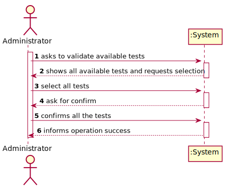
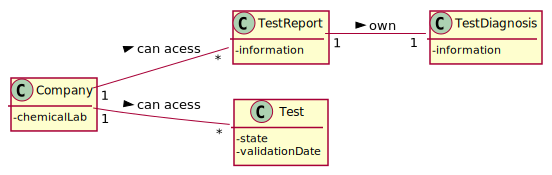
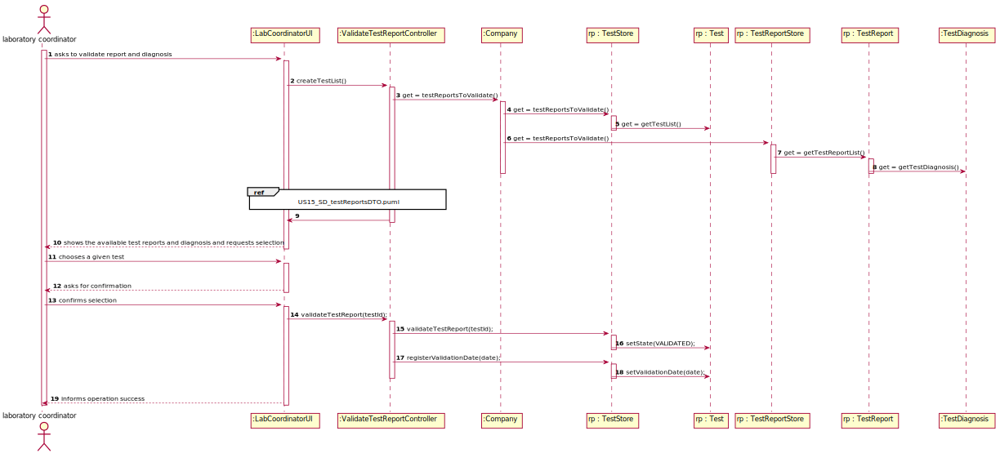
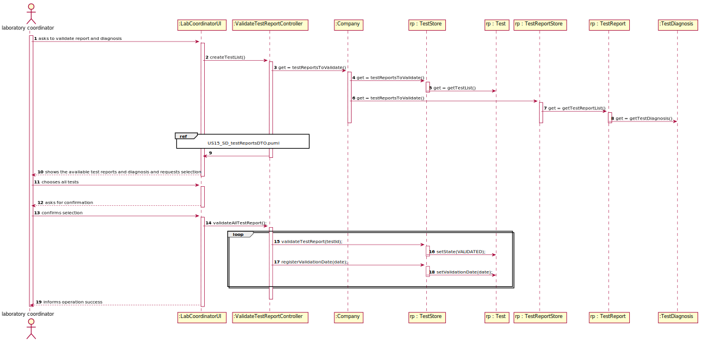
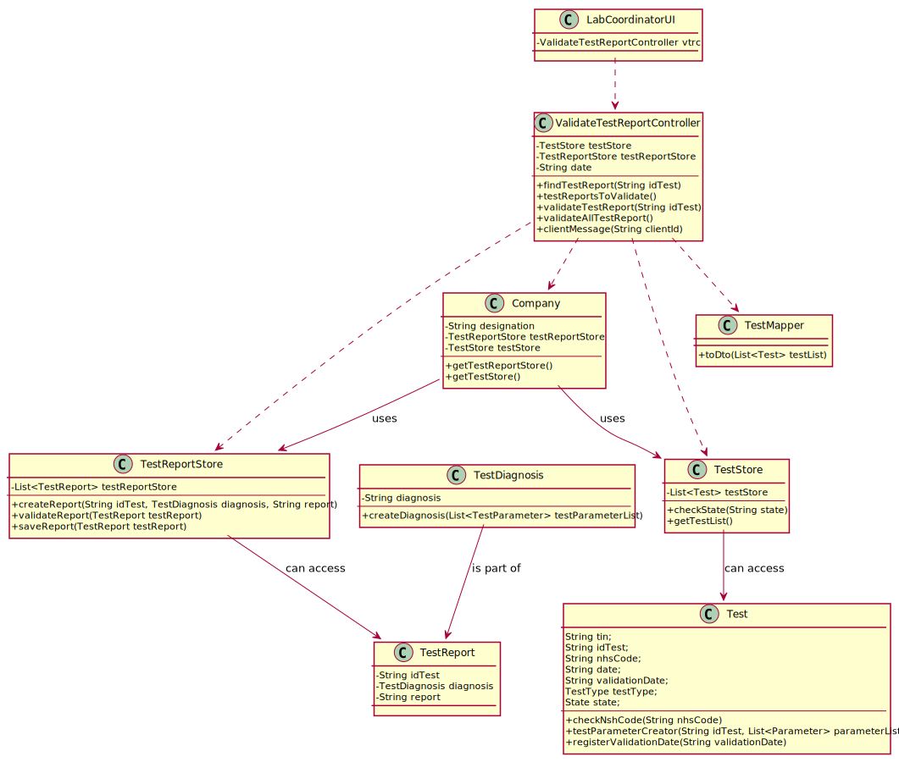

# US 015 - To validate the work done by the clinical chemistry technologist and specialist doctor.

## 1. Requirements Engineering

### 1.1. User Story Description

As a laboratory coordinator, I want to validate the work done by the clinical chemistry technologist and specialist doctor.

### 1.2. Customer Specifications and Clarifications 

**From the specifications document:**

>	After the specialist doctor has completed the diagnosis, the results of the clinical analyses and the report become available in the system and must be validated by the laboratory coordinator. To validate the work done, the laboratory coordinator checks the chemical test/result and associated diagnosis made and confirms that everything was done correctly. Once the laboratory coordinator confirms that everything was done correctly, the client receives a notification alerting that the results are already available in the central application and informing that he/she must access the application to view those results. The client receives the notification by SMS and e-mail. At the same time the results are also available in the central application where the medical lab technicians who collect the samples, the clinical chemistry technologist, the specialist doctor, and the laboratory coordinator can check them.

**From the client clarifications:**

> - **Question:** Regarding the process of validating a certain test/result, what validation states should be considered by the laboratory coordinator?
For example, can "Valid" or "Invalid" be accepted as a confirmation for the chemical test/result and its diagnosis?

>- **Answer:** Only Valid state. The system shows all tests ready to validate (tests that already have the test registration date, the chemical analysys date and the diagnosis date registered in the system) and the laboratory coordinator selects one or more tests to mark as validated.

> - **Question:** Should the laboratory coordinator validate the test results one by one or should he do only one validation of all of them?

>- **Answer:** The coordinator can validate all or a subset of test results. The system does not show client personal information but shows all dates (test registration date, chemical analysys date and diagnosis date).

> - **Question:** When the laboratory coordinator wants to validate a test does all the tests available show up for him or does he search using a code that identifies a specific test?

>- **Answer:** The system shows all tests ready to validate (tests that already have the test registration date, the chemical analysys date and the diagnosis date registered in the system) and the laboratory coordinator selects one or more tests to mark as validated.

> - **Question:** What should happen to a test if either the test report or the results are invalid? Should we prompt for a redo of either process or simply erase the test?

>- **Answer:** The laboratory coordinator only sees the test dates of tests that already have all dates registered in the system (test registration date, the chemical analysys date and the diagnosis date).

- The objective of this user story is only for the laboratory coordinator to be aware of the work developed in the chemical laboratory and to mark the job as done.

> - **Question:**To validate a test the laboratory coordinator should validate all the test results and the test report in that specific order?

>- **Answer:** Please read carefully my answers! The laboratory coordinator only sees dates of each test.

> - **Question:**As soon as a test is validated should the system send the notification to a txt file like in sprint B?

>- **Answer:** In the Project Description we get: "Once the laboratory coordinator confirms that everything was done correctly, the client receives a notification alerting that the results are already available in the central application and informing that he/she must access the application to view those results. The client receives the notification by SMS and e-mail. "

### 1.3. Acceptance Criteria

* **AC1:** All required fields must be filled in.
* **AC2:** The system does not show client personal information but shows all dates (test registration date, chemical analysis date and diagnosis date).

### 1.4. Found out Dependencies

* There is a dependency to the US 12 since clinical chemistry technologist must record the results of a given test.
* There is a dependency to the US 14 since specialist doctor must make the diagnosis and write a report for a given test.

### 1.5 Input and Output Data

**Input Data:**

* Selected data:
	* a check box (Seleted tests);
	* a check box (confirmation);

**Output Data:**

* The results of a given test.
* Diagnostic and report for a given test.
* (In)Success of the operation

### 1.6. System Sequence Diagram (SSD)

**Alternative 1**

**Alternative 2**

**Other alternatives might exist.**

### 1.7 Other Relevant Remarks
 
* The tests in "DIAGNOSED" state are able to validation, them their state must be set to "VALIDATED".

## 2. OO Analysis

### 2.1. Relevant Domain Model Excerpt 

### 2.2. Other Remarks

The list of all tests belongs to the company.
The list of all test reports belongs to the company.

The state of tests will be set VALIDATED and the clients will receive an email. 

## 3. Design - User Story Realization 

### 3.1. Rationale

**SSD - Alternative 1 is adopted.**

| Interaction ID | Question: Which class is responsible for... | Answer  | Justification (with patterns)  |
|:-------------  |:--------------------- |:------------|:---------------------------- |
| Step 1 - asks to validate test reports and diagnostics 		 |	... interacting with the actor? | LabCoordinatorUI  |  Pure Fabrication: there is no reason to assign this responsibility to any existing class in the Domain Model.           |
| 			  		 |	... coordinating the US? | ValidateTestReportController | Controller                             |
  		 |
| Step 2  |							 |             |                              |
| Step 3 - shows data and requests selection |...transfer the data in the domain to the UI?	| TestReportDto |  **DTO:** When there is so much data to transfer, it is better to opt by using a DTO in order to reduce coupling between UI and domain |
| Step 4 - shows the data and requests a confirmation		 |	...validating the data locally (e.g.: mandatory vs. non-mandatory data)? | Test  | IE: knows its own data. |
| 														      | ...validating the data globally (e.g.: duplicated)? | Company | IE: knows all the Test and TestReport objects |
| Step 5 - confirms the data 		 |	...seting Tests Validated? | ValidateTestReportController | IE: records all the Test objects |
| Step 6 - informs operation success		 |	...informing operation was a success?						 | LabCoordinatorUI          |    IE: responsible for user interaction                            |  

### Systematization ##

According to the taken rationale, the conceptual classes promoted to software classes are: 

 * Company
 * Test
 * TestReport

Other software classes (i.e. Pure Fabrication) identified: 

 * TestStore
 * TestReportStore

## 3.2. Sequence Diagram (SD)

**Alternative 1**

**Alternative 2**

## 3.3. Class Diagram (CD)

**From alternative 1**

# 4. Tests

Test

Check getter

    //    /**
           * Method that returns the date the object was created
           * @return - date
           */
          public String getDate() {
              return date;
          }

Test Report

Check getter   
    
        //    @Test
              public void getDate() {
                  TestDiagnosis td = new TestDiagnosis("aaa");
                  TestReport tr = new TestReport("0001",td,"bbb", date);
          
                  Assert.assertNotNull(tr.getDate());
              }

# 5. Construction (Implementation)

## Class LabCoordinatorUI

    public class LabCoordinatorUI implements Runnable{
    
        ValidateTestReportController vtrc;
    
        public LabCoordinatorUI(){
            vtrc = new ValidateTestReportController();
        }
    
        public void run() {
    
            List<TestReport> testReportsToValidate = new ArrayList<>(vtrc.testReportsToValidate());
    
            if (testReportsToValidate.isEmpty()) {
                System.out.println("There are no available tests for validation!");
                return;
            }
            for (TestReport testReport : testReportsToValidate) {
                System.out.println(option + " - Test Code: " + testReport.getIdTest() + " - Date: " + testReport.getDate() + "\nReport: " + testReport.getReport() + "\nDiagnosis: " + testReport.getDiagnosis().getDiagnosis());
            }
            do {
                option = Utils.readIntegerFromConsole("Select :");
                if (option < 0 || option > testReportsToValidate.size() + 1)
                    System.out.println("Invalid option!");
            } while (option < 0 || option > testReportsToValidate.size() + 1);
    
            if (option == 0)
                return;
    
            if (option == testReportsToValidate.size() + 1) {
                System.out.println("Validate all available tests?");
            } else {
                System.out.println("Validate test (" + testReportsToValidate.get(option - 1).getIdTest() + ")?");
            }
            boolean result = Utils.confirm("s -> confirm    n -> cancel");
            if (result) {
                if (option == testReportsToValidate.size() + 1) {
                    vtrc.validateAllTestReport();
                } else {
                    vtrc.validateTestReport(testReportsToValidate.get(option - 1).getIdTest());
                }
            }
        }
    }

## Class ValidateTestReportController

        public class ValidateTestReportController {
            TestStore testStore;
            TestReportStore testReportStore;
            String date;
        
            public ValidateTestReportController() 
        
            public TestReport findTestReport(String idTest) 
        
            public List<TestReport> testReportsToValidate()
        
            public void validateTestReport(String idTest) 
        
            public void validateAllTestReport()
        
            private void clientMessage(String clientId)
        }

# 6. Integration and Demo 

* A new option on main menu options was added(Lab Coordinator).

# 7. Observations

Selected tests will be seted as VALIDATED and the validate date will be stored. 