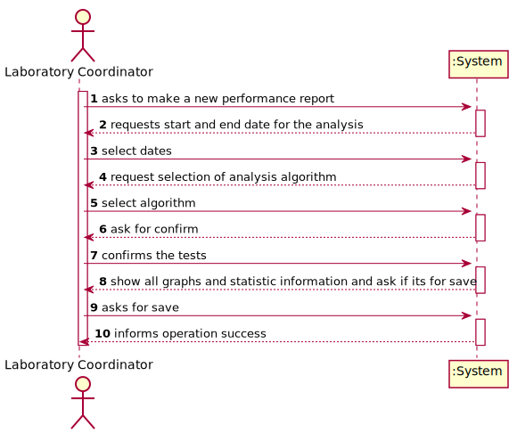
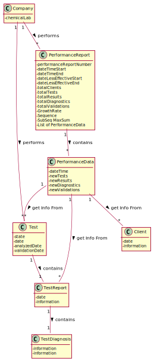
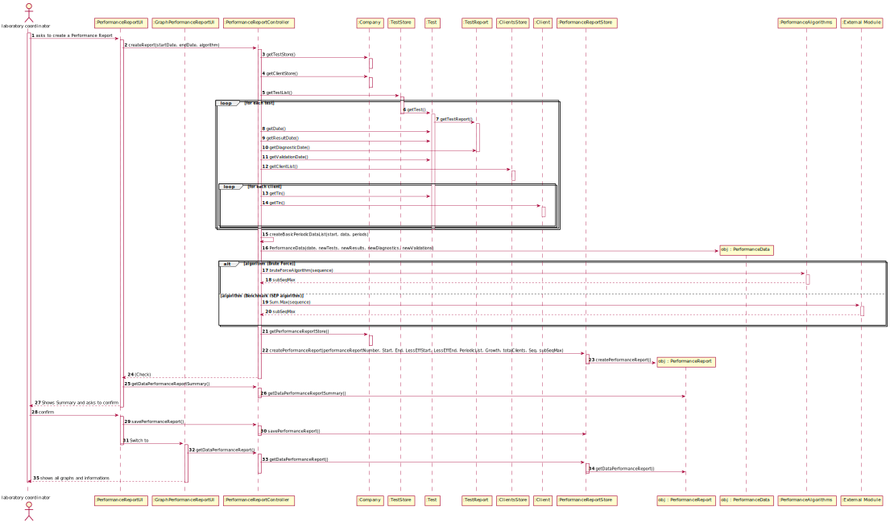
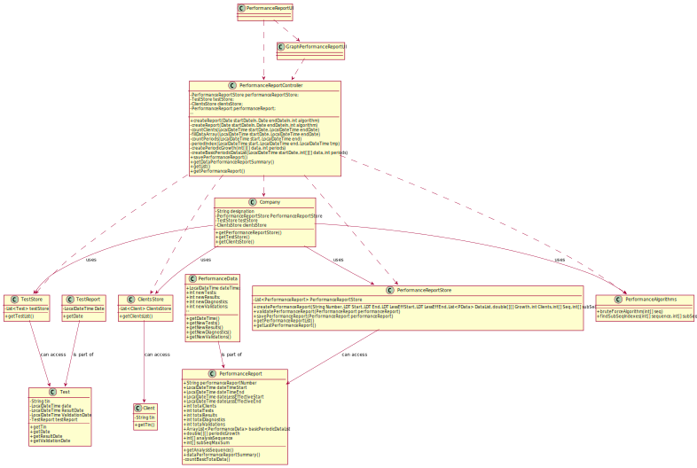

# US 016 - To analyse the overall performance of the company (Statistics & Graphs)

## 1. Requirements Engineering

### 1.1. User Story Description

As a laboratory coordinator, I want to have an overview of all the tests performed
by Many Labs and analyse the overall performance of the company (for instance, check
the sub-intervals in which there were more samples waiting for the result). To facilitate
overall analysis, the application should also display statistics and graphs.

### 1.2. Customer Specifications and Clarifications 

**From the specifications document:**

Many Labs is a company that needs to be continuously evaluating and improving its internal processes to achieve excellence and to beat the competition. Therefore, the company wants to decrease the number of tests waiting for its result. To evaluate this, it proceeds as following: for any interval of time, for example one week (6 working days with 12 working hours per day), the difference between the number of new tests and the number of results available to the client during each half an hour period is computed. In that case, a list with 144 integers is obtained, where a positive integer means that in such half an hour more tests were processed than results were obtained, and a negative integer means the opposite. Now, the problem consists in determining what the contiguous subsequence of the initial sequence is, whose sum of their entries is maximum. This will show the time interval, in such week, when the company was less effective in responding. So, the application should implement a brute-force algorithm (an algorithm which examines each subsequence) to determine the contiguous subsequence with maximum sum, for any interval of time registered. The implemented algorithm should be analysed in terms of its worst-case time complexity, and it should be compared to a provided benchmark algorithm. The algorithm to be used by the application must be defined through a configuration file.
The complexity analysis must be accompanied by the observation of the execution time of the algorithms for inputs of variable size in order to observe the asymptotic behaviour. The time complexity analysis of the algorithms should be properly documented in the application user manual (in the annexes) that must be delivered with the application.

**From the client clarifications:**

> - **Question:** Should the interval of time considered for the evaluation be asked to the Laboratory Coordinator?
>- **Answer:** Yes.
 
> - **Question 1:** How should we ask him the interval of time to be considered? Should we ask him to type a number of days? A number of weeks? Should we give general options like: last week, last month..., for him to select from?
> - **Question 2:** In case the Laboratory Coordinator chooses, for example, one week, should we consider the last 7 days, or should we consider, for example, the data from monday to sunday?
>- ### **Answer:** The laboratory coordinator should introduce two dates that define an interval, the beginning date and the end date. This interval will be used to find the contiguous subsequence with maximum sum.
 
> In the User Story Description, it reads:
>###"As a laboratory coordinator, I want to have an overview of all the tests performed by Many Labs[...]".
> - **Question:** What is the meaning of "overview" here? Should the laboratory coordinator see the number of tests waiting for samples, the number of tests waiting for results, the number of tests waiting for diagnoses... Or should he see the information available for each one of the tests in the application?
>- ###**Answer:** The laboratory coordinator should be able to check the number of clients, the number of tests waiting for results, the number of tests waiting for diagnosis and the total number of tests processed in the laboratory in each day, week, month and year. Moreover, the laboratory coordinator should be able to check the contiguous subsequence with maximum sum.

> - **Question:** Does the laboratory coordinator also select the amount of working hours per day? Or should we just consider it as 12 working hours/day?
>- ###**Answer:** The lab coordinator does not select the amount of working hours per day. Please consider 12 working hours per day.
>
> - **Question:** After the Laboratory Coordinator types the requested data and views the analysis of the company performance, should he be able to re-type different data and view the results for a different interval of time and/or algorithm? To make the re-type of the data easier, should there be a "clear" button, that is responsible for clearing the text fields for data entry?
>- ###**Answer:** The laboratory coordinator should be able to explore different parameter values (settings) and check the results. Each team should prepare a simple and intuitive interface that requires a minimum number of interactions with the user.
>
> - **Question:** When referring to "the application should also display statistics and graphs" is it up to the team to decide which API or resource should be used to generate graphs and statistics, or do you prefer something specific?
>- ###**Answer:** With JavaFX you can draw high quality graphs and there is no need to use other tools.

> - **Question:** You said in this Q&A https://moodle.isep.ipp.pt/mod/forum/discuss.php?d=8831, that the laboratory coordinator should define an interval, the beginning date and the end date.
> - **Question:** Can we assume that every day in the interval defined by the coordinator is a working day with 12 working hours each?
>- **Answer:** Yes.
 
> - **Question:** If Saturday or Sunday are in the interval should we skip them or count them also as working days?
>- ###**Answer:** Sunday is not a working day. All the other days of the week are working days. "For example one week (6 working days with 12 working hours)"   
>
> - **Question:** In this case, is there any specifc hour to start filling the 144 integers list?
>- ###**Answer:** A working day is from 8h00 to 20h00.

### 1.3. Acceptance Criteria

* **AC1:**  While evaluating the performance the laboratory
  coordinator should have the ability to dynamically select the algorithm to be applied from the ones available on the system (the benchmark algorithm provided in moodle and the brute-force algorithm to be developed). Support for easily
  adding other similar algorithms is required.
  
* **AC2:** The laboratory coordinator should be able to check the number of clients, the number of tests waiting for results, the number of tests waiting for diagnosis and the total number of tests processed in the laboratory in each day, week, month and year. Moreover, the laboratory coordinator should be able to check the contiguous subsequence with maximum sum.
  
### 1.4. Found out Dependencies

There is a dependency to "US3 - To register a new client" since, to analyse the overall performance, it is needed the client to perform a test.

There is a dependency to "US 4 - To register a test to be performed to a client" since, to analyse the overall performance, it is needed the test.

There is a dependency to "US 12 -  Record the Tests Results" since, to analyse the overall performance, it is needed the results and its date.

There is a dependency to "US 14 - To create a new diagnosis and report" since, to analyse the overall performance, it is needed the reports and diagnosis.

There is a dependency to "US 017 - As a laboratory coordinator, I want to import clinical tests from a CSV file" since, to analyse the overall performance, it is needed a considerable amount of data.

###There is a dependency to "US15 - As a laboratory coordinator, I want to validate the work done by the clinical chemistry technologist and specialist doctor." since, to analyse the overall performance, it is needed the validation of the reports and diagnosis.
*The US15 is the closest US to US16, since it represents the last step of the service provided, closing the cicle of data that should be studied.

### 1.5 Input and Output Data

**Input Data:**

* Typed data: NA

* Selected data:
    * Start Date of Analysys
    * End Date of Analysys 
    * Algorithm Selected

**Output Data:**

* Start date options
* End date options
* Total of commercial days analyzed
* Start date of the less effective period
* End date of the less effective period
* Sequence of Diagnostics - new tests
* SubSequence of Maximum Sum
* Total of Clients
* Total of tests
* Total of test results
* Tests waiting for results
* Total of test diagnostics
* Tests waiting for diagnostics
* Total of test validations
* Graph of new tests x time
* Graph of results x time
* Graph of diagnostics x time

### 1.6. System Sequence Diagram (SSD)

## 2. OO Analysis

### 2.1. Relevant Domain Model Excerpt 

### 2.2. Other Remarks

## 3. Design - User Story Realization 

### 3.1. Rationale

| Interaction ID | Question: Which class is responsible for... | Answer  | Justification (with patterns)  |
|:----------  |:-------------- |:------------|:------------------------------------- |
| **Step 1 -** *Laboratory Coordinator* asks to create a Performance Report of a period of days. |... interacting with the Laboratory Coordinator?| PerformanceReportUI| 	**Pure Fabrication:** There is no reason to assign this responsibility to any existing class in the Domain Model.|
| |... coordinating the US?|PerformanceReportController|**Controller**|
| **Step 2 -** *System* requests the start and end date| | | |
| **Step 3 -** *Laboratory Coordinator* select the dates and the algorithm|  ... knows TestStore?	 |  Company   |  **HC + LC:** Company knows the TestStore to which store needed to get to the information |
| | ... knowing all tests?|TestsStore|**IE:** knows its own tests|
| |  ... knows ClientStore?	 |  Company   |  **HC + LC:** Company knows the ClientStore to which it to which store needed to get to some other information |
| | ... knowing all Clients?|ClientsStore|**IE:** knows its own Clients|
| |... verified the tests dates |Test|**IE:** the test knows its own information|
| | ... knows PerformanceReportStore?	 |  Company   |  **HC + LC:** Company knows the PerformanceReport to which store needed to which it is delegating some tasks |
| | ... knowing all PerformanceReports?|PerformanceReportStore|**IE:** knows its own Performance Reports|
| | ... where to arrange information?| PerformanceReport | **IE:** knows its own data|
| | ... where to arrange more especific information?| PerformanceData | **IE:** knows its own data|
| | ... processes information?| PerformanceAlgorithms | **HC + LC:** Utility designed to perform data process|
| | ... optimize processing information?| Sum | **Protected Variations:** The system adapts the different external modules more efficient|
| **Step 4 -** *System* shows all data and asks if it should be stored | | | |
| **Step 5 -** *Laboratory Coordinator* ask to store | ... store the Performance Report?| PerformanceReportStore | **IE:** store menage its own content|
| **Step 6** - *System* informs operation success| ... informing operation success? | PerformanceReportUI | **IE:** is responsible for user interactions|

### Systematization ##

According to the taken rationale, the conceptual classes promoted to software classes are: 

*PerformanceData
*PerformanceReport

Other software classes (i.e. Pure Fabrication) identified:

*PerformanceReportStore
*PerformanceReportController
*PerformanceAlgorithms
*PerformanceReportUI
*GraphPerformanceReportUI

## 3.2. Sequence Diagram (SD)

## 3.3. Class Diagram (CD)

# 4. Tests 

###PerformanceData
**Test 1:** 

    public void testGetDateTime() {
        LocalDateTime expected = LocalDateTime.parse("2021/05/27 18:17:23", formatter);
        Assert.assertEquals(expected, performanceData.getDateTime());
    }
    
**Test 2:** 

    public void testGetNewTests() {
        int expected = 25;
        Assert.assertEquals(expected, performanceData.getNewTests());
    }
    
**Test 3:** 

    public void testGetNewResults() {
        int expected = 30;
        Assert.assertEquals(expected, performanceData.getNewResults());
    }
    
**Test 4:** 

    public void testGetNewDiagnostics() {
        int expected = 35;
        Assert.assertEquals(expected, performanceData.getNewDiagnostics());
    }
    
**Test 5:** 

    public void testGetNewValidations() {
        int expected = 40;
        Assert.assertEquals(expected, performanceData.getNewValidations());
    }

###PerformanceReport

**Test 1:** 

    public void testGetPerformanceReportNumber() {
        String expected = "000001";
        Assert.assertEquals(expected, performanceReport.getPerformanceReportNumber());
    }

**Test 2:** 

    public void testGetDateTimeStart() {
        LocalDateTime expected = LocalDateTime.parse("2021/05/27 18:17:23", formatter);
        Assert.assertEquals(expected, performanceReport.getDateTimeStart());
    }

**Test 3:** 

    public void testGetDateTimeEnd() {
        LocalDateTime expected = LocalDateTime.parse("2021/05/27 18:17:23", formatter);
        Assert.assertEquals(expected, performanceReport.getDateTimeEnd());
    }

**Test 4:** 

    public void testGetDateLessEffectiveStart() {
        LocalDateTime expected = LocalDateTime.parse("2021/05/27 18:17:23", formatter);
        Assert.assertEquals(expected, performanceReport.getDateLessEffectiveStart());
    }

**Test 5:** 

    public void testGetDateLessEffectiveEnd() {
        LocalDateTime expected = LocalDateTime.parse("2021/05/27 18:17:23", formatter);
        Assert.assertEquals(expected, performanceReport.getDateLessEffectiveEnd());
    }

**Test 6:** 

    public void testGetBasicPeriodicDataList() {
        Assert.assertEquals(basicList, performanceReport.getBasicPeriodicDataList());
    }

**Test 7:** 

    public void testGetPeriodicGrowth() {
        Assert.assertEquals(growth, performanceReport.getPeriodicGrowth());
    }

**Test 8:** 

    public void testGetTotalTests() {
        Assert.assertEquals(25, performanceReport.getTotalTests());
    }

**Test 9:** 

    public void testGetTotalResults() {
        Assert.assertEquals(30, performanceReport.getTotalResults());
    }

**Test 10:** 

    public void testGetTotalDiagnostics() {
        Assert.assertEquals(35, performanceReport.getTotalDiagnostics());
    }

**Test 11:** 

    public void testGetTotalValidations() {
        Assert.assertEquals(40, performanceReport.getTotalValidations());
    }

**Test 12:** 

    public void testGetTotalClients() {
        Assert.assertEquals(5, performanceReport.getTotalClients());
    }

**Test 13:** 

    public void testGetAnalysisSequence() {
        Assert.assertEquals(seq, performanceReport.getAnalysisSequence());
    }

**Test 14:** 

    public void testGetSubSeqMaxSum() {
        Assert.assertEquals(seq, performanceReport.getSubSeqMaxSum());
    }

**Test 15:** 

    public void testDataPerformanceReportSummary() {
        Assert.assertEquals(Summary, performanceReport.dataPerformanceReportSummary());
    }
# 5. Construction (Implementation)

## Class PerformanceData

    public class PerformanceData {
        private final LocalDateTime dateTime;
        private final int newTests;
        private final int newResults;
        private final int newDiagnostics;
        private final int newValidations;

        public PerformanceData(LocalDateTime dateTime, int newTests, int newResults, int newDiagnostics, int newValidations) {
            this.dateTime = dateTime;
            this.newTests = newTests;
            this.newResults = newResults;
            this.newDiagnostics = newDiagnostics;
            this.newValidations = newValidations;
        }

        public LocalDateTime getDateTime() { return dateTime; }

        public int getNewTests() { return newTests; }

        public int getNewResults() { return newResults; }

        public int getNewDiagnostics() { return newDiagnostics; }

        public int getNewValidations() { return newValidations; }
    }

## Class PerformanceReport

    public class PerformanceReport {

        private final String performanceReportNumber;
        private final LocalDateTime dateTimeStart;
        private final LocalDateTime dateTimeEnd;
        private final LocalDateTime dateLessEffectiveStart;
        private final LocalDateTime dateLessEffectiveEnd;
        private final int totalClients;
        private final int totalTests;
        private final int totalResults;
        private final int totalDiagnostics;
        private final int totalValidations;
        private final ArrayList<PerformanceData> basicPeriodicDataList;
        private final double[][] periodicGrowth; // tests, reports, diagnostics, validations
        private final int[] analysisSequence;
        private final int[] subSeqMaxSum;

        public PerformanceReport(String performanceReportNumber, LocalDateTime dateTimeStart, LocalDateTime dateTimeEnd, LocalDateTime dateLessEffectiveStart, LocalDateTime dateLessEffectiveEnd, List<PerformanceData> basicPeriodicDataList, double[][] periodicGrowth, int totalClients, int[] analysisSequence, int[] subSeqMaxSum) {
            this.performanceReportNumber = performanceReportNumber;
            this.dateTimeStart = dateTimeStart;
            this.dateTimeEnd = dateTimeEnd;
            this.dateLessEffectiveStart = dateLessEffectiveStart;
            this.dateLessEffectiveEnd = dateLessEffectiveEnd;
            this.basicPeriodicDataList = (ArrayList<PerformanceData>) basicPeriodicDataList;
            this.periodicGrowth = periodicGrowth;
            int[] totalBasicData = countBasicTotalData();
            this.totalTests = totalBasicData[0];
            this.totalResults = totalBasicData[1];
            this.totalDiagnostics = totalBasicData[2];
            this.totalValidations = totalBasicData[3];
            this.totalClients = totalClients;
            this.analysisSequence = analysisSequence;
            this.subSeqMaxSum = subSeqMaxSum;
        }
        
    public String getPerformanceReportNumber() { return performanceReportNumber; }

    public LocalDateTime getDateTimeStart() { return dateTimeStart; }

    public LocalDateTime getDateTimeEnd() { return dateTimeEnd; }

    public LocalDateTime getDateLessEffectiveStart() { return dateLessEffectiveStart; }

    public LocalDateTime getDateLessEffectiveEnd() { return dateLessEffectiveEnd; }

    public List<PerformanceData> getBasicPeriodicDataList() { return basicPeriodicDataList; }

    public double[][] getPeriodicGrowth() { return periodicGrowth; }

    public int getTotalTests() { return totalTests; }

    public int getTotalResults() { return totalResults; }

    public int getTotalDiagnostics() { return totalDiagnostics; }

    public int getTotalValidations() { return totalValidations; }

    public int getTotalClients() { return totalClients; }

    public int[] getAnalysisSequence() { return analysisSequence; }

    public int[] getSubSeqMaxSum() { return subSeqMaxSum; }

    private int[] countBasicTotalData() {
        int periods = getBasicPeriodicDataList().size();
        int[] newTestRepDiaValid = new int[4];
        for (int i = 0; i < periods; i++) {
            newTestRepDiaValid[0] += getBasicPeriodicDataList().get(i).getNewTests();
            newTestRepDiaValid[1] += getBasicPeriodicDataList().get(i).getNewResults();
            newTestRepDiaValid[2] += getBasicPeriodicDataList().get(i).getNewDiagnostics();
            newTestRepDiaValid[3] += getBasicPeriodicDataList().get(i).getNewValidations();
        }
        return newTestRepDiaValid;
    }

    public String dataPerformanceReportSummary() {
        DateTimeFormatter dtf = DateTimeFormatter.ofPattern("dd-MM-yyyy HH:mm");
        int periods = getBasicPeriodicDataList().size();
        int commercialDays = periods/24;
        return "Report summary" + "\n\nStart Date: " + getDateTimeStart().format(dtf) +
                "\nEnd Date: " + getDateTimeEnd().format(dtf) +
                "\nTotal days analyzed (Commercial days): " + commercialDays +
                "\n\nLess Effective Period Start Date: " + getDateLessEffectiveStart().format(dtf) +
                "\nLess Effective Period End Date: " + getDateLessEffectiveEnd().format(dtf) +
                "\n\nSequence of tests minus diagnostics: " + Arrays.toString(getAnalysisSequence()) +
                "\nSubsequence of maximum sum: " + Arrays.toString(getSubSeqMaxSum()) +
                "\n\nTotal Clients: " + totalClients +
                "\n\nTotal incoming tests: " + totalTests +
                "\n\nTotal test results: " + totalResults +
                "\nTests waiting for results: " + (totalTests-totalResults) +
                "\n\nTotal test Diagnostics: " + totalDiagnostics +
                "\nTests waiting for diagnostics: " + (totalTests-totalDiagnostics) +
                "\n\nTotal test Validations: " + totalValidations;
        }
    }

## Class PerformanceReportController

    public class PerformanceReportController {

    private final TestStore testStore;
    private final PerformanceReportStore performanceReportStore;
    private final ClientsStore clientsStore;
    private PerformanceReport performanceReport;

    DateTimeFormatter tf = DateTimeFormatter.ofPattern("HH:mm");
    LocalTime startTime = LocalTime.parse("08:00", tf);
    LocalTime endTime = LocalTime.parse("20:00", tf);

    public PerformanceReportController() {
        App app = App.getInstance();
        Company company = app.getCompany();
        testStore = company.getTestStore();
        performanceReportStore = company.getPerformanceReportStore();
        clientsStore = company.getClientStore();
    }

    public void createReport(LocalDate startDateIn, LocalDate endDateIn, int algorithm) {
        LocalDateTime startDate = LocalDateTime.of(startDateIn, startTime);
        LocalDateTime endDate = LocalDateTime.of(endDateIn, endTime);
        int[][] data = fillDataArray(startDate, endDate);
        createPerformanceReport(startDate, endDate, data, algorithm);
    }

    private LocalDate convertToLocalDateViaInstant(Date dateToConvert) {
        return dateToConvert.toInstant()
                .atZone(ZoneId.systemDefault())
                .toLocalDate();
    }

    private int countClients(LocalDateTime startDate, LocalDateTime endDate) {
        HashMap<String, Client> clientsMap = new HashMap<>();
        for (Test test : testStore.getTests()) {
            if (!test.getDate().isBefore(startDate) && test.getDate().isBefore(endDate)){
                for (Client client : clientsStore.getClientList()) {
                    if (client.getTin().equals(test.getTin())) {
                        clientsMap.put(client.getTin(), client);
                    }
                }
            }
        }

        return clientsMap.size();
    }

    private int[][] fillDataArray(LocalDateTime startDate, LocalDateTime endDate) {
        int periods = countPeriods(startDate, endDate);
        int[][] data = new int[4][periods];

        for (int[] row : data)
            Arrays.fill(row, 0);

        int registrationIndex;
        int resultIndex;
        int diagnosticIndex;
        int validationIndex;

        for (Test test : testStore.getTests()) {
            try {
                registrationIndex = periodIndex(startDate, endDate, test.getDate());
                resultIndex = periodIndex(startDate, endDate, test.analyzedDate());
                diagnosticIndex = periodIndex(startDate, endDate, test.getReport().getDate());
                if (test.getReport() == null)
                    diagnosticIndex = periodIndex(startDate, endDate, test.getValidationDate());
                validationIndex = periodIndex(startDate, endDate, test.getValidationDate());
            } catch (Exception e) {
                continue;
            }
            if (registrationIndex >= 0) {
                data[0][registrationIndex]++;
            }
            if (resultIndex >= 0) {
                data[1][resultIndex]++;
            }
            if (diagnosticIndex >= 0) {
                data[2][diagnosticIndex]++;
            }
            if (validationIndex >= 0) {
                data[3][validationIndex]++;
            }
        }

        return data;
    }

    private int countPeriods(LocalDateTime start, LocalDateTime end) {
        LocalDateTime temp = start;
        Duration tmpDuration = Duration.between(start, end);
        int days = (int) (tmpDuration.toDays() + 1);

        while (!temp.isAfter(end)) {
            if (temp.getDayOfWeek() == DayOfWeek.SUNDAY) {
                days--;
            }
            temp = temp.plusDays(1);
        }

        return days * 24;
    }

    private int periodIndex(LocalDateTime start, LocalDateTime end, LocalDateTime tmp) {
        long sundays = 0;

        for (LocalDateTime date = start; date.isBefore(tmp); date = date.plusDays(1)) {
            if (date.getDayOfWeek() == DayOfWeek.SUNDAY)
                sundays++;
        }

        if (tmp.isBefore(start) || !tmp.isBefore(end) || tmp.getDayOfWeek() == DayOfWeek.SUNDAY)
            return -1;
        LocalTime tmpHour = tmp.toLocalTime();
        if (tmpHour.isBefore(startTime) || !tmpHour.isBefore(endTime))
            return -1;

        Duration tmpDuration = Duration.between(start, tmp);

        int hourIndex = (tmpHour.getHour() - startTime.getHour()) * 2;
        if (tmpHour.getMinute() >= 30)
            hourIndex++;

        return (int) ((tmpDuration.toDays() - sundays) * 24) + hourIndex;
    }

    private void createPerformanceReport(LocalDateTime startDate, LocalDateTime endDate, int[][] data, int algorithm) {
        int periods = data[0].length;

        int[] testsMinusValidations = new int[periods];
        for (int i = 0; i < periods; i++) {
            testsMinusValidations[i] = data[0][i] - data[3][i];
        }
        int[] lessEffectiveSubSequence;

        if (algorithm == 0) {
            lessEffectiveSubSequence = PerformanceAlgorithms.bruteForceAlgorithm(testsMinusValidations);
        } else {
            lessEffectiveSubSequence = Sum.Max(testsMinusValidations);
        }
        int[] subSeqIndexes = PerformanceAlgorithms.findSubSeqIndexes(testsMinusValidations, lessEffectiveSubSequence);

        double[][] periodicGrowth = createPeriodicGrowth(data, periods);
        ArrayList<PerformanceData> basicPeriodicDataList = createBasicPeriodicDataList(startDate, data, periods);

        LocalDateTime dateLessEffectiveStart = basicPeriodicDataList.get(subSeqIndexes[0]).getDateTime();
        LocalDateTime dateLessEffectiveEnd = basicPeriodicDataList.get(subSeqIndexes[subSeqIndexes.length - 1]).getDateTime();
        Integer number = performanceReportStore.getPerformanceReportList().size() + 1;
        String numberStr = String.format("%06d", number);
        int totalClients = countClients(startDate, endDate);
        performanceReport = performanceReportStore.createPerformanceReport(numberStr, startDate, endDate, dateLessEffectiveStart, dateLessEffectiveEnd, basicPeriodicDataList, periodicGrowth, totalClients, testsMinusValidations, lessEffectiveSubSequence);
    }

    private double[][] createPeriodicGrowth(int[][] data, int periods) {
        double[][] periodicGrowth = new double[4][periods];

        for (double[] row : periodicGrowth) {
            row[0] = 0.0;
        }

        for (int i = 1; i < periods; i++) {
            for (int j = 0; j < 4; j++) {
                periodicGrowth[j][i] = (double) (data[j][i] - data[j][i - 1]) / data[j][i - 1];
            }
        }

        return periodicGrowth;
    }

    private ArrayList<PerformanceData> createBasicPeriodicDataList(LocalDateTime startDate, int[][] data, int periods) {
        LocalDateTime tempDate = startDate;
        ArrayList<PerformanceData> basicPeriodicDataList = new ArrayList<>();

        for (int i = 0; i < periods; i++) {
            PerformanceData performanceData = new PerformanceData(tempDate, data[0][i], data[1][i], data[2][i], data[3][i]);

            if (tempDate.getHour() >= 8 && tempDate.getHour() < 19) {
                tempDate = tempDate.plusMinutes(30);
            } else if (tempDate.getHour() == 19) {
                if (tempDate.getMinute() < 30) {
                    tempDate = tempDate.plusMinutes(30);
                } else {
                    LocalDate auxDate = tempDate.toLocalDate();
                    auxDate = auxDate.plusDays(1);
                    tempDate = LocalDateTime.of(auxDate, startTime);
                }
            }

            if (tempDate.getDayOfWeek() == DayOfWeek.SUNDAY) {
                tempDate = tempDate.plusDays(1);
            }

            basicPeriodicDataList.add(performanceData);
        }

        return basicPeriodicDataList;
    }

    public boolean savePerformanceReport() {
        return performanceReportStore.savePerformanceReport(performanceReport);
    }

    public String getDataPerformanceReportSummary() {
        return performanceReport.dataPerformanceReportSummary();
    }

    public PerformanceReportStore getList(){
        return performanceReportStore;
    }

    public PerformanceReport getPerformanceReport() {
        return performanceReport;
    }
}

## Class PerformanceAlgorithms (Utility Class)

    public class PerformanceAlgorithms {

    private PerformanceAlgorithms() throws IllegalStateException {
        throw new IllegalStateException("Utility class");
    }

    public static int[] bruteForceAlgorithm(int[] seq) {

        int startId = 0;
        int endId = 0;
        int max = seq[0];
        int sum = 0;
        int m;
        int tempEnd = 0;

        for (int i = 0; i < seq.length; i++) {
            for (int k = 0; k < seq.length - i; k++) {
                for (m = k; m <= k + i; m++) {
                    sum += seq[m];
                    if (seq[m] != 0)
                        tempEnd = m + 1;
                }

                if (sum >= max) {
                    max = sum;
                    startId = m - i - 1;
                    endId = tempEnd;
                }
                sum = 0;
            }
        }

        return Arrays.copyOfRange(seq, startId, endId);
    }

    public static int[] findSubSeqIndexes(int[] sequence, int[] subSeq) {

        int[] indexes = new int[subSeq.length];
        int i;
        int k = 0;

        for (i = 0; i < sequence.length; i++) {
            while (sequence[i] == subSeq[k]) {
                indexes[k] = i;
                i++;
                k++;

                if (k == subSeq.length)
                    return indexes;

                if (sequence[i] != subSeq[k]) {
                    k = 0;
                }
            }
        }

        for (i = 0; i < indexes.length; i++) {
            indexes[i] = 0;
        }

        return indexes;
        }
    }

# 6. Integration and Demo

* New classes were created to analyze data and report the Lab Coordinator (PerformanceData, PerformanceReport, PerformanceReportController, PerformanceReportUI, GraphPerformanceReportUI)
* It was added a new menu for the role of Laboratory Coordinator
* A new store added in the Company class(PerformanceReportStore)
* A new utility Class was created (PerformanceAlgorithms)

# 7. Observations

