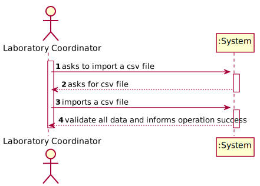
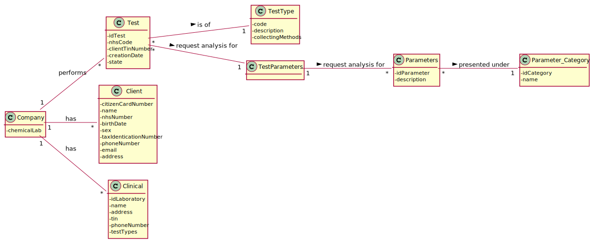
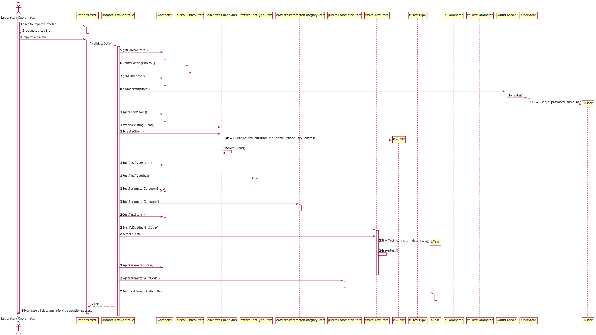
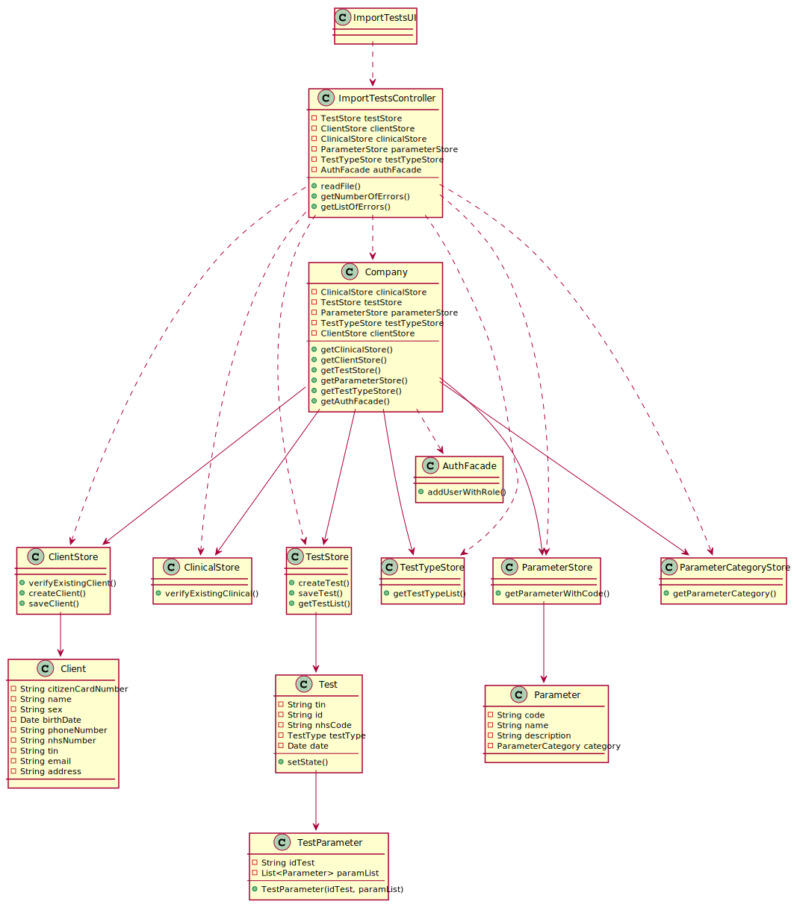

# US 017 - As a laboratory coordinator, I want to import clinical tests from a CSV file.

## 1. Requirements Engineering

### 1.1. User Story Description

As a laboratory coordinator, I want to import clinical tests from a CSV file.

### 1.2. Customer Specifications and Clarifications 

**From the specifications document:**

>	At the same time the results are also available in the central application

**From the client clarifications:**

> **Question:** Regarding the CSV files provided the citizen card number doesn't contain 16 digits, as you specified before. Should we change the restriction for the citizen card number length?
>  
> **Answer:** This is not an error. Please open the csv file with an editor like notepad.

-

> **Question:**  On the same issue, if there was, let’s say, a Urine type of test, would we also see some of its own categories and parameters reflected on the .csv file, as we see, for instance, N/A COVID categories on .csv files with only BLOOD type of tests?
> 
> **Answer:** Yes.

-

> **Question:** Up until now, we haven’t had any need to assign an address to a client. Seeing that there is now an Address column, that for us is somewhat left unused, would you advise us to add it as an attribute to the Client entity?
> 
> **Answer:** Yes. The address should have no more than 90 characters. Please consider the address of the Employee to have the same format that I am suggesting now for the client's address. In the beginning of the project I said that the address of the Employee should have no more than 30 characters but with this size we can not write a normal UK address.

-

> **Question:**  if a labID on the CSV file isn't found on the system, should we consider it "invalid data"?
> 
> **Answer:** Yes. To import tests of any laboratory (with a given Lab_ID), it is required that a laboratory having the given Lab_ID exists in the system.

-

> **Question:** Will the CSV files always have the same format as the ones available on moodle?
> 
> **Answer:** Yes. But we can have more categories and parameters for each type of test.
 
-

> **Question:** In what folder should the CSV file be when we want to use the application through the console?
> 
> **Answer:** In this sprint each team should develop a graphical user interface. The file to import can be located in any folder. The user should specify the path of the file.
### 1.3. Acceptance Criteria

* **AC1:** If the file contains invalid data (e.g., a parameter not defined in the system), that data should not be load into the system. An exception should be thrown.
* **AC2:** If the client data is correct, and the client does not exist, the system must create him.

### 1.4. Found out Dependencies

* *There is a dependency to "US3 To register a new client" because the clients that are in the file have to be checked so that the system knows if it has to create them or if they are already registered.
* *There is a dependency to "US8 To register a new clinical analysis laboratory" because the clinics in the csv file must be registered in the system.
* *There is a dependency to "US10 To specify a new parameter" because the parameters in the csv file must be registered in the system.
* *There is a dependency to "US11 To specify a new parameter category" because the categories in the csv file must be registered in the system.

### 1.5 Input and Output Data

**Input Data:**

* CSV File

**Output Data:**

* List with all the csv correct data 

### 1.6. System Sequence Diagram (SSD)

**Alternative 1**

### 1.7 Other Relevant Remarks

## 2. OO Analysis

### 2.1. Relevant Domain Model Excerpt 

## 3. Design - User Story Realization 

### 3.1. Rationale

**SSD - Alternative 1 is adopted.**

| Interaction ID | Question: Which class is responsible for... | Answer  | Justification (with patterns)  |
|:-------------  |:--------------------- |:------------|:---------------------------- |
| Step 1 - asks to import a csv file 		 |	... interacting with the actor? | ImportTestUI   |  Pure Fabrication: there is no reason to assign this responsibility to any existing class in the Domain Model.           |
| 			  		                             |	... coordinating the US? | ImportTestsController | Controller                             |
| 			  		                             | ... knowing the user using the system?  | UserSession  | IE: cf. A&A component documentation.  |
| Step 2 - asks for csv file |	 |  |   |
| Step 3 - imports a csv file |...import the csv file?  | ImportTestsController  |Controller   |
| Step 4 - validate all data and informs operation success | ...validate the client data in the csv file? |Client |knows the client data requirements  |
|   | ...validate the clinical data in the csv file? | Clinical | knows all the clinics|
|   |... validate the test data in the csv file? | Test | knows the test data requirements |

### Systematization ##

According to the taken rationale, the conceptual classes promoted to software classes are: 

 * Company
 * Client
 * Clinical  
 * Test

Other software classes (i.e. Pure Fabrication) identified: 

 * ImportTestUI  
 * CheckTestController
 

## 3.2. Sequence Diagram (SD)

**Alternative 1**

## 3.3. Class Diagram (CD)

**From alternative 1**

# 4. Tests 

* This US was entirely done on a controller, so there are no tests

# 5. Construction (Implementation)

## Class ImportTestsController 

		public ImportTestsController() {
        App app = App.getInstance();
        Company company = app.getCompany();
        clientStore = company.getClientStore();
        authFacade = company.getAuthFacade();
        testStore = company.getTestStore();
        testTypeStore = company.getTestTypeStore();
        parameterStore = company.getParameterStore();
        clinicalStore = company.getClinicalStore();
    }

    public void readFile(String path) throws IOException, ClassNotFoundException, InstantiationException, IllegalAccessException {
        Client client;
        String line;
        BufferedReader br;
        errors = 0;
        try {
            br = new BufferedReader(new FileReader(path));
        } catch (Exception e) {
            throw new IllegalArgumentException("File not found!");
        }
        int l = 0;
        String attributeOrder = "Test_Code;NHS_Code;Lab_ID;CitizenCard_Number;NHS_Number;TIN;BirthDay;PhoneNumber;Name;E-mail ;Address;TestType;Category;HB000;WBC00;PLT00;RBC00;Category;HDL00;Category;IgGAN;Test_Reg_DateHour;Test_Chemical_DateHour;Test_Doctor_DateHour;Test_Validation_DateHour";
        line = br.readLine();

        if (line.equals(attributeOrder)) {
            while ((line = br.readLine()) != null) {
                l++;
                attribute = line.split(";");

                String dateStr = attribute[6];
                SimpleDateFormat dateFormat = new SimpleDateFormat("dd/MM/yyyy");
                Date date = null;
                try {
                    date = dateFormat.parse(dateStr);
                } catch (Exception e) {
                    errors++;
                    continue;
                }
                if (!clinicalStore.verifyExistingClinical(attribute[2])) {
                    errors++;
                    continue;
                }
                try {
                    client = clientStore.createClient(attribute[3], attribute[4], date, attribute[5], attribute[8], attribute[7], "female");
                } catch (Exception e) {
                    System.err.println(e+ ", error on line: " + l);
                    errors++;
                    continue;
                }
                TestType testType1 = null;
                for (TestType testType : testTypeStore.getTestTypeList()) {
                    if (attribute[11].equalsIgnoreCase(testType.getDescription())) {
                        testType1 = testType;
                    }
                }
                if (testType1 == null) {
                    System.err.println("test type doesn't exist");
                    errors++;
                    continue;
                }

                if (!clientStore.verifyExistingClient(attribute[5])) {
                    String password = RandomStringUtils.randomAlphanumeric(10);
                    String email = attribute[9];
                    String name = attribute[8];

                    if (ClientNotification.sendMessage("email", "User: " + email + "\npassword: " + password, client.getTin())) {
                        client.setEmail(email);
                        authFacade.addUserWithRole(name, email, password, Constants.ROLE_CLIENT);
                    }

                    clientStore.saveClient(client);
                }
                if (testStore.verifyExistingNhsCode(attribute[1])) {
                    System.err.println("nhs code already exists, on line: " + l);
                    errors++;
                    continue;
                }

                try {
                    String dateTest = attribute[21];
                    String[] dateTestArr = dateTest.split(" ");
                    if (dateTestArr[1].length() == 4) {
                        dateTest = dateTestArr[0] + " 0" + dateTestArr[1];
                    }
                    test = testStore.createTest(attribute[5], attribute[0], attribute[1], testType1, dateTest);
                } catch (Exception e) {
                    System.err.println(e+", error on line: " + l);
                    errors++;
                    continue;
                }

                checkExistingParameter();

                test.testParameterCreator(attribute[0], parameterList);

                checkAddTestParameter();

                boolean result = testStore.saveTest(test);
                if (!result) {
                    System.out.println("error with test save");
                } else {
                    test.setState(Test.State.ANALYZED);
                    correctLine.add(Arrays.toString(attribute));
                }
            }
        }
    }
}
# 6. Integration and Demo 

* A new option on the Coordinator menu options was added.

* Some demo purposes some tasks are bootstrapped while system starts.

# 7. Observations

Platform and Organization classes are getting too many responsibilities due to IE pattern and, therefore, they are becoming huge and harder to maintain. 

It was not possible to create a clinical because in the file there was not all the info to create a clinical.

