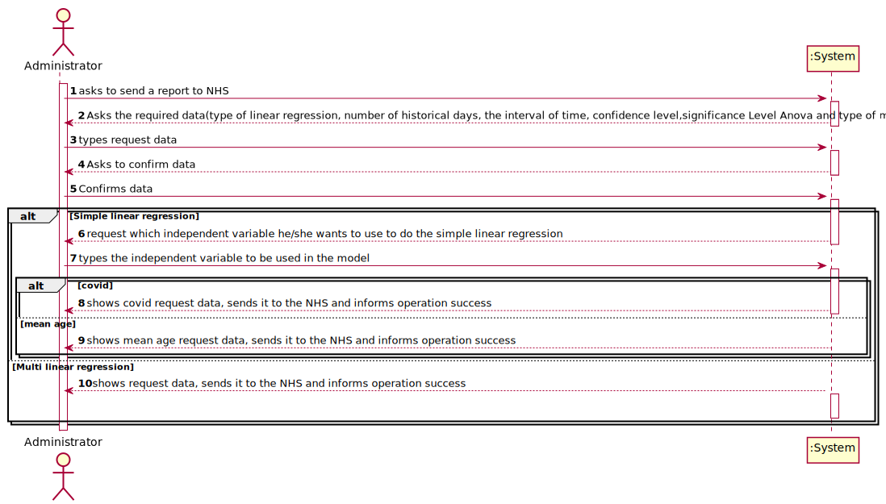
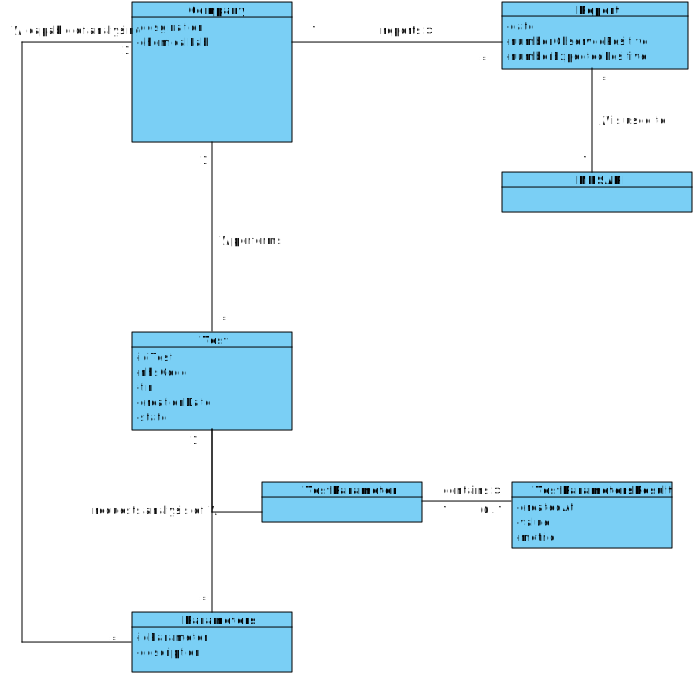
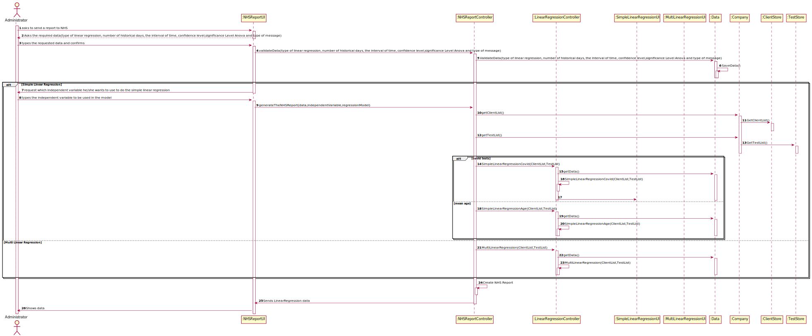
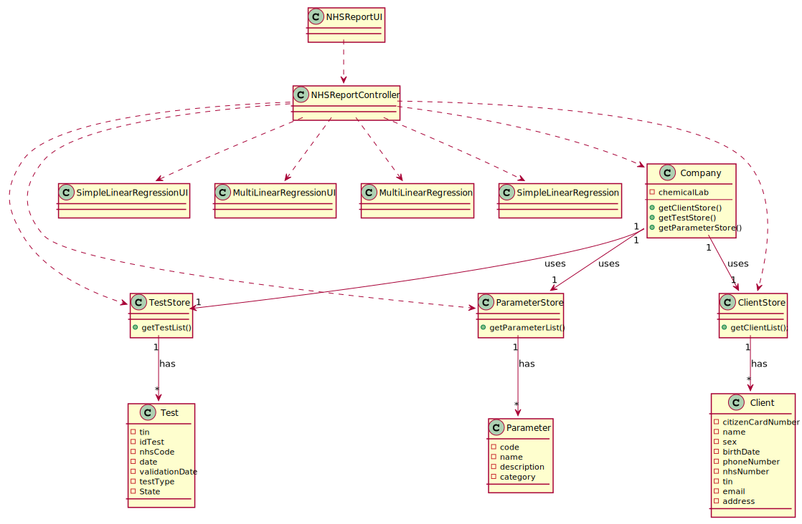

# US 018 - 

## 1. Requirements Engineering

### 1.1. User Story Description

As an Administrator I want to send the Covid-19 report to the NHS at any time. I
want to define the interval of dates to fit the regression model, the number of historical
points (number of days or number of weeks) that must be sent to the NHS, the regression
model to use and select the independent variables to use.

### 1.2. Customer Specifications and Clarifications

**From the specifications document:**

> “Considering that **Many Labs** has the exclusivity to perform **Covid 19 tests**, and that the contract with the **NHS** in England requires Many Labs to **summarize and report Covid 19 data**, the company needs to: **identify the number of Covid 19 tests performed, identify all positive results to Covid 19 tests, report the total number of Covid 19 cases per day, per week and per month of the year, and send the forecasts for these same time horizons the number of Covid 19 cases for the following day, next week and next month**.”

> "...should send them to the **NHS using their API**."

> “To make the **predictions** , the NHS contract defines that **a linear regression algorithm should be used** . The NHS required that both **simple linear and multiple linear regression algorithms should be evaluated to select the best model** . The accuracy of the **prediction models** should be **analysed and documented in the application user manual** (in the that must be delivered with the application The algorithm to be used by the application must be defined through a configuration file.”

**From the client clarifications:**

> **Question:** In US18 you said " ...the number of historical points (number of days or number of weeks) that must be sent to the NHS ..." what exactly is this ? Is this a interval of dates ?
>
> **Answer:** Yes, you must allow the client to choose days of weeks.

> **Question:** If the admin selects the multilinear regression he/she can select more than one independent variable. Should he select from a checklist the ones that he/she want? If so, what are the supposed independent variables we need to include in the checklist?
>
> **Answer:** to apply mlr you need two independent variables- daily number tests and mean age person tested daily. Also you need the same records per week.

> **Question:** From the covid report example you gave us we can see that is missing two dates(16/05/2021 and  23/05/2021) in the predictions table. Is there any specific reason?
>
> **Answer:** These days of the week are two sundays, and the laboratory does not work on Sundays.

> **Question:** From the report example we got that the administrator defines the dates interval to fit the model. Which date should the application use to provide the report? Is it the registration date or results registration date?
>
> **Answer:** The registration date should be considered. But only tests that have already been validated should be considered.

> **Question:** Should the number of historical points have the same range as the date interval defined by the administrator?
>
> **Answer:** No. The points within the interval are used to fit the linear regression model. The number of historical points are the points for which we want to send the estimates/expect values to NHS. The points within the interval and historical points can overlap. Please carefully review the report example file available in moodle.

> **Question:** From Sprint D requirements we get "I want to define... the number of historical points (number of days or number of weeks) that must be sent to the NHS". Is the Administrator who must choose between days or weeks? If so, how should he make this choice?
>
> **Answer:** Yes. The Administrator should select between days and weeks using the user interface.

> **Question:** Regarding US18 and US19, it is only one report containing all the tests performed by Many Labs to be sent each time, correct? Or is it one report per laboratory, for example? Or other option?
>
> **Answer:** The report should contain all the tests made by Many Labs.

> **Question:** Which significance level should we use for the hypothesis tests?
>
> **Answer:** The application should allow the user to choose the significance level.

### 1.3. Acceptance Criteria

* **AC1:**  The system should allow the Administrator to select between a simple linear and multilinear regression model
  to fit the data. Moreover, the Administrator should be able to choose the independent variable to use with the simple
  linear regression model (either the number of tests realized or the mean age). The system should send the report using
  the NHS API (available in moodle)
* **AC2:** The application should allow the user to choose the significance level.
* **AC3:** The report should contain all the tests made by Many Labs.
* **AC4:** The format of the report should follow the report example that is available in moodle.
* **AC5:** The NHS Covid-19 report should include statistics computed only from validated tests.
* **AC6:** The Administrator should select between days and weeks using the user interface.

### 1.4. Found out Dependencies

* There are some User Stories (US4, US5, US7, US12, US14, US15) that keep changing the test state until it reaches "
  Validated"

### 1.5 Input and Output Data

**Input Data:**

* Typed data:
  * Number of historical days
  * Confidence level IC
  *  Significance Level Anova

* Selected data:
  * Linear regression model
  * Start date
  * End date
  * Type of message

**Output Data:**
  * Linear regression model
  * Calendar to select the start and end date
  * Types of messages
  * Linear Regression Results 

### 1.6. System Sequence Diagram (SSD)

## 2. OO Analysis

### 2.1. Relevant Domain Model Excerpt

### 2.2. Other Remarks

## 3. Design - User Story Realization

### 3.1. Rationale

| Interaction ID | Question: Which class is responsible for... | Answer  | Justification (with patterns)  |
|:-------------  |:--------------------- |:------------|:---------------------------- |
| Step 1-  asks to send a report to NHS | ... interacting with the actor? | NHSReportUI | **PureFabrication:** there is no reason to assign this responsibility to any existing class in the Domain Model |
| |	... coordinating the US? |NHSReportController|Controller|
| |... know every test?  |TestStore| IE: Tests are defined by the TestStore class.|
| |... know every client?  |ClientStore| IE: Clients are defined by the ClientStore class.|
| Step 2-  Asks the required data()|	|   |    |
| Step 3-  types request data | ... how stores the information?	| Data   | Class where all the data inputted in the NHSReportUI is stored   |
| Step 4-  Asks to confirm data |	|   |    |
| Step 5-  Confirms data|	|   |    |
| Step 6-  request which independent variable he/she wants to use to do the simple linear regression|	... interacting with the actor?| SimpleLinearRegressionUI  | **PureFabrication:** there is no reason to assign this responsibility to any existing class in the Domain Model   |
| Step 7- types the independent variable to be used in the model||   |    |
| Step 8- shows covid request data, sends it to the NHS and informs operation success|	...calculating the simple linear Regression with the covid-19 independent variable?| SimpleLinearRegression   |  Has all the methods to calculate the simple linear regression  |
| Step 9- shows mean age request data, sends it to the NHS and informs operation success|	...calculating the simple linear Regression with the mean age independent variable?| SimpleLinearRegression   |  Has all the methods to calculate the simple linear regression  |
| Step 10- Shows request data, sends it to the NHS and informs operation success|	...calculating the Multi linear Regression?| MultiLinearRegression   |  Has all the methods to calculate the multi linear regression  |
| | ... interacting with the actor?|MultiLinearRegressionUI | **PureFabrication:** there is no reason to assign this responsibility to any existing class in the Domain Model  |

### Systematization ##

According to the taken rationale, the conceptual classes promoted to software classes are:

Data
SimpleLinearRegression
MultiLinearRegression

Other software classes (i.e. Pure Fabrication) identified:

MultiLinearRegressionUI
SimpleLinearRegressionUI
NHSReportUI

## 3.2. Sequence Diagram (SD)

## 3.3. Class Diagram (CD)

# 4. Tests

**Test 1:**

    @Test
    public void getF0Wrong() {
    String expected = "0.0000";
    String result = String.format("%.04f", slr.getF0());
    Assert.assertNotEquals(expected, result);
    }

**Test 2:**

    @Test
    public void getNCorrect() {
        String expected = "20";
        String result = String.valueOf(slr.getN());
        Assert.assertEquals(expected, result);
    }

**Test 3:**

    @Test
    public void getR2Wrong() {
    String expected = "0.0000";
    String result = String.format("%.04f", mlr.getR2());
    Assert.assertNotEquals(expected, result);
    }

**Test 4:**

    @Test
    public void getR2AdjustedWrong() {
        String expected = "0.0000";
        String result = String.format("%.04f", mlr.getR2adjusted());
        Assert.assertNotEquals(expected, result);
    }

# 5. Construction (Implementation)

## Class MultiLinearRegressionUI

    public class MultiLinearRegressionUI implements Initializable {

    @FXML
    private ListView<String> resultArea;

    private SceneController sceneController = new SceneController();
    private PopUpMessages popUpMessages = new PopUpMessages();

    private Company company = App.getInstance().getCompany();
    private Data data = company.getData();
    private TestStore testStore = company.getTestStore();

    private final String twoCases = "%.02f";
    private final String fourCases = "%.04f";

    private double[] agesInsideTheHistoricalDays;
    private double[] agesInsideTheDateInterval;
    private double[] covidTestsPerDayInsideTheHistoricalDays;
    private double[] covidTestsPerDayInsideTheIntervalOfDates;
    private double[] positiveCovidTestsPerDayInsideTheHistoricalInterval;
    private double[] positiveCovidTestsPerDayInsideTheDateInterval;
    private List<Client> clientsWithTests;
    private LinearRegressionController lrc = new LinearRegressionController();

    private double significanceLevelCoefficient = data.getConfidenceLevelIC();
    private double significanceLevelAnova = data.getSignificanceLevelAnova();

    @Override
    public void initialize(URL url, ResourceBundle resourceBundle) {
        multiRegression();

    }

    public void multiRegression() {
        double[] v3 = lrc.getPositiveCovidTestsPerDayHistoric();

        double[] covidTestsPerDayInsideTheDateInterval = lrc.getCovidTestsPerDayInterval();
        double[] agesInsideTheDateInterval = lrc.getAges();
        double[][] matrix = new double[lrc.getCovidTestsPerDayInterval().length][2];

        for (int i = 0; i < matrix.length; i++) {
            matrix[i][0] = covidTestsPerDayInsideTheDateInterval[i];
            matrix[i][1] = agesInsideTheDateInterval[i];
        }

        MultiLinearRegression multiLinearRegression = new MultiLinearRegression(matrix, lrc.getPositiveCovidTestsPerDayInterval());

        multiOutputLinear(multiLinearRegression);
        multiOutputOtherStatistics(multiLinearRegression);
        multiOutputHypothesis(multiLinearRegression);
        multiOutputAnova(multiLinearRegression);
        multiOutputPrediction(multiLinearRegression, v3, matrix);

    }

    public void returnBtn(ActionEvent event) {
        try {
            sceneController.switchToScene(event, Constants.ADMIN_UI_PATH);
        } catch (Exception error) {
            popUpMessages.errorMessage(event, "System Error\n\nMenu not found");
        }

        App app = App.getInstance();
        app.doLogout();
    }

    private void multiOutputLinear(MultiLinearRegression multiLinearRegression) {

        resultArea.getItems().clear();
        resultArea.getItems().add("Multi Linear");
        resultArea.getItems().add("The regression model fitted using data from the interval");
        resultArea.getItems().add(multiLinearRegression.toString());
        resultArea.getItems().add("");

    }

    private void multiOutputOtherStatistics(MultiLinearRegression multiLinearRegression) {
        double r2 = multiLinearRegression.getR2();
        double r = multiLinearRegression.getR();
        double r2adjusted = multiLinearRegression.getR2adjusted();

        resultArea.getItems().add("Other statistics");
        resultArea.getItems().add("R2 = " + String.format(fourCases, r2));
        resultArea.getItems().add("R2adjusted = " + String.format(fourCases, r2adjusted));
        resultArea.getItems().add("R = " + String.format(fourCases, r));
        resultArea.getItems().add("");

    }

    private void multiOutputHypothesis(MultiLinearRegression multiLinearRegression) {
        double tObs = multiLinearRegression.getT(significanceLevelCoefficient);
        double t = multiLinearRegression.getTObs(0);

        resultArea.getItems().add("Hypothesis tests for regression coefficients");
        resultArea.getItems().add("H0: betta0=0   H1: betta0!=0");
        resultArea.getItems().add("T = " + String.format(fourCases, t));
        resultArea.getItems().add("T_obs = " + String.format(fourCases, tObs));
        if (t > tObs) {
            resultArea.getItems().add("Decision: No reject H0");
        } else {
            resultArea.getItems().add("Decision: Reject H0");
        }

        t = multiLinearRegression.getTObs(1);

        resultArea.getItems().add("");
        resultArea.getItems().add("H0: betta1=0   H1: betta1!=0 ");
        resultArea.getItems().add("T = " + String.format(fourCases, t));
        resultArea.getItems().add("T_obs = " + String.format(fourCases, tObs));
        if (t > tObs) {
            resultArea.getItems().add("Decision: No reject H0");
        } else {
            resultArea.getItems().add("Decision: Reject H0");
        }
        resultArea.getItems().add("");
    }

    private void multiOutputAnova(MultiLinearRegression multiLinearRegression) {
        int n = multiLinearRegression.getN();
        double rss = multiLinearRegression.getSqe();
        double ssr = multiLinearRegression.getSqr();
        double mse = multiLinearRegression.getMqe();
        resultArea.getItems().add("Significance model with Anova");
        resultArea.getItems().add("H0: b=0  H1:b<>0 ");
        resultArea.getItems().add("                      df             SS           MS           F");
        resultArea.getItems().add("Regression          2           " + String.format(fourCases, ssr) + "      " + String.format(fourCases, ssr / 2) + "      " + String.format(fourCases, (ssr / 2) / mse));
        resultArea.getItems().add("Residual             " + (n - 3) + "           " + String.format(fourCases, rss) + "      " + String.format(fourCases, mse));
        resultArea.getItems().add("Total                 " + (n - 1) + "           " + (rss + ssr));
        resultArea.getItems().add("");
        double f0 = multiLinearRegression.getF0();
        double f = multiLinearRegression.getF(significanceLevelAnova);

        resultArea.getItems().add("0 > f" + significanceLevelAnova + ",(" + String.format(fourCases, f0) + ")=" + String.format(fourCases, f));

        if (f < f0) {
            resultArea.getItems().add("Decision: No reject H0");
        } else {
            resultArea.getItems().add("Decision: Reject H0");
        }
        resultArea.getItems().add("");

    }

    private void multiOutputPrediction(MultiLinearRegression multiLinearRegression, double[] positiveCovidTestsPerDayHistoric, double[][] x) {
        int historicalDate = data.getHistoricalDaysInt();
        int rows = historicalDate + 1;

        Calendar calendar = Calendar.getInstance();
        Date date = Date.from(LocalDate.now().atStartOfDay(ZoneId.systemDefault()).toInstant());
        calendar.setTime(date);

        resultArea.getItems().add("Prediction values");
        resultArea.getItems().add("Date                    Number of OBSERVED positive cases                    Number of ESTIMATED positive cases                    " + (100 - data.getConfidenceLevelIC()) + ("% intervals"));

        int a = 0;
        for (int c = 1; c < rows; c++) {
            calendar.add(Calendar.DATE, -1);
            if (calendar.get(Calendar.DAY_OF_WEEK) != Calendar.SUNDAY) {
                resultArea.getItems().add(String.format("%02d", calendar.get(Calendar.DATE)) + "/" + String.format("%02d", (calendar.get(Calendar.MONTH) + 1)) + "/" + calendar.get(Calendar.YEAR) + "                                  " + positiveCovidTestsPerDayHistoric[a] + "                                                                            " + String.format(twoCases, multiLinearRegression.predict(x[a])) + "                                                    " + String.format(twoCases, multiLinearRegression.lowerLimit(x[a], significanceLevelCoefficient)) + "->" + String.format(twoCases, multiLinearRegression.upperLimit(x[a], significanceLevelCoefficient)));
                a++;
            } else {
                c--;
            }
        }
    }
    }

## Class SimpleLinearRegressionUI

    public class SimpleLinearRegressionUI implements Initializable {

    @FXML
    private ComboBox<String> variableCbb;
    @FXML
    private ListView<String> resultArea;

    private SceneController sceneController = new SceneController();
    private PopUpMessages popUpMessages = new PopUpMessages();

    private Company company = App.getInstance().getCompany();

    private Data data = company.getData();
    private Properties proper = PropertiesController.getProperties();

    private final String twoCases = "%.02f";
    private final String fourCases = "%.04f";

    //private SimpleLinearRegression simpleLinearRegression;

    private double[] positiveCovidTestsPerDayHistoric;

    @Override
    public void initialize(URL url, ResourceBundle resourceBundle) {
        variableCbb.getItems().add("Covid-19 tests");
        variableCbb.getItems().add("Mean age");
    }

    public void returnBtn(ActionEvent event) {
        try {
            sceneController.switchToScene(event, Constants.ADMIN_UI_PATH);
        } catch (Exception error) {
            popUpMessages.errorMessage(event, "System Error\n\nMenu not found");
        }

        App app = App.getInstance();
        app.doLogout();
    }

    public void confirm(ActionEvent event) {
        LinearRegressionController lrc = new LinearRegressionController();
        if (variableCbb.getValue() == null) {
            popUpMessages.errorMessage(event, "System Error\n\nVariable cannot be blank");
        } else {
            if (variableCbb.getValue().equals("Covid-19 tests")) {
                linearRegressionCovidTests(lrc);
            } else if (variableCbb.getValue().equals("Mean age")) {
                linearRegressionMeanAge(lrc);
            }
        }
    }

    private void linearRegressionCovidTests(LinearRegressionController lrc) {

        positiveCovidTestsPerDayHistoric = lrc.getPositiveCovidTestsPerDayHistoric();
        double[] v1 = lrc.getPositiveCovidTestsPerDayInterval();
        double[] v2 = lrc.getCovidTestsPerDayInterval();

        SimpleLinearRegression simpleLinearRegressionCovid = new SimpleLinearRegression(v1, v2);

        resultArea.getItems().clear();
        outputLinear(simpleLinearRegressionCovid);
        outputOtherStatistics(simpleLinearRegressionCovid);
        outputHypothesis(simpleLinearRegressionCovid);
        outputAnova(simpleLinearRegressionCovid);
        outputPrediction(simpleLinearRegressionCovid);

    }

    private void linearRegressionMeanAge(LinearRegressionController lrc) {
        double[] v0 = lrc.getAges();
        double[] v2 = lrc.getCovidTestsPerDayInterval();
        positiveCovidTestsPerDayHistoric = lrc.getPositiveCovidTestsPerDayHistoric();

        SimpleLinearRegression simpleLinearRegressionAge = new SimpleLinearRegression(v0, v2);

        resultArea.getItems().clear();
        outputLinear(simpleLinearRegressionAge);
        outputOtherStatistics(simpleLinearRegressionAge);
        outputHypothesis(simpleLinearRegressionAge);
        outputAnova(simpleLinearRegressionAge);
        outputPrediction(simpleLinearRegressionAge);
    }

    private void outputLinear(SimpleLinearRegression simpleLinearRegression) {
        resultArea.getItems().add("Linear");
        resultArea.getItems().add("The regression model fitted using data from the interval");

        resultArea.getItems().add(simpleLinearRegression.toString());
        resultArea.getItems().add("");
    }

    private void outputOtherStatistics(SimpleLinearRegression simpleLinearRegression) {
        double r2 = simpleLinearRegression.getR2();
        double r = simpleLinearRegression.getR();

        resultArea.getItems().add("Other statistics");
        resultArea.getItems().add("R2 = " + String.format(fourCases, r2));
        resultArea.getItems().add("R = " + String.format(fourCases, r));
        resultArea.getItems().add("");
    }

    private void outputHypothesis(SimpleLinearRegression simpleLinearRegression) {
        double t = simpleLinearRegression.getT(1 - data.getConfidenceLevelIC());
        double tObs1 = simpleLinearRegression.getTObs1();
        resultArea.getItems().add("Hypothesis tests for regression coefficients");
        resultArea.getItems().add("HO:b=0 (a=0) H1: b<>0 (a<>0)");
        resultArea.getItems().add("T = " + String.format(fourCases, t));
        resultArea.getItems().add("T_obs = " + String.format(fourCases, tObs1));
        if (t < tObs1) {
            resultArea.getItems().add("Decision: No reject H0");
        } else {
            resultArea.getItems().add("Decision: Reject H0");
        }
        resultArea.getItems().add("");
        double tObs2 = simpleLinearRegression.getTObs2();
        resultArea.getItems().add("HO:a=0 H1: a<>0");
        resultArea.getItems().add("T = " + String.format(fourCases, t));
        resultArea.getItems().add("T_obs = " + String.format(fourCases, tObs2));

        if (t < tObs2) {
            resultArea.getItems().add("Decision: No reject H0");
        } else {
            resultArea.getItems().add("Decision: Reject H0");
        }
        resultArea.getItems().add("");
    }

    private void outputAnova(SimpleLinearRegression simpleLinearRegression) {

        double n = simpleLinearRegression.getN();
        double rss = simpleLinearRegression.getRss();
        double ssr = simpleLinearRegression.getSsr();
        double mse = simpleLinearRegression.getMse();
        resultArea.getItems().add("Significance model with Anova");
        resultArea.getItems().add("H0: b=0  H1:b<>0");
        resultArea.getItems().add("                        df             SS           MS           F");
        resultArea.getItems().add("Regression          1           " + String.format(fourCases, ssr) + "      " + String.format(fourCases, ssr) + "      " + String.format(fourCases, ssr / mse));
        resultArea.getItems().add("Residual             " + (n - 2) + "           " + String.format(fourCases, rss) + "       " + String.format(fourCases, mse));
        resultArea.getItems().add("Total                 " + (n - 1));
        resultArea.getItems().add("");

        double f0 = simpleLinearRegression.getF0();
        double f = simpleLinearRegression.getF(data.getSignificanceLevelAnova());

        resultArea.getItems().add("0 > f" + data.getSignificanceLevelAnova() + ",(" + String.format(fourCases, f0) + ")=" + String.format(fourCases, f));

        if (f < f0) {
            resultArea.getItems().add("Decision: No reject H0");
        } else {
            resultArea.getItems().add("Decision: Reject H0");
        }

        resultArea.getItems().add("");

    }

    private void outputPrediction(SimpleLinearRegression simpleLinearRegression) {

        int historicalDate = data.getHistoricalDaysInt();
        int rows = historicalDate + 1;

        Calendar calendar = Calendar.getInstance();
        Date date = Date.from(LocalDate.now().atStartOfDay(ZoneId.systemDefault()).toInstant());
        calendar.setTime(date);
        resultArea.getItems().add("Prediction values");
        resultArea.getItems().add("Date                    Number of OBSERVED positive cases                    Number of ESTIMATED positive cases                    " + (100 - data.getConfidenceLevelIC()) + ("% intervals"));

        int a = 0;
        for (int c = 1; c < rows; c++) {
            calendar.add(Calendar.DATE, -1);
            if (calendar.get(Calendar.DAY_OF_WEEK) != Calendar.SUNDAY) {
                resultArea.getItems().add(String.format("%02d", calendar.get(Calendar.DATE)) + "/" + String.format("%02d", (calendar.get(Calendar.MONTH) + 1)) + "/" + calendar.get(Calendar.YEAR) + "                                    " + positiveCovidTestsPerDayHistoric[a] + "                                                                              " + String.format("%.02f", simpleLinearRegression.predict(positiveCovidTestsPerDayHistoric[a])) + "                                                   " + String.format("%.02f", simpleLinearRegression.lowerLimit(positiveCovidTestsPerDayHistoric[a], data.getConfidenceLevelIC())) + " -> " + String.format("%.02f", simpleLinearRegression.upperLimit(positiveCovidTestsPerDayHistoric[a], data.getConfidenceLevelIC())));
                a++;
            } else {
                c--;
            }
        }
    }
    }

## Class NHSReportUI

    @Override
    public void initialize(URL url, ResourceBundle resourceBundle) {
    data = company.getData();
    modelCbb.getItems().add("Simple Linear Regression");
    modelCbb.getItems().add("Multi Linear Regression");

        typeCbb.getItems().add("Daily");
        typeCbb.getItems().add("Weekly");
    }

    public void returnBtn(ActionEvent event) {
        try {
            sceneController.switchToScene(event, Constants.ADMIN_UI_PATH);
        } catch (Exception error) {
            popUpMessages.errorMessage(event, "System Error\n\nMenu not found");
        }

        App app = App.getInstance();
        app.doLogout();
    }

    public void confirm(ActionEvent event) {
        boolean check = true;

        if (historicalDaysTxt.getText().equals("")) {
            popUpMessages.errorMessage(event, "System Error\n\nHistory Days cannot be blank");
            check = false;
        }

        if (confidenceLevelTxt.getText().equals("")) {
            popUpMessages.errorMessage(event, "System Error\n\nConfidence Level cannot be blank");
            check = false;
        }

        if (significanceLevelAnovaTxt.getText().equals("")) {
            popUpMessages.errorMessage(event, "System Error\n\nSignificance Level Anova cannot be blank");
            check = false;
        }

        if (startDatePicker.getValue() == null) {
            popUpMessages.errorMessage(event, "System Error\n\nStart day not set");
            check = false;
        }

        if (endDatePicker.getValue() == null) {
            popUpMessages.errorMessage(event, "System Error\n\nEnd day not set");
            check = false;
        }

        if (modelCbb.getValue() == null) {
            popUpMessages.errorMessage(event, "System Error\n\nInvalid day\nLinear regression model - option not set");
            check = false;
        }

        if (Period.between(endDatePicker.getValue(), todayDate).getDays() < 0) {
            popUpMessages.errorMessage(event, "System Error\n\nInvalid day\nFinal day passed the current day");
            check = false;
        }

        if (check && setInformation(event)) {
            changeWindow(event);
        }
    }

    private boolean setInformation(ActionEvent event) {
        try {
            double confidenceLevelTxtint = Double.parseDouble(confidenceLevelTxt.getText()) / 100;
            double confidenceLevelAnovaTxtint = Double.parseDouble(significanceLevelAnovaTxt.getText()) / 100;
            data.setInformation(historicalDaysTxt.getText(), String.valueOf(confidenceLevelTxtint), startDatePicker.getValue(), endDatePicker.getValue(), String.valueOf(confidenceLevelAnovaTxtint));
            return true;
        } catch (Exception error) {
            popUpMessages.errorMessage(event, "System error\n\n" + error.getMessage());
            return false;
        }
    }

    private void changeWindow(ActionEvent event) {
        try {
            if (modelCbb.getValue().equals("Simple Linear Regression")) {
                sceneController.switchToScene(event, Constants.SIMPLE_LINEAR_REGRESSION_PATH);
            } else {
                if (modelCbb.getValue().equals("Multi Linear Regression")) {
                    sceneController.switchToScene(event, Constants.MULTI_LINEAR_REGRESSION_PATH);
                } else {
                    sceneController.switchToScene(event, Constants.ADMIN_UI_PATH);
                }
            }
        } catch (Exception error) {
            popUpMessages.errorMessage(event, "System Error\n\nMenu not found");
        }
    }

# 6. Integration and Demo

* A new option on the administrator menu options was added.

# 7. Observations

Type of message only works for daily

