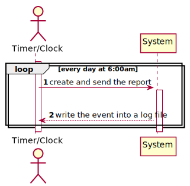
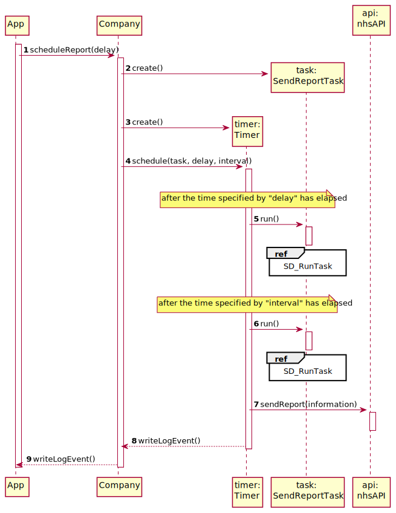

# US 19 - Send to the NHS daily reports of Covid-19

## 1. Requirements Engineering

### 1.1. User Story Description

The Many Labs company wants to send to the NHS daily reports of Covid-19 data, including the number of observed values and estimated values. Reports should be generated automatically with historical data and must be sent every day at 6:00 am.

### 1.2. Customer Specifications and Clarifications 

**From the specifications document:**
* "The Many Labs company wants to send to the NHS daily reports of Covid-19 data, including the number of observed values and estimated values. Reports should be generated automatically with historical data and must be sent every day at 6:00 am" 
* "The contract with the NHS in England requires Many Labs to summarize and report Covid-19 data, the company needs to: identify the number of Covid-19 tests performed, identify all positive results to Covid-19 tests, report the total number of Covid-19 cases per day, per week and per month of the year, and send the forecasts for these same time horizons (the number of Covid-19 cases for the following day, next week and next month)" 
* "Many Labs is also required to generate daily (automatic) reports with all the information demanded by the NHS and should send them to the NHS using their API." 
* "To make the predictions, the NHS contract defines that a linear regression algorithm should be used. The NHS required that both simple linear and multiple linear regression algorithms should be evaluated to select the best model. The accuracy of the prediction models should be analysed and documented in the application user manual (in the annexes) that must be delivered with the application. The algorithm to be used by the application must be defined through a configuration file." 

**From the client clarifications:**
> **Question:** "Which significance level should we use for the hypothesis tests?"
>
> **Answer:** "The application should allow the user to choose the significance level."
-
> **Question:** "As the report is generated automatically, should the system generate a notification that the report was sent?"
> 
> **Answer:** "The application should write the event into a log file."
-
> **Question:** "It is only one report containing all the tests performed by Many Labs to be sent each time, correct? Or is it one report per laboratory, for example? Or other option?"
> 
> **Answer:** "The report should contain all the tests made by Many Labs."
-
> **Question:** "As the Report is to be automatically sent very early in the morning, do you wish the report to have the data concerning the day before and the last week starting at the day before?"
>
> **Answer:** "The format of the report should follow the report example that is available in moodle."
-
> **Question:** "Should the report contain the data of all the tests with results (with or without report, with or without validation) or contain only the validated tests? (Or other option?)"
>
> **Answer:** "The NHS Covid-19 report should include statistics computed only from validated tests."
-
> **Question:** "Should the number of historical points have the same range as the date interval defined by the administrator?"
>
> **Answer:** "No. The points within the interval are used to fit the linear regression model. The number of historical points is the points for which we want to send the estimates/expect values to NHS. The points within the interval and historical points can overlap. Please carefully review the report example file available in moodle."
-
> **Question:** "From the report example we got that the administrator defines the dates' interval to fit the model. Which date should the application use to provide the report? Is it the registration date or results registration date?"
>
> **Answer:** "The registration date should be considered. But only tests that have already been validated should be considered."
-
> **Question:** "Which class is responsible for creating the scheduler(s)? Should we assume the report scope is Many Labs or is it each laboratory?"
>
> **Answer:** "Many Labs Many has exclusivity for doing Covid-19 tests and should send nationwide reports to NHS. The scope is Many Labs."
-
> **Question:** "In the context of sprint D US19 and US18. We are a group without MATCP and MDISC. What parameters should we use in the config files if we dont have to implement things related to Math curricular units?"
>
> **Answer:** "US19 and US18 are US associated only with MATCP. Please check the requirements introduced in Sprint D and the NHS report example available in moodle. You can easily find the parameters required for these user stories."

### 1.3. Acceptance Criteria

* **AC1:** The report should include day and week (observed and estimated) values, the regression model used to estimate each value, R(SLR), R2 and R2 adjusted for SLR and MLR, hypothesis tests for regression coefficients significance model with Anova. Simple linear and multilinear regression models can be used to compute the estimates and corresponding confidence intervals. When the system is configured to use the simple linear regression model, the performance of each model should be used to select the best model (the one that uses the number of tests realized or the one that uses the mean age as independent variable). The best model will be used to make the estimated/expected values that will be send to NHS. The interval of dates to fit the regression model and the number of historical points (number of days and number of weeks) must be defined through a configuration file. The system should send the report using the NHS API (available in moodle).
* **AC2:** The application should allow the user to choose the significance level.
* **AC3:** The application should write the event into a log file.
* **AC4:** The report should contain all the tests made by Many Labs.
* **AC5:** The format of the report should follow the report example that is available in moodle.
* **AC6:** The NHS Covid-19 report should include statistics computed only from validated tests.

### 1.4. Found out Dependencies

* There are some User Stories (US4, US5, US12, US14, US15) that keep changing the test state until it reaches "Validated"

### 1.5 Input and Output Data

**Input Data:**
* (none)

**Output Data:**
* Daily reports

### 1.6. System Sequence Diagram (SSD)

## 2. OO Analysis

### 2.1. Relevant Domain Model Excerpt 

## 3. Design - User Story Realization 

### 3.1. Rationale

| Interaction ID | Question: Which class is responsible for... | Answer  | Justification (with patterns)  |
|:-------------  |:--------------------- |:------------|:---------------------------- |
| **Step 1**  |	...schedule report submission?|  Company| **IE:** The company has access to all information to create the report|
| |	... controlling the calculations and the report?| SendReportTask | **Controller** |
| |	... knows TestStore? | Company | **HC + LC:** Company knows the TestStore to which it is delegating some tasks   |
| | ... controlling the time? | Timer | **Pure Fabrication:** There is no reason to assign this responsibility to any existing class in the Domain Model.|
| |... knows ClientStore?	| Company  | **HC + LC:** Company knows the ClientStore to which it is delegating some tasks  |
| |	... knowing all tests? | TestStore  |  **IE:** knows its own tests  |
| | ... have all the information regarding the test? | Test | **IE:** has is own data |
| | ... have all the information regarding the client? | Client | **IE:** has is own client |
| |... knowing all clients?	|  ClientStores |  **IE:** knows its own clients  |
| |... send the report to NHS? |NhsAPI| **Protected Variations:** The system needs adapts the different API's|
| |... create the regression model?| Simple Linear Regression or Multi Linear Regression| **IE:** know how to do the calculations|
|**Step 2**| ... write the log?| SendReportTask | **IE** have all the necessary information|

### Systematization ##

According to the taken rationale, the conceptual classes promoted to software classes are:

* Company
* TestsStore
* ClientStore
* Test
* Client

Other software classes identified:
* SendReportTask
* Simple Linear Regression
* Multi Linear Regression
* Timer

## 3.2. Sequence Diagram (SD)

## 3.3. Class Diagram (CD)

# 4. Tests

    @Test
    public void getTWrong() {
        String expected = "0.0000";
        String result = String.format("%.04f", slr.getT(0.9));
        Assert.assertNotEquals(expected, result);
    }

    @Test(expected = OutOfRangeException.class)
    public void getTNull() {
        slr.getT(50);
    }

    @Test
    public void getFWrong() {
        String expected = "0.0000";
        String result = String.format("%.04f", slr.getF(0.9));
        Assert.assertNotEquals(expected, result);
    }

    @Test(expected = OutOfRangeException.class)
    public void getFNull() {
        slr.getF(50);
    }

    @Test
    public void getF0Wrong() {
        String expected = "0.0000";
        String result = String.format("%.04f", slr.getF0());
        Assert.assertNotEquals(expected, result);
    }

    @Test
    public void getNCorrect() {
        String expected = "20";
        String result = String.valueOf(slr.getN());
        Assert.assertEquals(expected, result);
    }

    @Test
    public void getNWrong() {
        String expected = "0";
        String result = String.valueOf(slr.getN());
        Assert.assertNotEquals(expected, result);
    }

    @Test
    public void getRWrong() {
        String expected = "0.0000";
        String result = String.format("%.04f", slr.getR());
        Assert.assertNotEquals(expected, result);
    }

    @Test
    public void getR2Wrong() {
        String expected = "0.0000";
        String result = String.format("%.04f", slr.getR2());
        Assert.assertNotEquals(expected, result);
    }

    @Test
    public void getMSEWrong() {
        String expected = "0.0000";
        String result = String.format("%.04f", slr.getMse());
        Assert.assertNotEquals(expected, result);
    }

    @Test
    public void getRssWrong() {
        String expected = "0.0000";
        String result = String.format("%.04f", slr.getMse());
        Assert.assertNotEquals(expected, result);
    }

    @Test
    public void getSsrWrong() {
        String expected = "0.0000";
        String result = String.format("%.04f", slr.getSsr());
        Assert.assertNotEquals(expected, result);
    }

    @Test
    public void getTObs1Wrong() {
        String expected = "0.0000";
        String result = String.format("%.04f", slr.getTObs1());
        Assert.assertNotEquals(expected, result);
    }

    @Test
    public void getTObs2Wrong() {
        String expected = "0.0000";
        String result = String.format("%.04f", slr.getTObs2());
        Assert.assertNotEquals(expected, result);
    }

    @Test
    public void getPredictedWrong() {
        String expected = "0.0000";
        String result = String.format("%.04f", slr.predict(5));
        Assert.assertNotEquals(expected, result);
    }

    @Test
    public void getUpperWrong() {
        String expected = "0.0000";
        String result = String.format("%.04f", slr.upperLimit(5, 0.9));
        Assert.assertNotEquals(expected, result);
    }

    @Test(expected = OutOfRangeException.class)
    public void getUpperNull() {
        slr.upperLimit(5, 5);
    }

    @Test
    public void getLowerWrong() {
        String expected = "0.0000";
        String result = String.format("%.04f", slr.lowerLimit(5, 0.9));
        Assert.assertNotEquals(expected, result);
    }

    @Test(expected = OutOfRangeException.class)
    public void getLowerNull() {
        slr.lowerLimit(5, 5);
    }

    @Test
    public void getToStringWrong() {
        String expected = " ";
        String result = slr.toString();
        Assert.assertNotEquals(expected, result);
    } 

# 5. Construction (Implementation)

## Company

    public void Company(){
        //ommited
        scheduleReport(hour, min, sec);
    }

    private void scheduleReport(int hour, int min, int sec) {
        Calendar today = Calendar.getInstance();
        today.set(Calendar.HOUR_OF_DAY, hour);
        today.set(Calendar.MINUTE, min);
        today.set(Calendar.SECOND, sec);
        Timer timer = new Timer();
        timer.schedule(new ReportTaskController(), today.getTime(), TimeUnit.MILLISECONDS.convert(1, TimeUnit.DAYS));
    }

## SendReportTask

    public SendReportTask(){
        proper = PropertiesController.getProperties();
        historicDays = proper.//ommited
        startDay = proper.//ommited
        endDay = proper.//ommited
        coefientLevel = proper.//ommited
        estimatedLevel = proper.//ommited
        anovaLevel = proper.//ommited
    }

    public void run(){
        if(proper == //ommited){
            if(proper == //ommited{
                SimpleLinearRegression slr = new SimpleLinearRegression(covidCases, positiveCases)
            }else{
                SimpleLinearRegression slr = new SimpleLinearRegression(meanAge, positiveCases)
            }
        }else{
            MultiLinearRegression slr = new MultiLinearRegression(m1, covidCases, meanAge)
        }
    }

    private void meanAge(){
        meanAge = //omitted
    }

    private void covidCases(){
        covidCases = //omitted
    }

    private void covidPositiveCases(){
        covidPositiveCases = //omitted
    }

# 6. Integration and Demo

* Some demo purposes some tasks are bootstrapped while system starts.

# 7. Observations

* Nothing to appoint.

