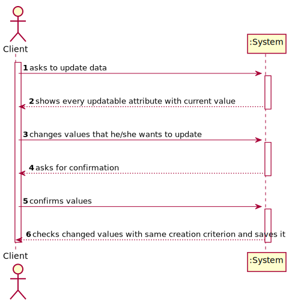
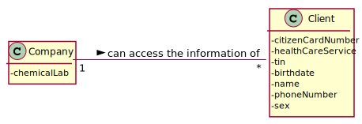
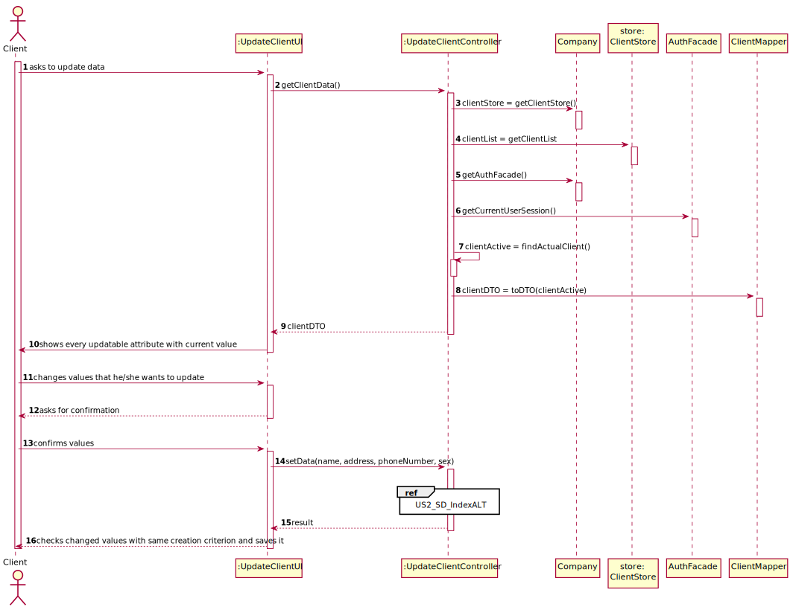
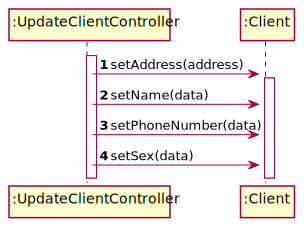
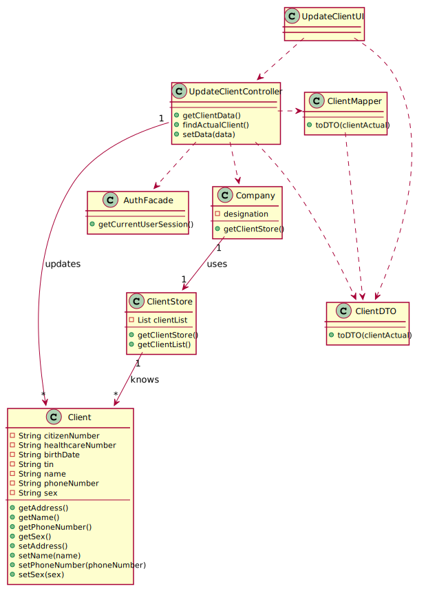

# US 002 - Update Personal Data

## 1. Requirements Engineering

### 1.1. User Story Description

As a client, I want to update my personal data.

### 1.2. Customer Specifications and Clarifications 

**From the client clarifications:**

> **Question:** To update the attribute, should the Client type the previous data?
>  
> **Answer:** The application should show the current user data.
-
> **Question:** What is the Data that the Client can update?
> 
> **Answer:** The client can update any attribute.

> **Question:** What is the Data that the Client can update?
> **Question:** To update the attribute, should the Client type the previous data?
> **Question:** Should the Client type in the attribute he/she wants to update or should he choose from a list?
>
> **Answer:** In this sprint each team should develop a graphical user interface for US2. The application should show the current user data and the client can update any attribute.

> **Question:** Should/Can we show the current data held in the client's account? If so, we think that showing certain information(Password, for exemple) could violate some security purposes. How should we approach that situation?
>
> **Answer:** Today I made the following clarification: "The client can only update his: name, address, phone number and sex attributes. The other attributes can not be updated. There are some restrictions that forced me to make this decision."

> **Question:** When we update the client's information, should we send an email informing that the client's data has been changed? If so, what should this email contain?
>
> **Answer:** Yes. The e-mail message should only inform the client that his personal data has been updated.

### 1.3. Acceptance Criteria

* **AC1:** The client must be registered and logged in
* **AC2:** The application should show the current user data.
* **AC3:** The client can only update name, address, phone number and sex attributes.

### 1.4. Found out Dependencies

* There is a dependency to "US003 Register a Client" since the client needs to be able to register in the system.

### 1.5 Input and Output Data

**Input Data:**

* Typed data:
	* Name
	* Address
	* Phone Number
	* Sex
	
**Output Data:**

* (In)Success of the operation

### 1.6. System Sequence Diagram (SSD)

### 1.7 Other Relevant Remarks

* The loop only ends when the client no longer wants to update any of its data.

## 2. OO Analysis

### 2.1. Relevant Domain Model Excerpt 

### 2.2. Other Remarks

n/a

## 3. Design - User Story Realization 

### 3.1. Rationale

**SSD - Alternative 1 is adopted.**

| Interaction ID                                                               | Question: Which class is responsible for...          | Answer                 | Justification (with patterns)                                                                                                         |
| :-------------                                                               | :---------------------                               | :------------          | :----------------------------                                                                                                         |
| **Step 1 -**  *client* asks to update data                                   | ... interacting with the actor?                      | UpdateClientUI         | **Pure Fabrication:** there is no reason to assign this responsibility to any existing class in the Domain Model.                     |
|                                                                              | ... coordinating the US?                             | UpdateClientController | **Controller**                                                                                                                        |
|                                                                              | ... knowing the user using the system?               | AuthFacade             | **IE:** cf. A&A component documentation.                                                                                              |
|                                                                              | ... instantiating the ClientStore                    | Company                | **HC + LC:** Company knows the ClientStore to which it is delegating some tasks                                                       |
|                                                                              | ... getting the Client object needed?                | ClientStore            | **IE:** knows its own clients                                                                                                         |
|                                                                              | ... transfer the date between the domain and the UI? | ClientDTO              | **DTO:** When there is so much data to transfer, it is better to opt by using a DTO in order to reduce coupling between UI and domain |
| **Step 2 -** *System* shows the list of information it is possible to update |                                                      |                        |                                                                                                                                       |
| **Step 3 -** *client* selects the one that the client wants to update        | ...saving the selected data?                         | UpdateClientController | **IE:** has access to all the data related, and controls the information                                                              |
| **Step 4 -** *System* requests data                                          |                                                      |                        |                                                                                                                                       |
| **Step 5 -** *client* types requested data                                   | ...updating the Client data?                         | Client                 | **IE:** has its own data                                                                                                              |
|                                                                              | ... validating the data                              | Client                 | **IE:** has its own data and validates it                                                                                             |
| **Step 8 -** *System* success information                                    |                                                      |                        |                                                                                                                                       |
| **Step 9 -** *System* finalMessage                                           | ... informing operation success?                     | UpdateClientUI         | **IE:** is responsible for user interactions.                                                                                         |

### Systematization ##

According to the taken rationale, the conceptual classes promoted to software classes are: 

 * Company
 * Client

Other software classes identified: 

 * UpdateClientUI  
 * UpdateClientController
 * AuthFacade
 * ClientStore
 * ClientDTO

## 3.2. Sequence Diagram (SD)

## 3.3. Class Diagram (CD)

# 4. Tests 

* This US was entirely done on a controller, so there are no tests

# 5. Construction (Implementation)

## Class UpdateClientController

    public UpdateClientController() {
		authFacade = company.getAuthFacade();
		clientStore = company.getClientStore();
    }

	public String getClientInformation() {
		client = clientStore.getClientFromEmail(authFacade.getCurrentUserSession().getEmail());

		//DTO ommited
		return clientInformation
	}

    public void editCitizenNumber(String citizenNumber) {
        client.setCitizenNumber(citizenNumber);
    }

    public void editHealthcareNumber(String healthcareNumber) {
        client.setHealthcareNumber(healthcareNumber);
    }

    public void editTin(String tin) {
        client.setTin(tin);
    }

    public void editBirthDate(String birthDate) {
        client.setBirthDate(date);
    }

    public void editName(String name) {
        client.setName(name);
    }

    public void editPhoneNumber(String phoneNumber) {
        client.setPhoneNumber(phoneNumber);
    }

    public void editSex(String sex) {
        client.setSex(sex);
    }

# 6. Integration and Demo 

* A new client menu was added.
* A new option to the client menu was added.

# 7. Observations

* Nothing to point

