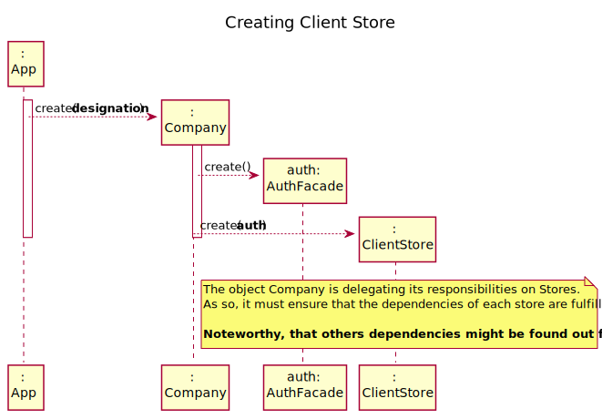

# US3 - To register a new client

## 1. Requirements Engineering

### 1.1. User Story Description

As a receptionist of the laboratory, I want to register a client.

### 1.2. Customer Specifications and Clarifications

**From the specifications document:**

- "In case of a new client, the **receptionist registers the client in the application**. To register a client the receptionist needs the client’s citizen card number, National Healthcare Service (NHS) number, birth date, sex, Tax Identification number (TIN), phone number, email and name."
- "Once the laboratory coordinator confirms that everything was done correctly the client receives a notification alerting that the results are already available in the central application and informing that **he/she must access the application** to view those results."
- "All those who wish to use the application must be **authenticated with a password** holding seven alphanumeric characters, including three capital letters and two digits."

**From the client clarifications:**

> - **Question:**- Considering the creation of new clients, we have this information. - "To register a client the receptionist needs the client’s citizen card number, National Healthcare Service (NHS) number, birth date, sex, Tax Identification number (TIF), phone number, e-mail and name."- Which type/format they should have? - Citizen Card/NHS/TIF - which length - Birthday - in which format? - Sex - should only be Male/Female or include more options. - Phone number: which length/format? - Also, are all the fields required/mandatory?
>- **Answer:**- "Citizen Card": 16 digit number- "NHS": 10 digit number- "TIN": 10 digit number- "Birth day - in which format?": DD/MM/YY- "Sex - should only be Male/Female or include more options:" Male/Female- "Phone number: which length/format?:" 11 digit number- The phone number is opcional. All other fields are required.

 

>- **Question:** What are exactly the **optional attributes** when creating a client? In a previous post you've stated that it was only the phone number, and in another that it was only the sex.
>- **Answer:** The **sex** is opcional. All other fields are required.

 

>- **Question:** Recently you said that the maximum acceptable **age** is 150 years old, so the client can be born in 1870 and the data format is DD/MM/YY, this format can be tricky because, for example, if the data is DD/MM/70 the data can indicate that he born on 1870 or 1970. How can we solve this? Or I am understanding wrong?
>- **Answer:** Thank you for identifying this issue. Please consider DD / MM / YYYY format for all dates.

 

>- **Question:** Is there any restrictions to the client **age**?
>- **Answer:** A client should not have more than 150 years of age. Although there are important developments in the pursuit of eternal youth, for now this value is ok.

 

>- **Question:** login information?
>- **Answer:**  e-mail and password   
   

 

>- **Question:** Also, regarding the acronym **TIF**, and for Glossary and consistency purposes, there seems to be a misleading information. All the aforementioned resources refer to the Taxpayer Identification Number as TIN, and not TIF, as stated in the Integrative Project Descritption. Which version of the acronym do you want us to use in the software?
>- **Answer:** It was a typo. I wanted to write TIN.

 

>- **Question:** What should be the maximum length of the String with the **name** of the Client?
>- **Answer:** A string with no more than 35 characters.

 

>- **Question:** Can they change their **password** whenever they want?
>- **Answer:** No. For now, there are no user story or use case to update the password.

 

>- **Question:** What parameter (asked by the receptionist) should the system use to create the **password** of the new client?
>- **Answer:** The password should be randomly generated. It should have ten alphanumeric characters.

 

>- **Question:** Should each client have an unique **ID**, generated during their creation?
>- **Answer:** No.

 

>- **Question:**  Also, does the **phone number** has to be validated as a valid phone number? And can it be registered with a prefix (+44) or just the number?
>- **Answer:** This lab only operates in England, there is no need to use the prefix.

 

>- **Question:** Should some data of the client (**phone number** and **e-mail** address, for example) be edited in the future?
>- **Answer:** For now there is no need to have such feature.

 

>- **Question:** During the registration of a customer, if he gives a phone number already used by another customer, should the registration continue normally or should it be canceled?
>- **Answer:** From a previous post: "The **e-mail** address and **phone number** should be unique for each user". The system should present a message informing about the error and asking for a different phone number.

 

>- **Question:** "How should the system send a **e-mail** to the client with the password
>- **Answer:** Considering a set of technical restrictions, during the development of the Integrative Project we will not use any e-mail or SMS API services to send messages. All the e-mail and SMS messages should be written to a file with the name emailAndSMSMessages.txt. This file simulates the use of e-mail and SMS API services.

 

>- **Question:** Does the **e-mail** have to be validated as a valid address or do we just accept whatever input the receptionist writes?
>- **Answer:** You should use a regular expression to validate the e-mail address.

 

>- **Question:** After being registered by the receptionist, should the client receive some kind of confirmation e-mail in order to finish his registration?
>- **Answer:** The client only receives an **e-mail** informing that the registration was successful and that he can start to use the system. The e-mail includes the client password.

 

>- **SW Client**: Considering a set of technical restrictions, during the development of the Integrative Project we will not use any **e-mail** or SMS API services to send messages. All the e-mail and SMS messages should be written to a file with the name emailAndSMSMessages.txt. This file simulates the use of e-mail and SMS API services.

 

>- **Question:** "The **client**, after receiving the notification that the results are available in the application, how does he/she access? Does he/she have user access, or does he/she only access the result through a link generated for him/her?"
>- **Answer:** Every client will be registered as a user of the application. This will be a user story in Sprint B. After being registered, the client can access the application at any time.

 

>- **Question:** Relative to registering a new user, how should the system respond in the event of creating a new **user with the same attributes** of an already existing user?
>- **Answer:** This should be treated as an error. A subset of the attributes of any client are unique.

### 1.3. Acceptance Criteria

* **AC01:** The client must become a system user. The "auth" component available on the repository must be reused (without modifications).
* **AC02:** Citizen Card number must have 16 digits.
* **AC03:** Name must be a string with no more than 35 characters.
* **AC04:** NHS number must have 10 digits.
* **AC05:** TIN must have 10 digits.
* **AC06:** Birth day must have the format: DD/MM/YYYY. A client should not have more than 150 years of age.
* **AC07:** Sex options: Male/Female.
* **AC08:** Phone number must have 11 digits.
* **AC09:** E-mail address must have 11 digits and validation must use a regular expression.
* **AC10:** All input fields are required except sex.
* **AC11:** The password should be randomly generated. It should have 10 alphanumeric characters.
* **AC12:** The following fields must be unique for each client: citizen card number, NHS number, TIN, phone number, and e-mail address. When this condition is not met, the system must reject the operation and the user must have the chance to modify the invalid typed data.
* **AC13:** The client receives an e-mail informing that the registration was successful and that he can start to use the system. The e-mail includes the client password. All the e-mail messages should be written to a file with the name emailAndSMSMessages.txt.

### 1.4. Found out Dependencies

* No dependencies were found.

### 1.5 Input and Output Data

**Input Data:**

* **Typed data:**
    * Citizen card number
    * Name
    * NHS number
    * TIN
    * Birthdate
    * Sex
    * Phone number
    * Email address

* **Selected data:**
    * (none)

**Output Data:**

* (In)Success of the operation

### 1.6. System Sequence Diagram (SSD)

### 1.7 Other Relevant Remarks

* There are some similarities to US 7 regarding the need (i) to generate a password and (ii) to send an email to the resulting user.

## 2. OO Analysis

### 2.1. Relevant Domain Model Excerpt

### 2.2. Other Remarks

n/a

## 3. Design - User Story Realization

### 3.1. Rationale

| Interaction ID | Question: Which class is responsible for... | Answer  | Justification (with patterns)  |
|:-------------  |:--------------------- |:------------|:---------------------------- |
| Step 1  |	... interacting with the actor? | RegisterClientUI   |  **Pure Fabrication:** there is no reason to assign this responsibility to any existing class in the Domain Model           |
| 			  		 |	... coordinating the US? | RegisterClientController | **Controller**                             |
| Step 2  |							 |             |                              |
| Step 3  |	...transfer the data typed in the UI to the domain? | ClientDto | **DTO:** When there is so much data to transfer, it is better to opt by using a DTO in order to reduce coupling between UI and domain |
|                        |	...saving the typed data? | Client  | **IE:** a client knows its own data 						 |             |                              |
| 		                 |	... instantiating a new Client? | ClientStore   | **Creator (R1)** and **HC+LC**: By the application of the Creator (R1) it would be the "Company". But, by applying HC + LC to the "Company", this delegates that responsibility to the "ClientStore"   |
|  		 			     |  ... knows ClientStore?	 |  Company   |  **IE:** Company knows the ClientStore to which it is delegating some tasks |
|  		             |	... validating all data (local validation)? | Client | **IE:** an object knows its data|
| 			  		 |	... validating all data (global validation)? | ClientStore | **IE:** knows all the clients| 
|                    | ... validate the exclusivity of the client's email? | AuthFacade | **IE:** user management is responsibility of the respective external component whose point of interaction is through the class "AuthFacade"
| Step 4 |	 |   |  |        
| Step 5 |	... generating the password? | PasswordGenerator | **IE** and **Pure Fabrication:** ClientStore has all the required information and means to generate the password (IE). However, to avoid code duplication (cf. US7) this responsibility might be assign to a common and shared artificial class, specialized in this task.|
| 			  		 |	... registering the client as a system user? | AuthFacade | **IE:** cf. A&A component documentation | 
| 			  		 |	... saving the client? | ClientStore | **IE:** Knows all clients| 
| 			  		 |	... sending email? | EmailNotificationSender | **IE** and **Pure Fabrication:** has all the required information and means to send the email (IE). However, to avoid code duplication (cf. US7) this responsibility might be assign to a common and shared artificial class, specialized in this task.| 
| Step 6  |	... informing operation success?| RegisterClientUI  | **IE:** is responsible for user interactions  | 

### Systematization ##

According to the taken rationale, the conceptual classes promoted to software classes are:

* Company
* Client

Other software classes (i.e. Pure Fabrication) identified:

* RegisterClientUI
* RegisterClientController
* ClientStore
* ClientDto
* **PasswordGenerator**
* **EmailNotificationSender**

Other software classes of external systems/components:

* AuthFacade

## 3.2. Sequence Diagram (SD)

**Remark 1:** It is worth noticing that all objects' interactions are consistent with the responsibilities assigned during the rationale.

**Remark 2:** The **__interaction use__** technique could be used to highlight that details regarding to (i) generate password and (ii) send an email are available on complementary sequence diagrams. The reason for that relies on the fact that such technique was not timely lectured to all classes during sprint B.

**Remark 3:** The most attentive ones might be wondering how the _ClientStore_ knows the _AuthFacade_ object since, according to the depicted SD, the first object is interacting with the second one but nothing is stated about it. To enlight such information an additional SD is provided, presenting a very common approach for objects to get knowing other objects on which they depend on.

## 3.3. Class Diagram (CD)

# 4. Tests

**Acceptance Criteria 3**

    @Test(expected = IllegalArgumentException.class)
    public void CreateCitizenNumberWithMoreThan16Carac() throws ParseException {
        Date date = dateFormat.parse(dateStr);
        client = new Client("10101010101010101010","1010101010", date, "1010101010", "client", "10101010101", "male");
    }

    @Test(expected = IllegalArgumentException.class)
    public void CreateCitizenNumberWithLessThan16Carac() throws ParseException {
        Date date = dateFormat.parse(dateStr);
        client = new Client("101010","1010101010", date, "1010101010", "client", "10101010101", "male");
    }

**Acceptance Criteria 4**

    @Test(expected = IllegalArgumentException.class)
    public void CreateNHSWithMoreThan10Carac() throws ParseException {
        Date date = dateFormat.parse(dateStr);
        client = new Client("1010101010101010","10101010101010", date, "1010101010", "client", "10101010101", "male");
    }

    @Test(expected = IllegalArgumentException.class)
    public void CreateNHSWithLessThan10Carac() throws ParseException {
        Date date = dateFormat.parse(dateStr);
        client = new Client("1010101010101010","101010", date, "1010101010", "client", "10101010101", "male");
    }

**Acceptance Criteria 5**

    @Test(expected = IllegalArgumentException.class)
    public void CreateTinWithMoreThan10Carac() throws ParseException {
        Date date = dateFormat.parse(dateStr);
        client = new Client("1010101010101010","1010101010", date, "10101010101010", "client", "10101010101", "male");
    }

    @Test(expected = IllegalArgumentException.class)
    public void CreateTinWithLessThan10Carac() throws ParseException {
        Date date = dateFormat.parse(dateStr);
        client = new Client("1010101010101010","1010101010", date, "101010", "client", "10101010101", "male");
    }

**Acceptance Criteria 6**

    @Test(expected = ParseException.class)
    public void CreateBirthDateBlank() throws ParseException {
        dateStr = "";
        Date date = dateFormat.parse(dateStr);
        client = new Client("1010101010101010","1010101010", date, "1010101010", "client", "10101010101", "male");
    }

**Acceptance Criteria 7**

    @Test(expected = ParseException.class)
    public void CreateBirthDateBlank() throws ParseException {
        //Arrange + Act
        dateStr = "";
        Date date = dateFormat.parse(dateStr);
        client = new Client("1010101010101010","1010101010", date, "1010101010", "client", "10101010101", "male");
    }

    @Test(expected = IllegalArgumentException.class)
    public void CreateNegativeAge() throws ParseException {
        //Arrange + Act
        dateStr = "11-11-2050";
        Date date = dateFormat.parse(dateStr);
        client = new Client("1010101010101010","1010101010", date, "1010101010", "client", "10101010101", "male");
    }

**Acceptance Criteria 8**

    @Test(expected = IllegalArgumentException.class)
    public void CreateNameWithNumbers() throws ParseException {
        Date date = dateFormat.parse(dateStr);
        client = new Client("1010101010101010","1010101010", date, "1010101010", "client11", "10101010101", "male");
    }

    @Test(expected = IllegalArgumentException.class)
    public void CreateNameWithMoreThan35Digits() throws ParseException {
        Date date = dateFormat.parse(dateStr);
        client = new Client("1010101010101010","1010101010", date, "1010101010", "clientclientclientclientclientclientclientclientclientclientclientclient", "10101010101", "male");
    }

**Acceptance Criteria 9**

    @Test(expected = IllegalArgumentException.class)
    public void CreateSexOther() throws ParseException {
        Date date = dateFormat.parse(dateStr);
        client = new Client("1010101010101010","1010101010", date, "1010101010", "client", "10101010101", "aaaaaaa");
    }

**Acceptance Criteria 10**

    @Test(expected = IllegalArgumentException.class)
    public void CreatePhoneNumberWithMoreThan11Carac() throws ParseException {
        Date date = dateFormat.parse(dateStr);
        client = new Client("1010101010101010","1010101010", date, "1010101010", "client", "1010101010101010", "male");
    }

    @Test(expected = IllegalArgumentException.class)
    public void CreatePhoneNumberWithLessThan11Carac() throws ParseException {
        Date date = dateFormat.parse(dateStr);
        client = new Client("1010101010101010","1010101010", date, "1010101010", "client", "101010", "male");
    }

# 5. Construction (Implementation)

## Class ClientCreateController

    public class ClientCreateController {

        public ClientCreateController() {

        }

        public boolean CreateClient(String citizenNumber, String healthcareNumber, Date birthDate, String tin, String name, String phoneNumber, String sex) {

            client = recep.CreateClient(citizenNumber, healthcareNumber, birthDate, tin, name, phoneNumber, sex);
    
            return client != null;
        }

        public boolean SaveClient() {
            return recep.SaveClient(client);
        }

        public boolean AddUser(String email, String name) {
            String password = //omitted
    
            AuthFacade loginCC = new AuthFacade();
            if (!loginCC.existsUser(email)) {
                return loginCC.addUser(name, email, password);
            }
    
            return false;
        }

        public boolean clientNotification(String type, String message){
            ClientNotification noti = new ClientNotification();

            return noti.sendNotification(type, message)
        }
    }

## Class Receptionist

    public class Receptionist extends Employee {

        public Receptionist(String id, String name, String phoneNumber, String email, String address, String soc) {
            super(id, name, phoneNumber, email, address, soc)
        }

        public Client CreateClient(String citizenNumber, String healthcareNumber, Date birthDate, String tin, String name, String phoneNumber, String sex) {
            Client client = new Client(citizenNumber, healthcareNumber, birthDate, tin, name, phoneNumber, sex);
            if (this.Validate(client)) {
                return client;
            }
            return null;
        }

        public boolean Validate(Client client) {
            result = //omitted
            if(result){
                return true;
            }else{
                return false;
            }
        }

        public boolean SaveClient(Client client) {
            result = //omitted
            if(result){
                return true;
            }else{
                return false;
            }
        }
    }   

## Class Platform

    class Platform
    {
        public Platform()
        {

        }

        public Clients[] getClients(){
            ClientsStore clients = new ClientsStore();
            
            return ClientsStore.getClients();
        }

        public boolean AddClient(Client client)
        {
            ClientsStore clients = new ClientsStore();

            return clients.AddClient(client)
        }
    }

## Class Client

    private String citizenNumber, healthcareNumber, birthDate, tin, name, phoneNumber, sex;
    
    class Client
    {
        public Client(String citizenNumber, String healthcareNumber, String birthDate, String tin, String name, String phoneNumber, String sex)
        this.citizenNumber = citizenNumber;
        this.healthcareNumber = healthcareNumber;
        this.tin = tin;
        this.birthDate = birthDate;
        this.name = name;
        this.phoneNumber = phoneNumber;
        this.sex = sex;
    }

## Class ClientNotification

    class ClientNotification
    {
        public ClientNotification()
        {

        }

        public boolean sendNotification(String type, String message)
        {
            try{
                // ... (omitted)
                return true
            }
            catch{
                // ... (omitted)
                return false
            }
        }
    }

## Class ClientsStore

    class ClientsStore
    {
        public Client[] getClients()
        {
            return // ... (omitted)
        }

        public AddClient(Client client)
        {
            try
            {
                // ... (omitted)
                return true;
            }
            catch
            {   
                // ... (omitted)
                return false;
            }
        }
    }

# 6. Integration and Demo

* A new option to the receptionist menu was added.

# 7. Observations

As requested by the SW Client the e-mail are not being sent. Instead, email are being written to a file with the name emailAndSMSMessages.txt.

Further, after SW Client deciding which Email Service to use, it will be necessary to update the class __EmailNotificationSender__.

