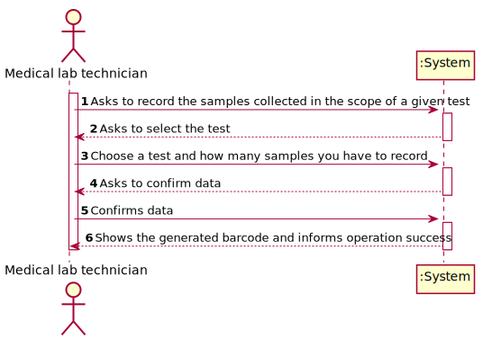
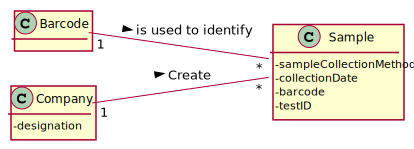
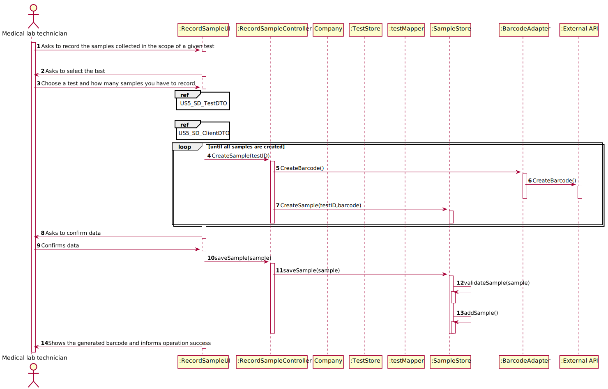
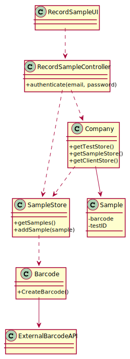

US7: Register a new employee

## 1. Requirements Engineering

### 1.1. User Story Description

*As a medical lab technician, I want to record the samples collected in the scope of a given test.*

### 1.2. Customer Specifications and Clarifications

**From the specifications document:**

> All the tests (clinical blood tests and Covid-19 tests) performed by the network of laboratories are registered locally by the medical lab technicians who collect the samples.

> When sampling (blood or swab) the medical lab technician records the samples in the system, associating the samples with the client/test, and identifying each sample with a barcode that is automatically generated using an external API.

**From the client clarifications:**

> In US5, the medical lab technician checks the system and see all tests for which there are no samples collected. The medical lab technician selects a test and the system asks for the number of samples to collect.

> **Question:** What kind of attributes should a sample have?
>
> **Answer:** Each sample is associated with a test. A sample has only one attribute, a barcode number (UPC) that is a sequential number and is automatically generated by the system. Each sample has a unique barcode number.

> **Question:** Can a test have more than one sample?
>
> **Answer:** Yes.

> **Question:** We didn't fully understand what will the API do in this US, so here's out interpretation from the US, correct us if we're wrong please: The API will be generated randomly and the API is an attribute from the sample.
>
> **Answer:** The API will be used to generate/print barcodes.

> **Question:** What information does the medical lab technician needs to input to the record a new sample?
>
> **Answer:** The medical lab technician checks a list of tests and selects one. Then, the application generates barcodes (one or more). After printing the barcodes (one or more) the use case ends.

> **Question:** During the current sprint, how should we allow the barcodes to be printed. After generating them via the API, should we save the barcode images to the disk?
>
> **Answer:** Each generated barcode should be saved in a folder as a jpeg file.d

### 1.3. Acceptance Criteria

* **AC1:** The system should support several barcode APIs. The API to use is defined by configuration.
* **AC2:** Can't create samples from a test that already has samples created before.

### 1.4. Found out Dependencies

* The test needs to be created by the receptionist.

### 1.5 Input and Output Data

**Input Data:**

* Selected data:
    * Test

**Output Data:**

* Print Tests
* Print Client information
* Print barcode

### 1.6. System Sequence Diagram (SSD)

### 1.7 Other Relevant Remarks

* There is no other relevant remarks.

## 2. OO Analysis

### 2.1. Relevant Domain Model Excerpt

### 2.2. Other Remarks

* There is no other remarks.

## 3. Design - User Story Realization

### 3.1. Rationale

**The rationale grounds on the SSD interactions, and the identified input/output data.**

| Interaction ID | Question: Which class is responsible for... | Answer  | Justification (with patterns)  |
|:-------------  |:--------------------- |:------------|:---------------------------- |
| Step 1: Asks to record the samples collected in the scope of a given test|...coordinate the US?|RecordSampleController|Controller|
| |... interacting with the Medical Lab Technician?|RecordSampleUI|Pure Fabrication: There is no reason to assign this responsibility to any existing class in the Domain Model.|
| Step 2: Asks to select the test||||
| Step 3: Choose a test and how many samples you have to record|...show every test that doesn't have samples created?|RecordSampleUI|    Pure Fabrication: There is no reason to assign this responsibility to any existing class in the Domain Model.                          |
| |...store tests?|TestStore|This class stores every test created|
| Step 4: Asks to confirm data||||
| Step 5: Confirms data|... validating all data?|SampleStore|IE: knows all the Samples|
| Step 6: Shows the generated barcode and informs operation success|...showing all the information stored?|RecordSampleUI|Pure Fabrication: There is no reason to assign this responsibility to any existing class in the Domain Model.|

### Systematization ##

According to the taken rationale, the conceptual classes promoted to software classes are:

* Sample
* Barcode
* Company

Other software classes (i.e. Pure Fabrication) identified:

* RecordSampleUI
* RecordSampleController
* SampleStore

## 3.2. Sequence Diagram (SD)

**Alternative 1**

## 3.3. Class Diagram (CD)

# 4. Tests

**Test 1:**

    @Test
    public void createSample() throws OutputException, BarcodeException {
        assertNotNull(sampleStore.createSample("12345678909", "2021/05/27 18:17:24"));
    }

**Test 2:**

    @Test
    public void getSampleList() { 
      sampleList1 = sampleStore.getSampleList(); 
      assertNotNull(sampleList1);
    }

**Test 3:**

    @Test
    public void getTestID() {
      Sample sample = new Sample("12345678909", "100001230000", "2021/05/27 18:17:23");
      assertEquals("100001230000", sample.getTestID());
    }

**Test 4:**

    @Test
    public void getDate() {
        Sample sample = new Sample("12345678909", "100001230000", "2021/05/27 18:17:23");

        assertEquals("2021/05/27 18:17:23", sample.getDate());
    }

# 5. Construction (Implementation)

## Class Sample

    private String barcode;
    private String testID;
    private String date;

    /**
     * constructor that create a full sample object
     *
     * @param barcode - barcode
     * @param testID  - test id
     * @param date    - date
     */
    public Sample(String barcode, String testID, String date) {
        this.barcode = barcode;
        this.testID = testID;
        this.date = date;
    }

    /**
     * return barcode
     *
     * @return barcode
     */
    public String getBarcode() {
        return barcode;
    }

    /**
     * return testID
     *
     * @return testID
     */
    public String getTestID() {
        return testID;
    }

    /**
     * return date
     *
     * @return date
     */
    public String getDate() {
        return date;
    }

## Class SampleStore

    private List<Sample> sampleList = new ArrayList<>();
    BarcodeAdapter bar = new BarcodeAdapter();
    String barcode;

    /**
     * Constructor that create a empty list of samples
     */
    public SampleStore() {
        //Sample Store
    }

    /**
     * @return sample list
     */
    public List<Sample> getSampleList() {
        return sampleList;
    }

    /**
     * create sample
     *
     * @param testID - testID
     * @param date   - date
     * @return return the sample
     */
    public Sample createSample(String testID, String date) throws BarcodeException {
        barcode = bar.createBarcode();

        return new Sample(barcode, testID, date);
    }

    /**
     * save sample
     *
     * @param sample - sample
     * @return if the sample was saved
     */
    public boolean saveSample(Sample sample) throws OutputException, IOException {
        if (validateSample(sample)) {
            sampleList.add(sample);
            bar.writeBarcodeImage();
            return true;
        }
        return false;
    }

    /**
     * Validate sample
     *
     * @param sample - sample
     * @return validate the sample
     */
    public boolean validateSample(Sample sample) {

        for (Sample sample1 : sampleList) {
            if (sample1.getBarcode().equalsIgnoreCase(sample.getBarcode()) || sample1.getDate().equalsIgnoreCase(sample.getDate())) {
                return false;
            }
        }
        return true;
    }

## Class RecordSampleController

    TestStore testStore;
    SampleStore sampleStore;
    ClientsStore clientStore;
    Sample sample = null;
    String barcode;
    String date;

    public RecordSampleController() {
        App app = App.getInstance();
        Company company = app.getCompany();
        testStore = company.getTestStore();
        sampleStore = company.getSampleStore();
        clientStore = company.getClientStore();
    }

    public List<Test> getTestList() {
        return testStore.getTests();
    }

    public String getBarcode() {
        return barcode;
    }

    public boolean createSample(String testID) throws BarcodeException, OutputException {
        DateTimeFormatter dtf = DateTimeFormatter.ofPattern("yyyy/MM/dd HH:mm:ss");
        LocalDateTime now = LocalDateTime.now();
        date = dtf.format(now);

        sample = sampleStore.createSample(testID, date);
        barcode = sample.getBarcode();

        return sample != null;
    }

    public String getDate() {
        return date;
    }

    public boolean saveSample() throws OutputException, IOException {
        return sampleStore.saveSample(sample);
    }

    public void setState(String testId) {
        for (Test t : testStore.getTests()) {
            if (t.getTestCode().equals(testId)) {
                t.setState(Test.State.SAMPLECOLLECTED);
            }
        }
    }

    public Client getClientFromTest(Test test) {

        for (Client c : clientStore.getClientList()) {
            if (c.getTin().equals(test.getTin())) {
                return c;
            }
        }

        return null;
    }

    public Test getTestFromTestID(String testcode) {

        for (Test t : testStore.getTests()) {
            if (t.getTestCode().equals(testcode)) {
                return t;
            }
        }

        return null;
    }

# 6. Integration and Demo

* New classes were added with the functionality to create reports and diagnosis (Sample, SampleStore, RecordSampleController, RecordSampleUI, BarcodeAdapter)
* It was added a new menu for the role of Medical Lab Technician
* Added in the Company class a new store to initialize (sampleStore)

# 7. Observations

* Selected tests will be seted as SAMPLECOLLECTED

